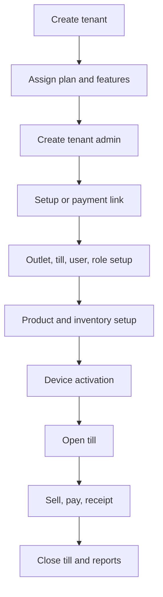

<!-- title: Release 1 Scope -->
<!-- status: Active -->
<!-- system: SCS-TIX EPOS Release 1 -->
<!-- last_updated: 2026-06-18 -->

# Release 1 Scope

## Purpose

This file locks the Release 1 scope for SCS-TIX EPOS.

Release 1 is a POS-first SaaS MVP.

Use this file before creating journeys, backend modules, database migrations,
UI tasks, test cases, or AI development prompts.

## Scope Decision Rule

A feature is Release 1 only when it is supported by confirmed project decisions,
uploaded UI journeys, backend architecture, database design, or scope images.

A database table or old UI reference does not automatically make a feature
Release 1.

When scope conflict appears, follow:

1. [[Release_1_Scope]]
2. [[Included_Features]]
3. [[Excluded_Features]]
4. Confirmed architecture and database design
5. Open project decisions

## Release 1 Boundary

| Area | Decision |
|---|---|
| Product model | Multi-tenant SaaS EPOS |
| Primary channel | POS-first |
| Admin surface | Platform Admin Web |
| POS surface | Single Flutter POS App |
| Tenant admin | Inside Flutter POS App |
| Portable POS | Included as queue-busting POS flow |
| E-commerce | Excluded |
| Offline sync | Excluded |
| Kiosk | Excluded |
| Supplier/stock transfer | Excluded |

## Software Surfaces

| Surface | Main Responsibility |
|---|---|
| Platform Admin Web | Tenant, subscription, entitlement, billing link, activation |
| Flutter POS App | Cashier, manager, tenant-admin operational flows |
| Portable POS Flow | Mobile POS checkout under same POS rules |
| Reports | Basic sales, payment, inventory, till, return/refund reports |

Tenant Admin must not be treated as a separate standalone web application.

## Core Release 1 Flow

## Platform Admin Scope

Platform Admin includes login, dashboard, tenant creation, tenant profile,
business details, tenant address, subscription plan assignment, billing summary,
payment link, feature entitlement, tenant admin creation, optional setup support,
tenant activation, status control, and audit visibility.

## Tenant Admin Scope

Tenant Admin includes setup link/password setup, billing summary, outlet
management, till management, activation code visibility, user management, role
and permission management, product onboarding, product management, basic
inventory, expiry visibility, expiry discount setup, basic loyalty setup, and
reports access when permitted.

Role permission assignment uses the backend-driven catalog
(`GET /api/v1/tenant-admin/permission-catalog`); dedicated tenant role list
CRUD APIs remain future work. See
[[../02_ACCESS_CONTROL/Backend_Driven_Permission_Catalog]].

## Cashier POS Scope

Cashier includes login, device activation, trusted-device validation, till
selection, till open, till close, product search, barcode scan, variant
selection, cart, park/recall sale, discount, manager PIN approval, customer
selection, loyalty earn/redeem, cash/card/QR/split payment, receipt, return,
refund, exchange, customer credit, and cash in/out.

## Product, Inventory, Discount Scope

Release 1 includes product catalog, variants, SKU/barcode, product images, price
list items, CSV product import, inventory balances, stock movements, adjustments,
stocktake, product batches, expiry tracking, inventory alerts, product discounts,
POS discounts, and expiry discount rules.

Supplier management, stock transfer, coupons, and full promotions are excluded.

## Hardware Scope

Release 1 is hardware-ready.

Flutter POS or local device service handles direct physical communication.

Backend stores configuration, status, references, test logs, and transaction
metadata for fixed POS, portable POS, scanner, receipt printer, cash drawer, and
card reader/payment device.

## Access-Control Boundary

Every protected POS operation must validate authenticated user, active session,
active tenant, subscription or entitlement, required permission, outlet access,
trusted device, assigned till where required, and open till session where
required.

This applies to sale, payment, refund, exchange, cash drawer, receipt, and
till-close operations.

## Related Files

- [[Included_Features]]
- [[Excluded_Features]]
- [[../02_ACCESS_CONTROL/Access_Control_Overview]]
- [[../05_BACKEND_ARCHITECTURE/Backend_Overview]]
- [[../06_DATABASE_KNOWLEDGE/Database_Overview]]
