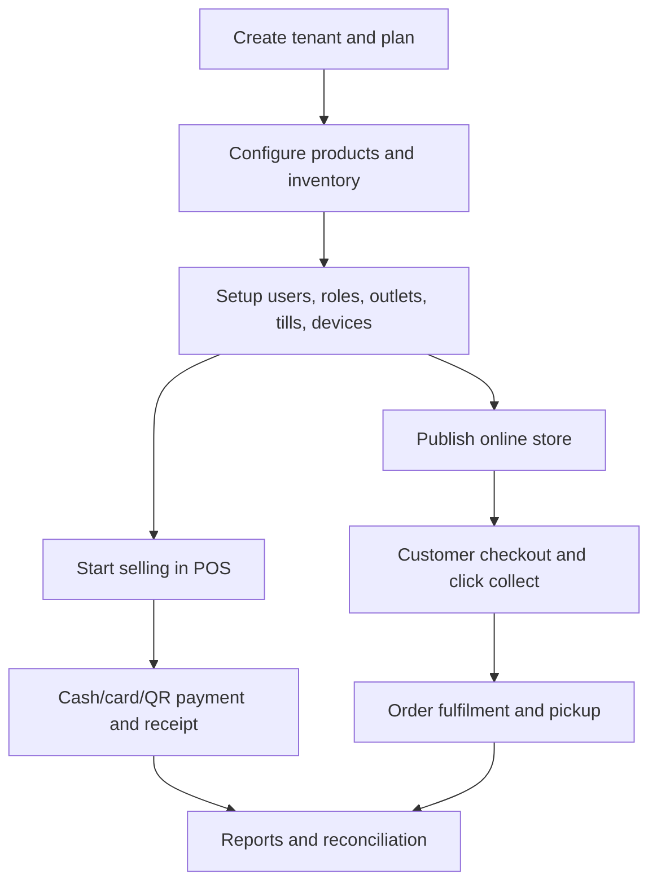

<!-- title: TM-EPOS MVP Scope -->
<!-- status: Active -->
<!-- system: TM-EPOS MVP -->
<!-- last_updated: 2026-06-29 -->


# TM-EPOS MVP Scope

## Purpose

This file locks the current TM-EPOS MVP scope.
Use it before creating journeys, backend modules, database migrations, UI tasks,
test cases, or AI development prompts.

This file replaces older POS-first scope statements where they conflict with the
updated TM-EPOS scope images and Unified Commerce database design.

## Scope Decision Rule

A feature is in MVP only when it is supported by confirmed project decisions,
uploaded scope images, the updated database design, or approved architecture
documents.

A database table alone does not make a feature active MVP scope.
When uncertain, ask for confirmation before implementation.

## MVP Product Position

TM-EPOS is a modern, low-cost, offline-capable EPOS platform for events,
merchandising, food and beverage operators, attractions, stadiums, and temporary
retail locations.

The goal is to help businesses start selling within minutes using affordable
hardware and devices they already own.

## MVP Goal

```text
Start selling in minutes using a phone, tablet, laptop, or desktop PC.
```

## Core Scope Boundary

| Area | MVP Decision |
|---|---|
| Product model | Multi-tenant Unified Commerce EPOS |
| Sales channels | In-store POS and responsive online store |
| Business apps | Mobile and desktop EPOS/admin experience |
| Customer surface | Online store and click & collect |
| Offline operation | Included with controlled sync and backend validation |
| Hardware | Low-cost printer, scanner, drawer, payment device support |
| Order model | Unified sales order, cart, checkout, fulfilment, pickup |
| Admin model | Platform admin and business admin operations |
| Future expansion | Delivery and franchise/chain expansion are deferred |

## MVP Software Surfaces

| Surface | Main Responsibility |
|---|---|
| Mobile POS | Fast sales on phone/tablet with barcode, basket, payment, receipt |
| Desktop EPOS | Selling/admin workflows on laptop or desktop PC |
| Online Store | Customer product browsing and ordering website |
| Click & Collect | Online order collection time and pickup management |
| Business Admin | Products, variants, inventory, users, permissions, reports |
| Platform Admin | Tenants, plans, entitlements, billing, setup, activation |
| Sync/Offline Support | Local cache, offline cash operation, sync outbox |

## Target Business Scope

Initial target businesses include event merchandise shops, stadiums and arenas,
festivals and concerts, pop-up shops, souvenir and gift shops, museums and
attractions, food stalls, burger shops, beverage counters, bars, and market
traders.

These customers need fast setup, low cost, simple operations, portable selling,
and basic resilience when internet is unreliable.

## MVP Module List

| No. | Module | Scope |
|---:|---|---|
| 1 | Mobile POS | Product search, barcode scan, basket, cash/card payment, receipt |
| 2 | Product & Variant Management | Products, categories, variants, attributes, images, barcodes |
| 3 | Inventory Management | Stock in, adjustment, variant stock, alerts, movement history |
| 4 | Online Store | Product catalogue, search, categories, cart, online checkout |
| 5 | Click & Collect | Online ordering, collection time, notifications, pickup handling |
| 6 | Offline Operation | Cache, offline cash sale, current till, receipt print, sync queue |
| 7 | Order Management | In-store, online, and click & collect order tracking |
| 8 | Reporting & Analytics | Sales, product, inventory, order reports, dashboard |
| 9 | Users & Permissions | Role-based and permission-based access |
| 10 | Device & Peripheral Integration | Receipt printer, scanner, drawer, card payment machine |

## Core MVP Flow



## Offline Boundary

Offline operation is included for safe minimum EPOS continuity.
The system may cache product, price, tax, permission, outlet, till, hardware,
receipt template, cart, held sale, and recent customer reference data.

Allowed offline actions include product lookup, barcode scan, product grid/search,
price and tax calculation, active basket save/restore, cash sale, receipt print,
park/hold sale, current till session usage, basic customer lookup, pending
inventory movement, and sync outbox.

## Backend Final Validation Boundary

The backend remains final authority for final inventory quantity, card and QR
payment, refund, exchange, loyalty/store credit, till final close, final sale
total, tenant isolation, permission, and audit.

Offline records must be synced and revalidated before becoming final system truth.

## Access-Control Boundary

Every protected operation must validate authenticated user, active tenant,
feature entitlement, permission, outlet access, device trust, till assignment,
and open till session where required.

This applies to POS sale, payment, refund, exchange, cash drawer, receipt,
offline sync, order fulfilment, pickup, reporting, and admin operations.

## Related Files

- [[Included_Features]]
- [[Excluded_Features]]
- [[../00_START_HERE/Current_Source_Of_Truth]]
