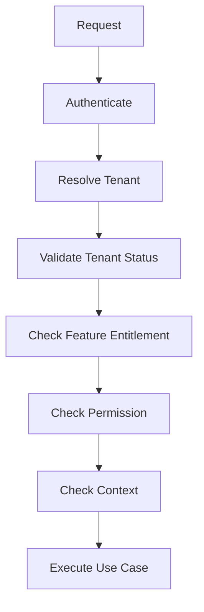

<!-- title: API Authorization Rules -->
<!-- status: Active -->
<!-- system: TM-EPOS MVP -->
<!-- last_updated: 2026-07-02 -->

# API Authorization Rules

## Purpose

This file defines API authorization rules for TM-EPOS MVP.

Every protected API must validate user/session, tenant, feature entitlement,
permission, and operational context where required.

## API Rule

Frontend checks are UX only.

Backend API checks are mandatory.

## Standard API Guard Chain

## Platform APIs

Platform APIs require platform JWT authentication and explicit platform permission codes.

Frontend route guards and menu filtering are UX only. Backend service checks are mandatory.

### Implemented platform permission mapping (Option A)

| API Area | Required permission(s) |
|---|---|
| Platform dashboard | `platform.dashboard.view` |
| Tenant list/summary/filter | `platform.tenants.view` |
| Tenant create | `platform.tenants.create` |
| Tenant update | `platform.tenants.update` |
| Tenant activate | `platform.tenants.activate` |
| Tenant suspend | `platform.tenants.suspend` |
| Tenant entitlements | `platform.tenants.entitlements.update` |
| Subscription plan list/catalog | `platform.subscription_plans.view` |
| Subscription plan create/edit/publish | `platform.subscription_plans.create`, `platform.subscription_plans.edit` |
| Subscription plan duplicate/archive/delete | respective `platform.subscription_plans.*` codes |
| Permission catalog | `platform.permissions.view` |
| Platform roles | `platform.roles.view`, `platform.roles.create`, `platform.roles.update` |
| Platform role permissions | `platform.roles.permissions.view`, `platform.roles.permissions.update` |
| Platform users | `platform.users.view`, `platform.users.create`, `platform.users.update`, `platform.users.roles.assign` |
| Platform settings | `platform.settings.view`, `platform.settings.update` |
| Platform billing | `platform.billing.view`, `platform.billing.manage` |
| Platform audit | `platform.audit.view` |
| Platform integrations | `platform.integrations.manage` |

Do not use umbrella-only checks such as `platform.subscriptions.manage` where granular codes already exist.

## Tenant Admin APIs

Tenant admin APIs require tenant user authentication, active tenant, enabled
feature, and permission.

Examples:

| API Area | Required Rule |
|---|---|
| Outlet/till/device setup | tenant/outlet/till/device permissions |
| User/role management | tenant.users.manage or tenant.roles.manage |
| Product setup | catalog permissions |
| Inventory setup | inventory permissions |
| Reports | reports permissions |

## POS APIs

POS APIs require tenant user, active tenant, POS entitlement, permission, outlet
access, trusted device when required, selected till, and open till session for
billing actions.

Do not allow billing without an open till.

## Online Store APIs

Public catalogue browsing may use tenant/domain/sales-channel validation.

Checkout, customer order status, customer profile, and pickup visibility require
customer/session or secure token rules.

Tenant admin storefront setup requires tenant user permissions.

## Cart And Checkout APIs

Cart and checkout APIs must validate tenant, sales channel, product visibility,
pricing, tax, fulfilment method, pickup rule, and idempotency where required.

Checkout cannot trust frontend totals.

## Order / Fulfilment / Pickup APIs

Order APIs require order permissions for staff/admin access.

Fulfilment and pickup APIs require fulfilment or pickup permissions and must
only expose the correct tenant, outlet, pickup slot, fulfilment order, and order
status data.

## Payment And Refund APIs

Payment, refund, return, and exchange APIs must validate permission, tenant,
order, payment method, idempotency, and backend business rules.

Do not blindly retry payment, refund, exchange, sale completion, cash movement,
till open, or till close APIs.

## Offline Sync APIs

Offline sync APIs require tenant user/session or approved device credentials,
trusted offline client, device/outlet context, feature entitlement, sync
permission, idempotency key, and payload validation.

Sync upload does not automatically approve business truth.
Backend validation determines final state.

## Error Rules

| Failure | Response |
|---|---|
| Not authenticated | 401 |
| Authenticated but not allowed | 403 |
| Feature disabled | 403 or feature-disabled error |
| Invalid tenant/outlet/till/device | 403 or 409 |
| Validation failed | 400 |
| Conflict/duplicate/idempotency issue | 409 |
| Unexpected error | 500 with safe message |

## Related Files

- [[Access_Control_Overview]]
- [[Permission_Code_List]]
- [[Feature_Entitlement_Matrix]]
