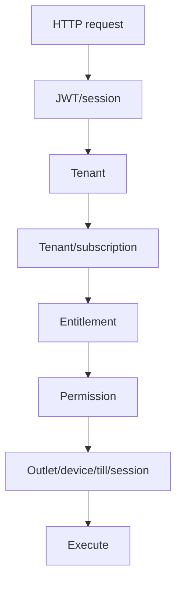

<!-- title: API Authorization Rules -->
<!-- status: Active -->
<!-- system: SCS-TIX EPOS Release 1 -->
<!-- last_updated: 2026-06-08 -->

# API Authorization Rules

## Purpose

This file defines how Release 1 APIs must enforce authentication,
authorization, tenant isolation, entitlement, permission, device, outlet, and
till-session rules.

Controllers must stay thin.

Application services and access-decision services must enforce access rules.

## Principle

A valid JWT is necessary but not sufficient.

## Standard Request Gate



## Tenant Context Rule

Tenant-owned APIs must not accept frontend `tenant_id` as source of truth.

Tenant context must be resolved from token/session and applied in services and repositories.

## Platform API Rules

| API Area | Required Checks |
|---|---|
| Tenant creation | Platform user and platform permission |
| Subscription setup | Platform user and billing/subscription permission |
| Feature entitlement | Platform user and entitlement permission |
| Tenant activation | Platform user and activation permission |
| Platform audit | Platform user and audit permission |

## Tenant Admin API Rules

| API Area | Required Checks |
|---|---|
| Outlet management | Tenant active, entitlement, permission |
| Till management | Tenant active, entitlement, permission |
| User management | Tenant active, entitlement, permission |
| Role/permission management | Tenant active, entitlement, permission |
| Product management | Catalog entitlement and product permission |
| Inventory management | Inventory entitlement and inventory permission |
| Loyalty setup | Loyalty entitlement and loyalty permission |
| Reports | Reports entitlement and report permission |

## POS API Rules

| API Action | Required Checks |
|---|---|
| Create sale | POS entitlement, sale permission, outlet, trusted device, assigned till, open session |
| Park/recall sale | POS entitlement, sale permission, outlet, trusted device, open session |
| Apply discount | Discount entitlement, discount permission, policy check |
| Approve discount | Discount permission and manager PIN where required |
| Take payment | Payment entitlement, permission, open till session |
| Print receipt | Receipt entitlement, permission, device context |
| Return/refund | POS entitlement, permission, original sale validation |
| Exchange | POS entitlement, permission, exchange validation |
| Cash in/out | Cash drawer entitlement, permission, open till |
| Close till | Till permission, open till, cash count validation |

## Device and Till Rules

POS APIs must validate trusted device, same tenant, same outlet, requested till
assignment where required, active till, one open till session, and user outlet
access.

## Payment Rule

Payment APIs must validate enabled tenant payment method, supported method type,
open till session where required, valid amount, correct split allocation, safe
provider reference storage, and no sensitive card-data storage.

## Post-Sale Rule

Return, refund, and exchange APIs must validate original sale inside same tenant,
returnable quantity, refundable amount, exchange values, difference direction,
customer credit where required, and consistent stock/payment records.

## Response Codes

| Case | Status |
|---|---|
| Missing/invalid token | 401 |
| Authenticated but not allowed | 403 |
| Validation error | 400 |
| Not found inside tenant scope | 404 |
| Duplicate/conflict | 409 |
| Unexpected server error | 500 |

## Standard Error Shape

```json
{
  "success": false,
  "message": "Access denied",
  "errorCode": "FORBIDDEN",
  "errors": [],
  "traceId": "00-..."
}
```

Do not expose stack traces, tokens, secrets, raw PINs, card data, or payment
secrets in API responses.

## Audit Rule

Audit tenant activation, payment status change, permission change, device
activation, till open/close, discount approval, refund approval, exchange
completion, cash movement, and report export where required.

## Related Files

- [[Access_Control_Overview]]
- [[Permission_Code_List]]
- [[Feature_Entitlement_Matrix]]
- [[../05_BACKEND_ARCHITECTURE/API_Standards]]
- [[../05_BACKEND_ARCHITECTURE/Error_Response_Standards]]
