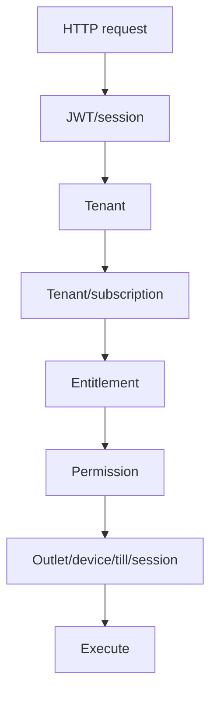

<!-- title: API Authorization Rules -->
<!-- status: Active -->
<!-- system: TM-EPOS MVP -->
<!-- last_updated: 2026-07-13 -->

# API Authorization Rules

## Purpose

This file defines how Release 1 APIs must enforce authentication,
authorization, tenant isolation, entitlement, permission, device, outlet, and
till-session rules.

Controllers must stay thin.

Application services and access-decision services must enforce access rules.

## Principle

A valid JWT is necessary but not sufficient.

## Standard Request Gate



## Tenant Context Rule

Tenant-owned APIs must not accept frontend `tenant_id` as source of truth.

Tenant context must be resolved from token/session and applied in services and repositories.

## Platform API Rules

Platform APIs require platform JWT authentication and explicit platform permission codes.

Frontend route guards and menu filtering are UX only. Backend service checks are mandatory.

### Implemented platform permission mapping (Option A)

| API Area | Required permission(s) |
|---|---|
| Platform dashboard | `platform.dashboard.view` |
| Tenant list/summary/filter | `platform.tenants.view` |
| Tenant create | `platform.tenants.create` |
| Tenant update | `platform.tenants.update` |
| Tenant activate | `platform.tenants.activate` |
| Tenant suspend | `platform.tenants.suspend` |
| Tenant entitlements | `platform.tenants.entitlements.update` |
| Subscription plan list/catalog | `platform.subscription_plans.view` |
| Subscription plan create/edit/publish | `platform.subscription_plans.create`, `platform.subscription_plans.edit` |
| Subscription plan duplicate/archive/delete | respective `platform.subscription_plans.*` codes |
| Permission catalog | `platform.permissions.view` |
| Platform roles | `platform.roles.view`, `platform.roles.create`, `platform.roles.update` |
| Platform role permissions | `platform.roles.permissions.view`, `platform.roles.permissions.update` |
| Platform users | `platform.users.view`, `platform.users.create`, `platform.users.update`, `platform.users.roles.assign` |
| Platform settings | `platform.settings.view`, `platform.settings.update` |
| Platform billing | `platform.billing.view`, `platform.billing.manage` |
| Platform audit logs (R1 login/security) | `platform.audit.view` → `GET /api/v1/platform-admin/audit-logs` |
| Platform integrations | `platform.integrations.manage` |
| Return policy templates | Respective `platform.return_policy_templates.*` action code |

Do not use umbrella-only checks such as `platform.subscriptions.manage` where granular codes already exist.

## Tenant Admin API Rules

| API Area | Required Checks |
|---|---|
| Outlet management | Tenant active, entitlement, permission |
| Till management | Tenant active, entitlement, permission |
| Device setup | Tenant active, entitlement, device permission |
| User management | Tenant active, entitlement, permission |
| Role/permission management | Tenant active, entitlement, permission |
| Permission catalog read | Tenant active, `roles.permissions.view`; catalog filtered by tenant entitlements |
| Role permission update | Tenant active, `roles.permissions.update`; assigned codes must stay within entitlements |
| Product management | Catalog entitlement and product permission |
| Catalog master data | Catalog entitlement and respective department, category, brand, collection, or return-policy permission |
| Inventory management | Inventory entitlement and inventory permission |
| Loyalty setup | Loyalty entitlement and loyalty permission |
| Reports | Reports entitlement and report permission |

## POS API Rules

| API Action | Required Checks |
|---|---|
| Create sale | POS entitlement, sale permission, outlet, trusted device, assigned till, open session |
| Park/recall sale | POS entitlement, sale permission, outlet, trusted device, open session |
| Apply discount | Discount entitlement, discount permission, policy check |
| Approve discount | Discount permission and manager PIN where required |
| Take payment | Payment entitlement, permission, open till session |
| Print receipt | Receipt entitlement, permission, device context |
| Return/refund | POS entitlement, permission, original sale validation |
| Exchange | POS entitlement, permission, exchange validation |
| Cash in/out | Cash drawer entitlement, permission, open till |
| Close till | Till permission, open till, cash count validation |

## POS Payment And Receipt Rules

Verified current backend behavior:

| Endpoint / Action | Required Permission Behavior | Notes |
|---|---|---|
| `POST /api/v1/pos/cart/calculate` | `sales.cart.update_item` | Direct cart calculate controller path. Needs Verification against intended `sales.cart.manage` alias. |
| `POST /api/v1/pos/checkout/summary` | `sales.checkout` | Recalculates totals and returns permitted payment methods. |
| `POST /api/v1/pos/checkout/start-payment` | `sales.checkout` plus selected method permission such as `payments.cash.accept` | Current Flutter cash completion path. |
| `POST /api/v1/pos/sales` | `sales.checkout` | Creates draft sale only. |
| `POST /api/v1/pos/sales/checkout` | `sales.checkout` | Alias for draft sale creation; not the full paid checkout flow. |
| `GET /api/v1/pos/sales/{saleId}` | `sales.view` | Returns sale/receipt detail for same tenant scope. |
| `POST /api/v1/pos/payments` | Selected payment method permission | Records payment for existing draft sale; cash completion generates receipt. |
| `GET /api/v1/pos/receipts/{saleId}` | `receipts.view` or `receipts.print` | Receipt preview/detail endpoint. |
| `POST /api/v1/pos/receipts/{saleId}/print` | `receipts.print` | Updates print metadata and inserts `receipt_print_logs`. |

## Device and Till Rules

POS APIs must validate trusted device, same tenant, same outlet, requested till
assignment where required, active till, one open till session, and user outlet
access.

## Payment Rule

Payment APIs must validate enabled tenant payment method, supported method type,
open till session where required, valid amount, correct split allocation, safe
provider reference storage, and no sensitive card-data storage.

## Post-Sale Rule

Return, refund, and exchange APIs must validate original sale inside same tenant,
returnable quantity, refundable amount, exchange values, difference direction,
customer credit where required, and consistent stock/payment records.

## Response Codes

| Case | Status |
|---|---|
| Missing/invalid token | 401 |
| Authenticated but not allowed | 403 |
| Validation error | 400 |
| Not found inside tenant scope | 404 |
| Duplicate/conflict | 409 |
| Unexpected server error | 500 |

## Standard Error Shape

```json
{
  "success": false,
  "message": "Access denied",
  "errorCode": "FORBIDDEN",
  "errors": [],
  "traceId": "00-..."
}
```

Do not expose stack traces, tokens, secrets, raw PINs, card data, or payment
secrets in API responses.

## Audit Rule

Audit tenant activation, payment status change, permission change, device
activation, till open/close, discount approval, refund approval, exchange
completion, cash movement, and report export where required.

### Platform Admin audit read (R1)

- Permission: `platform.audit.view`
- Endpoint: `GET /api/v1/platform-admin/audit-logs`
- R1 reads `platform_login_audits` only (`auditScope: platform_login_security`).
- Generic `audit_logs` business audit is not implemented in Unified Commerce R1.

## Related Files

- [[Backend_Driven_Permission_Catalog]]
- [[Access_Control_Overview]]
- [[Permission_Code_List]]
- [[Feature_Entitlement_Matrix]]
- [[../05_BACKEND_ARCHITECTURE/API_Standards]]
- [[../05_BACKEND_ARCHITECTURE/Error_Response_Standards]]
