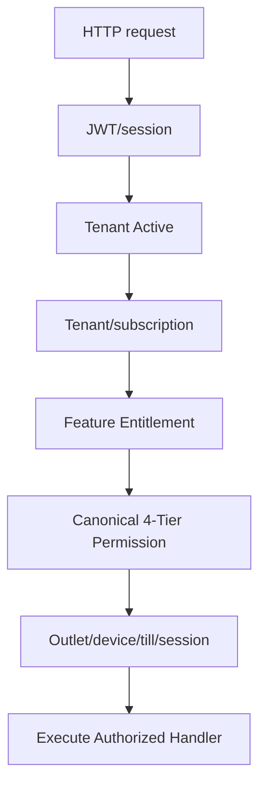

<!-- title: API Authorization Rules -->
<!-- status: Active -->
<!-- system: OneVerz POS MVP -->
<!-- last_updated: 2026-08-27 -->

# API Authorization Rules

## Purpose

This file defines how Release 1 APIs must enforce authentication, authorization, tenant isolation, entitlement, permission, device, outlet, and till-session rules using the canonical **4-Tier Permission Taxonomy** (`domain.module.feature.action`).

Controllers must stay thin; Application services and access-decision services enforce authorization gates.

---

## Principle

A valid JWT is necessary but not sufficient.

```mermaid
flowchart TD
    A[HTTP request] --> B[JWT/session]
    B --> C[Tenant Active]
    C --> D[Tenant/subscription]
    D --> E[Feature Entitlement]
    E --> F[Canonical 4-Tier Permission]
    F --> G[Outlet/device/till/session]
    G --> H[Execute Authorized Handler]
```

---

## Tenant Context Rule

Tenant-owned APIs must not accept frontend `tenant_id` as source of truth. Tenant context must be resolved from token/session claims and applied in repositories.

---

## Platform API Rules

Platform APIs require platform JWT authentication and explicit canonical `platform.*` permission codes.

### Implemented Platform Permission Mapping (Canonical 4-Tier)

| API Area | Canonical 4-Tier Permission | Legacy Alias (Deprecated) | Notes |
|---|---|---|---|
| Platform dashboard page / aggregate API | `platform.admin.dashboard.view` | `platform.dashboard.view` | Loads system health & tenant summary |
| Dashboard → tenant metrics / navigation | `platform.tenants.lifecycle.view` | `platform.tenants.view` | Destination data / list navigation |
| Dashboard commercial widgets (MRR, past due) | `platform.billing.invoices.view` | `platform.billing.view` | Hide when absent |
| Dashboard platform users count | `platform.users.management.view` | `platform.users.view` | Count platform users |
| Dashboard tenant subscriptions widget | `platform.tenants.subscriptions.view` | `platform.tenant_subscriptions.view` | Subscription metrics |
| Tenant list / summary / filter | `platform.tenants.lifecycle.view` | `platform.tenants.view` | List & filter tenants |
| Tenant create | `platform.tenants.lifecycle.create` | `platform.tenants.create` | Provision new tenant |
| Tenant update | `platform.tenants.lifecycle.update` | `platform.tenants.update` | Update profile / metadata |
| Tenant activate | `platform.tenants.lifecycle.activate` | `platform.tenants.activate` | Transition to active |
| Tenant suspend | `platform.tenants.lifecycle.suspend` | `platform.tenants.suspend` | Suspend tenant |
| Tenant entitlements update | `platform.tenants.entitlements.update` | `platform.tenants.entitlements.update` | Assign module entitlements |
| Subscription plan catalog | `platform.subscription_plans.lifecycle.view` | `platform.subscription_plans.view` | View plans |
| Subscription plan create / edit / publish | `platform.subscription_plans.lifecycle.create`, `platform.subscription_plans.lifecycle.edit` | `platform.subscription_plans.*` | Create & publish plan |
| Subscription plan duplicate / archive / delete | respective `platform.subscription_plans.lifecycle.*` codes | `platform.subscription_plans.*` | Lifecycle mutations |
| Permission catalog read | `platform.catalog.permissions.view` | `platform.permissions.view` | Read permissions tree |
| Platform roles management | `platform.roles.management.view`, `platform.roles.management.create`, `platform.roles.management.update` | `platform.roles.*` | Role CRUD |
| Platform role permissions | `platform.roles.permissions.view`, `platform.roles.permissions.update` | `platform.roles.permissions.*` | Assign permissions to role |
| Platform users management | `platform.users.management.view`, `platform.users.management.create`, `platform.users.management.update`, `platform.users.roles.assign` | `platform.users.*` | User CRUD & role assign |
| Platform settings | `platform.settings.configuration.view`, `platform.settings.configuration.update` | `platform.settings.*` | Platform configs |
| Platform billing & invoices | `platform.billing.invoices.view`, `platform.billing.invoices.manage` | `platform.billing.*` | Invoice issuance |
| Platform security audit logs | `platform.audit_logs.security.view` | `platform.audit.view` | `GET /api/v1/platform-admin/audit-logs` |
| Platform integrations | `platform.integrations.setup.manage` | `platform.integrations.manage` | Manage integrations |
| Return policy templates | Respective `platform.return_policy_templates.master.*` action code | `platform.return_policy_templates.*` | Master return templates |
| Selected-Tenant bootstrap summary | `platform.tenants.bootstrap.access` + `platform.tenants.lifecycle.view` | `platform.tenants.bootstrap.access` | Setup Hub access |
| Selected-Tenant bootstrap outlet create | `platform.tenants.bootstrap.outlets_manage` | `platform.tenants.bootstrap.outlets.manage` | Bootstrap outlet |
| Selected-Tenant bootstrap till create | `platform.tenants.bootstrap.tills_manage` | `platform.tenants.bootstrap.tills.manage` | Bootstrap till |
| Selected-Tenant bootstrap role create | `platform.tenants.bootstrap.roles_manage` | `platform.tenants.bootstrap.roles.manage` | Bootstrap role |
| Selected-Tenant bootstrap user create | `platform.tenants.bootstrap.users_manage` | `platform.tenants.bootstrap.users.manage` | Bootstrap user |
| Selected-Tenant bootstrap product create | `platform.tenants.bootstrap.products_manage` | `platform.tenants.bootstrap.products.manage` | Bootstrap product |
| Selected-Tenant bootstrap product import | `platform.tenants.bootstrap.products_import` | `platform.tenants.bootstrap.products.import` | Bootstrap CSV import |
| Selected-Tenant bootstrap online store | `platform.tenants.bootstrap.online_store_manage` | `platform.tenants.bootstrap.online_store.manage` | Bootstrap online store |

---

## Tenant Admin API Rules

| API Area | Required Checks & Canonical Permissions |
|---|---|
| **Outlet management** | Tenant active, entitlement, `tenant.outlets.management.view` / `manage` |
| **Till management** | Tenant active, entitlement `till_management`, `tenant.tills.management.view` / `create` / `update` / `delete` / `manage` |
| **Device setup** | Tenant active, `tenant.devices.management.manage` |
| **User management** | Tenant active, `tenant.users.management.manage` |
| **Role/permission management** | Tenant active, `tenant.roles.management.manage` |
| **Permission catalog read** | Tenant active, `tenant.roles.permissions.view` |
| **Role permission update** | Tenant active, `tenant.roles.permissions.update` |
| **Tax Management** | Catalog entitlement, `pricing.tax_classes.master.view`, `pricing.tax_rates.master.view` |
| **Product management** | Catalog entitlement and `catalog.products.master.view`, `create`, `update`, `delete`, `publish`, `restore`, or `duplicate` |
| **Catalog master data** | Catalog entitlement and respective `catalog.departments.master.*`, `catalog.categories.master.*`, `catalog.brands.master.*`, `catalog.collections.master.*`, `catalog.return_policies.master.*` |
| **Inventory management** | Inventory entitlement, `inventory.stock.levels.view`, `inventory.stock.adjustments.adjust` |
| **Reports** | Reports entitlement, `tenant.admin.dashboard.view` |

---

## POS API Rules

### POS Device Activation Authorization

| Endpoint | Canonical Authorization | Legacy Alias (Deprecated) | Context Checks |
|---|---|---|---|
| `GET /api/v1/devices/current` | `TenantOnly` | N/A | Tenant claims, fingerprint resolution |
| `POST /api/v1/devices/activate` | `TenantOnly` + **`tenant.tills.management.manage`** | `tenant.till.manage` | Code, till, device, assignment, fingerprint |

### POS Open / Close Till Authorization

| Endpoint | Canonical Authorization | Legacy Alias (Deprecated) | Context Checks |
|---|---|---|---|
| `GET /api/v1/tills/current-session` | `TenantOnly` + any of `pos.till.session.open`, `pos.till.session.close`, `pos.till.session.view` | `pos.till.open`, `pos.till.close`, `till.session.view` | Trusted ACTIVE device |
| `POST /api/v1/tills/open` | `TenantOnly` + **`pos.till.session.open`** | `pos.till.open` | Trusted ACTIVE device, active till, float >= 0 |
| `POST /api/v1/tills/close` | `TenantOnly` + **`pos.till.session.close`** | `pos.till.close` | Trusted device, Counted Cash, reconciliation reason |

---

### POS Customer API Authorization

| Endpoint | Canonical Permission | Legacy Alias (Deprecated) | Context Requirements |
|---|---|---|---|
| `GET /api/v1/customers/summary` | `pos.customers.management.view` | `customers.view` | Trusted device, assigned till, open session |
| `GET /api/v1/customers` | `pos.customers.management.view` | `customers.view` | Trusted device, assigned till, open session |
| `GET /api/v1/customers/{id}` | `pos.customers.management.view` | `customers.view` | Trusted device, assigned till, open session |
| `GET /api/v1/customers/{id}/orders` | `pos.customers.management.view` | `customers.view` | Trusted device, assigned till, open session |
| `POST /api/v1/customers` | `pos.customers.management.create` | `customers.create` | Trusted device, assigned till, open session |
| `PUT /api/v1/customers/{id}` | `pos.customers.management.update` | `customers.update` | Trusted device, assigned till, open session |
| `POST /api/v1/customers/{id}/attach-to-sale` | `pos.customers.management.view` + `pos.sales.cart.manage` | `customers.view` + `sales.cart.manage` | Trusted device, assigned till, open session |

---

### POS Sales, Cart & Park/Recall Authorization

| API Action / Endpoint | Canonical Permission | Legacy Alias (Deprecated) | Required Checks |
|---|---|---|---|
| `POST /api/v1/pos/sales` (Create draft) | `pos.sales.new_sale.create` | `sales.create` | POS entitlement, trusted device, open session |
| `POST /api/v1/pos/cart/calculate` | `pos.sales.cart.update_item` (or `manage`) | `sales.cart.update_item` | Recalculate line totals atomically |
| `POST /api/v1/pos/checkout/summary` | `pos.sales.checkout.execute` | `sales.checkout` | Recalculate totals & return permitted payment methods |
| `POST /api/v1/pos/checkout/start-payment` | `pos.sales.checkout.execute` + `pos.payments.cash.accept` | `sales.checkout` + `payments.cash.accept` | Cash completion path |
| `POST /api/v1/pos/holds` (Park Sale) | `pos.sales.held_sales.create` | `sales.park.create` | POS entitlement, trusted device, open till |
| `GET /api/v1/pos/holds` (List Parked Sales) | `pos.sales.held_sales.view` | `sales.park.view` | Same till, holding cashier, HELD, non-expired |
| `POST /api/v1/pos/holds/{id}/recall` | `pos.sales.held_sales.recall` | `sales.park.recall` | Same till, open till session |
| `DELETE /api/v1/pos/holds/{id}` (Cancel Parked) | `pos.sales.held_sales.create` | `sales.park.create` | Mandatory Cancel Reason |
| Apply Cashier Manual Discount | `pos.sales.manual_discount.apply` | `sales.discount.apply` | Discount entitlement, authority validation |
| Approve Over-Authority Discount | `pos.sales.discount.approve` | `sales.discount.approve` | Manager approval (deferred) |

---

### POS Payment, Receipts & Returns Authorization

| API Action / Endpoint | Canonical Permission | Legacy Alias (Deprecated) | Required Checks |
|---|---|---|---|
| `POST /api/v1/pos/payments` | `pos.payments.cash.accept` (or card/qr) | `payments.cash.accept` | Payment method enabled, open till session |
| `GET /api/v1/pos/sales/{saleId}` | `pos.sales.order_history.view` | `sales.view` | Tenant scope |
| `GET /api/v1/pos/receipts/{saleId}` | `pos.receipts.digital.view` | `receipts.view` | Receipt detail preview |
| `POST /api/v1/pos/receipts/{saleId}/print` | `pos.receipts.physical.print` | `receipts.print` | Inserts `receipt_print_logs` |
| `GET /api/v1/pos/returns/sales/search` | `pos.returns.search_sale.view` | `returns.view` | Outlet isolation, open till |
| `GET /api/v1/pos/returns/sales/{id}/eligibility` | `pos.returns.search_sale.view` | `returns.view` | Same outlet completed sale |
| `POST /api/v1/pos/returns/sales/{id}/eligibility-check` | `pos.returns.search_sale.view` | `returns.view` | Checklist non-mutating validation |
| `POST /api/v1/pos/returns` (Complete Return) | `pos.returns.workflow.create` + `pos.refunds.processing.create` | `returns.create` + `refunds.create` | Atomic refund commit |

---

## Click & Collect / Online Orders Staff APIs

| Endpoint / Capability | Canonical 4-Tier Permission | Notes |
|---|---|---|
| Orders Queue Entry | `commerce.online_order.orders.access` | Requires `click_collect` entitlement |
| List / View Orders | `commerce.online_order.orders.view` | Scoped to permitted outlet |
| Start Fulfilment | `commerce.online_order.fulfilment.start` | Transition to PICKING |
| View Picking Queue | `commerce.online_order.picking.view` | Item locations & quantities |
| Pick Item Line | `commerce.online_order.picking.pick` | Item quantity pick |
| Pack Package | `commerce.online_order.packing.pack` | Package completion |
| Mark Ready for Collection | `commerce.online_order.collection.mark_ready` | Customer ready dispatch |
| Handover & Finalize Collection | `commerce.online_order.collection.handover`, `commerce.online_order.collection.collect` | Atomic handover confirmation |
| Accept Pay-on-Collection Cash | `commerce.online_order.payment.accept_cash` | Unified payment integration |

---

## Response Status Codes & Errors

| Case | Status |
|---|---|
| Missing or invalid JWT | 401 Unauthorized |
| Authenticated but missing canonical permission | 403 Forbidden |
| Validation error / unparseable payload | 400 Bad Request / 422 Unprocessable Entity |
| Tenant / resource not found | 404 Not Found |
| State conflict / duplicate open session | 409 Conflict |

---

## Related Files

- [[Permission_Code_List]]
- [[../13_DECISIONS_AND_CHANGES/ADR/ADR_007_Permission_Code_Strategy]]
- [[Backend_Driven_Permission_Catalog]]
- [[Access_Control_Overview]]
- [[Feature_Entitlement_Matrix]]
