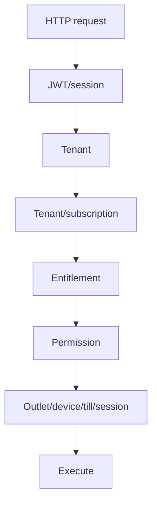

<!-- title: API Authorization Rules -->
<!-- status: Active -->
<!-- system: OneVerz POS MVP -->
<!-- last_updated: 2026-08-10 -->

# API Authorization Rules

## Purpose

This file defines how Release 1 APIs must enforce authentication,
authorization, tenant isolation, entitlement, permission, device, outlet, and
till-session rules.

Controllers must stay thin.

Application services and access-decision services must enforce access rules.

## Principle

A valid JWT is necessary but not sufficient.

## Standard Request Gate


```mermaid
flowchart TD
    A[HTTP request] --> B[JWT/session]
    B --> C[Tenant]
    C --> D[Tenant/subscription]
    D --> E[Entitlement]
    E --> F[Permission]
    F --> G[Outlet/device/till/session]
    G --> H[Execute]
```

## Tenant Context Rule

Tenant-owned APIs must not accept frontend `tenant_id` as source of truth.

Tenant context must be resolved from token/session and applied in services and repositories.

## Platform API Rules

Platform APIs require platform JWT authentication and explicit platform permission codes.

Frontend route guards and menu filtering are UX only. Backend service checks are mandatory.

### Implemented platform permission mapping (Option A)

| API Area | Required permission(s) |
|---|---|
| Platform dashboard page / aggregate API / R1 basic System Health | `platform.dashboard.view` |
| Dashboard → tenant metrics / attention navigation | `platform.tenants.view` (destination/data; page may still load without it) |
| Dashboard commercial widgets (MRR, pending billing, past-due values) | `platform.billing.view` (MRR additionally requires `platform.tenant_subscriptions.view`; hide when absent) |
| Dashboard Platform Users count | `platform.users.view` |
| Dashboard tenant-subscription metric widgets | `platform.tenant_subscriptions.view` (approved; **Partially Implemented** — catalogue/seed/Super Administrator grant + Backend Dashboard filtering present; Frontend widget/nav gating incomplete). Default grant: `super_administrator` only; Billing Admin, Support Admin, custom roles require explicit assignment. Permission-hidden sections must be omitted/hidden — not returned as authentic-looking zeros. |
| Tenant list/summary/filter | `platform.tenants.view` |
| Tenant create | `platform.tenants.create` |
| Tenant update | `platform.tenants.update` |
| Tenant activate | `platform.tenants.activate` |
| Tenant suspend | `platform.tenants.suspend` |
| Tenant entitlements | `platform.tenants.entitlements.update` |
| Subscription plan list/catalog | `platform.subscription_plans.view` |
| Subscription plan create/edit/publish | `platform.subscription_plans.create`, `platform.subscription_plans.edit` |
| Subscription plan duplicate/archive/delete | respective `platform.subscription_plans.*` codes |
| Permission catalog | `platform.permissions.view` |
| Platform roles | `platform.roles.view`, `platform.roles.create`, `platform.roles.update` |
| Platform role permissions | `platform.roles.permissions.view`, `platform.roles.permissions.update` |
| Platform users | `platform.users.view`, `platform.users.create`, `platform.users.update`, `platform.users.roles.assign` |
| Platform settings | `platform.settings.view`, `platform.settings.update` |
| Platform billing | `platform.billing.view`, `platform.billing.manage` |
| Platform audit logs (R1 login/security) | `platform.audit.view` → `GET /api/v1/platform-admin/audit-logs` |
| Platform integrations | `platform.integrations.manage` |
| Return policy templates | Respective `platform.return_policy_templates.*` action code |

Do not use umbrella-only checks such as `platform.subscriptions.manage` where granular codes already exist.

## Tenant Admin API Rules

| API Area | Required Checks |
|---|---|
| Outlet management | Tenant active, entitlement, permission |
| Till management | Tenant active, entitlement, permission |
| Device setup | Tenant active, entitlement, device permission |
| User management | Tenant active, entitlement, permission |
| Role/permission management | Tenant active, entitlement, permission |
| Permission catalog read | Tenant active, `roles.permissions.view`; catalog filtered by tenant entitlements |
| Role permission update | Tenant active, `roles.permissions.update`; assigned codes must stay within entitlements |
| Product management | Catalog entitlement and permission `catalog.products.view`, `catalog.products.create`, `catalog.products.update`, `catalog.products.delete`, `catalog.products.publish`, `catalog.products.restore`, or `catalog.products.duplicate` (Note: `catalog.products.import` remains in schema but is deferred and excluded from the active Tenant Admin UI scope). Legacy permission codes starting with `tenant.products.*` must be mapped to their canonical `catalog.products.*` equivalents in the Flutter client per ADR 007. |
| Catalog master data | Catalog entitlement and respective department, category, brand, collection, or return-policy permission |
| Inventory management | Inventory entitlement and inventory permission |
| Loyalty setup | Future/deferred; not active Release 1 Cashier Customer Management |
| Reports | Reports entitlement and report permission |

## POS API Rules

### POS Device Activation authorization

| Endpoint | Canonical authorization |
|---|---|
| `GET /api/v1/devices/current` | Authenticated `TenantOnly`; tenant from claims; fingerprint resolves only a same-tenant active trusted device and active assignment |
| `POST /api/v1/devices/activate` | Authenticated `TenantOnly` **and** `tenant.till.manage`; tenant from claims; code/till/device/assignment/fingerprint validation |

No new permission is required. Flutter `canActivatePosDevice` is a UX gate only;
backend enforcement of `tenant.till.manage` is authoritative. Backend service
enforcement and canonical 403 mapping were implemented and runtime-verified on
2026-08-11. `GET /devices/current` remains `TenantOnly` and does not require the
activation permission.

Activation must never accept client tenant identity as authority, log/store the
raw activation code, or persist partial trusted state after failure. Existing
same-device trusted resolution may be idempotent; a `USED` code must not re-pair
a changed fingerprint.

### POS Customer API authorization

Current implementation applies `[Authorize(Policy = "TenantOnly")]`, resolves
tenant/user from claims, checks the action permission in `PosCustomerService`,
and requires a valid trusted device assigned to a till with an open session for
every endpoint below. No separate customer entitlement check exists in the
current controller/service; this is an implementation gap if product policy
requires one.

| Endpoint | Permission | Device/till context |
|---|---|---|
| `GET /api/v1/customers/summary` | `customers.view` | Trusted device, assigned till, open session |
| `GET /api/v1/customers` | `customers.view` | Trusted device, assigned till, open session |
| `GET /api/v1/customers/{customerId}` | `customers.view` | Trusted device, assigned till, open session |
| `GET /api/v1/customers/{customerId}/orders` | `customers.view` | Trusted device, assigned till, open session |
| `POST /api/v1/customers` | `customers.create` | Trusted device, assigned till, open session |
| `PUT /api/v1/customers/{customerId}` | `customers.update` | Trusted device, assigned till, open session |
| `POST /api/v1/customers/{customerId}/attach-to-sale` | `customers.view` + `sales.cart.manage` | Trusted device, assigned till, open session |

Frontend route/button gating is UX only. Repository tenant predicates and
service status checks remain security authority.

| API Action | Required Checks |
|---|---|
| Create sale | POS entitlement, sale permission, outlet, trusted device, assigned till, open session |
| Park Sale | POS entitlement, `sales.park.create`, tenant context, trusted device, assigned till, open session |
| List Parked Sales | POS entitlement, `sales.park.view`; tenant + current till + holding cashier + HELD + non-expired (home count same predicate) |
| Recall Sale | POS entitlement, `sales.park.recall`, trusted device, same till, open session |
| Cancel Parked Sale | POS entitlement, `sales.park.create`; Cancel Reason mandatory at service |

Canonical codes: `sales.park.create`, `sales.park.view`, `sales.park.recall`.
Legacy aliases `pos.sale.park`, `pos.sale.park.view`, and `pos.sale.recall` are
demoted compatibility codes and must not authorize Flutter home/Park actions.
Frontend hiding is UX only; backend authorization is final. Cancel uses
`sales.park.create`; no separate cancel permission is approved.
Parked-sale detail uses `sales.park.view`; Start New Sale uses verified
`sales.create`. The exact list-screen mapping is documented in
[[../08_FLUTTER_POS_KNOWLEDGE/Flutter_Parked_Sales_Recall_Screen_Implementation_Specification]].
| Apply/cancel current cashier Discount | Discount entitlement, `sales.discount.apply`, tenant/outlet/device/till/session, user authority, cart/target, currency, one-discount and idempotency checks |
| Approve discount | Existing/deferred `sales.discount.approve`; not invoked by current cashier flow |

Offline permission/authority context is a cached snapshot only. Generic sync must
revalidate all gates and expose rejection/conflict. Current above-authority
cashier input is directly rejected, not routed to manager approval. See
[[../13_DECISIONS_AND_CHANGES/POS_CASHIER_DISCOUNT_CURRENT_RELEASE_DECISION_2026-08-09]].
| Take payment | Payment entitlement, permission, open till session |
| Print receipt | Receipt entitlement, permission, device context |
| Return/refund | POS entitlement, exact `returns.view` for shared Step 1 search/eligibility load, open till/outlet isolation, original sale validation |
| Exchange | POS entitlement, permission, exchange validation |
| Cash in/out | Cash drawer entitlement, permission, open till |
| Close till | Till permission, open till, cash count validation |

## Storefront Customer Authentication Rules

Customer authentication APIs are customer-facing online store APIs. They are not
platform admin auth and they are not tenant staff auth.

| API Area | Required Checks |
|---|---|
| Register | Storefront tenant context present, tenant active, unique email/phone inside tenant, valid password, terms/privacy consent captured, verification email delivery available. |
| Verify email | Storefront tenant context present, tenant/customer/OTP match, active tenant and customer, latest pending OTP, expiry and attempt limits enforced. |
| Resend verification | Storefront tenant context present, tenant active, account exists and is not already verified, previous pending OTPs invalidated before new OTP is sent. |
| Forgot password | Storefront tenant context present, tenant active, safe non-enumerating response where applicable, reset token stored only as hash, email delivery available. |
| Reset password | Storefront tenant context present, active reset token hash match, tenant/customer/account still active, token consumed after success. |
| Login | Storefront tenant context present, tenant/customer/account active, password valid, email verified before sign-in, lockout rules enforced. |
| Refresh | Storefront tenant context present, valid refresh cookie, token hash and session active, rotation and reuse detection enforced. |
| Logout | `CustomerOnly` JWT, tenant_id/sub/session_id from token, current session revoked, refresh cookie cleared. |
| Customer profile read/update | `CustomerOnly` JWT, tenant_id and customer id from token only, profile scoped to current customer and tenant. |

Customer auth APIs must not accept `tenant_id`, `customer_id`, raw OTP hashes,
password hashes, refresh-token hashes, or reset-token hashes from request bodies
as source of truth. Frontend route guards are UX helpers only; backend auth and
repository tenant filters remain the authority.

Current implementation status and QA gaps are tracked in
[[../15_IMPLEMENTATION_TRACKING/Backend/ECommerce/Customer_Auth_Implementation_Status]].
## Storefront Collection And Checkout Rules

Storefront public catalog and collection-option reads may use the storefront tenant context, but the backend must still validate that the tenant is active and that required entitlements are effective.

| API Area | Required Checks |
|---|---|
| Collection options read | Active tenant, effective `online_store`, effective `click_collect`, outlet belongs to tenant, collection enabled for outlet. |
| Checkout from cart/read/update/confirm | Customer JWT, active tenant, tenant/customer from token, session/cart scoped to same tenant and customer. |
| Checkout collection update | Existing checkout session, selected outlet belongs to tenant, requested time is generated/valid for outlet configuration, inventory reservation moved atomically when outlet changes. |
| Checkout confirm | Existing session, requested collection window present, collection timezone snapshot still matches outlet timezone, order created inside same tenant/customer scope. |
| Tenant admin enabling outlet collection | Tenant active, outlet-management access, effective `click_collect`, valid current open business-hours configuration. |

Checkout APIs must not accept tenant id or customer id from request payload as source of truth. Cross-tenant or cross-customer checkout session access returns not found. This release stores a requested collection window only; it does not reserve pickup-slot capacity.

## POS Payment And Receipt Rules

Verified current backend behavior:

| Endpoint / Action | Required Permission Behavior | Notes |
|---|---|---|
| `POST /api/v1/pos/cart/calculate` | `sales.cart.update_item` | Direct cart calculate controller path. Needs Verification against intended `sales.cart.manage` alias. |
| `POST /api/v1/pos/checkout/summary` | `sales.checkout` | Recalculates totals and returns permitted payment methods. |
| `POST /api/v1/pos/checkout/start-payment` | `sales.checkout` plus selected method permission such as `payments.cash.accept` | Current Flutter cash completion path. |
| `POST /api/v1/pos/sales` | `sales.checkout` | Creates draft sale only. |
| `POST /api/v1/pos/sales/checkout` | `sales.checkout` | Alias for draft sale creation; not the full paid checkout flow. |
| `GET /api/v1/pos/sales/{saleId}` | `sales.view` | Returns sale/receipt detail for same tenant scope. |
| `GET /api/v1/pos/returns/sales/search` | exact `returns.view` | Outlet from open till session; supports date/payment/amount filters and pagination. |
| `GET /api/v1/pos/returns/sales/{saleId}/eligibility` | exact `returns.view` | Same-outlet completed sale only; returns safe masked payment reference. |
| `POST /api/v1/pos/returns/sales/{saleId}/eligibility-check` | exact `returns.view` | Selected-line eligibility; non-mutating; same outlet isolation as GET. Checklist evaluates receipt (`requires_receipt`), payment settlement, product return policy, preliminary inspection, and manager-approval review. |
| `POST /api/v1/pos/payments` | Selected payment method permission | Records payment for existing draft sale; cash completion generates receipt. |
| `GET /api/v1/pos/receipts/{saleId}` | `receipts.view` or `receipts.print` | Receipt preview/detail endpoint. |
| `POST /api/v1/pos/receipts/{saleId}/print` | `receipts.print` | Updates print metadata and inserts `receipt_print_logs`. |

## Device and Till Rules

POS APIs must validate trusted device, same tenant, same outlet, requested till
assignment where required, active till, one open till session, and user outlet
access.

## Payment Rule

Payment APIs must validate enabled tenant payment method, supported method type,
open till session where required, valid amount, correct split allocation, safe
provider reference storage, and no sensitive card-data storage.

## Post-Sale Rule

Return, refund, and exchange APIs must validate original sale inside same tenant,
returnable quantity, refundable amount, exchange values, difference direction,
customer credit where required, and consistent stock/payment records.

## Response Codes

| Case | Status |
|---|---|
| Missing/invalid token | 401 |
| Authenticated but not allowed | 403 |
| Validation error | 400 or 422 depending on endpoint convention |
| Invalid return-search filters / search type | 422 |
| Not found inside tenant/outlet scope | 404 |
| Duplicate/conflict | 409 |
| Unexpected server error | 500 |

## Standard Error Shape

```json
{
  "success": false,
  "message": "Access denied",
  "errorCode": "FORBIDDEN",
  "errors": [],
  "traceId": "00-..."
}
```

Do not expose stack traces, tokens, secrets, raw PINs, card data, or payment
secrets in API responses.

## Audit Rule

Audit tenant activation, payment status change, permission change, device
activation, till open/close, discount approval, refund approval, exchange
completion, cash movement, and report export where required.

### Platform Admin audit read (R1)

- Permission: `platform.audit.view`
- Endpoint: `GET /api/v1/platform-admin/audit-logs`
- R1 reads `platform_login_audits` only (`auditScope: platform_login_security`).
- Generic `audit_logs` business audit is not implemented in Unified Commerce R1.

## Related Files

- [[Backend_Driven_Permission_Catalog]]
- [[Access_Control_Overview]]
- [[Permission_Code_List]]
- [[Feature_Entitlement_Matrix]]
- [[../05_BACKEND_ARCHITECTURE/API_Standards]]
- [[../05_BACKEND_ARCHITECTURE/Error_Response_Standards]]
