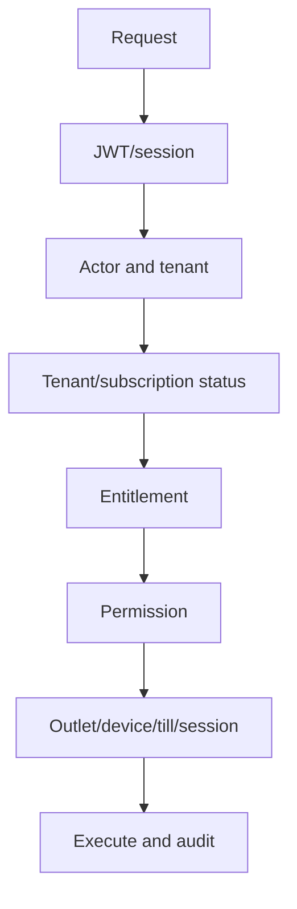

<!-- title: Access Control Overview -->
<!-- status: Active -->
<!-- system: SCS-TIX EPOS Release 1 -->
<!-- last_updated: 2026-06-18 -->

# Access Control Overview

## Purpose

This file explains the Release 1 access-control model for SCS-TIX EPOS.

Release 1 must not rely on login alone.

Protected POS and tenant operations must validate feature entitlement, permission,
outlet, trusted device, assigned till, and open till session where required.

## Access-Control Layers

| Layer | Purpose |
|---|---|
| Authentication | Confirms the actor is logged in |
| Tenant status | Confirms the tenant can operate |
| Feature entitlement | Confirms the tenant has the feature |
| Permission | Confirms the user can perform the action |
| Outlet access | Confirms the user can operate in the outlet |
| Device trust | Confirms the POS device is paired and trusted |
| Till context | Confirms the till is valid for the device |
| Till session | Confirms a session is open where required |

## Actor Boundaries

| Actor | Identity Source | Scope |
|---|---|---|
| Platform Admin | `platform_users` | Platform tenant/setup control |
| Tenant Admin | `users` | Tenant operations inside POS app |
| Cashier | `users` | POS checkout and till work |
| Manager | `users` | POS approval and operational permissions |

Platform Admin and Tenant User identities are separate boundaries.

## Main Tables

| Area | Tables |
|---|---|
| Platform identity | `platform_users`, `platform_roles`, `platform_permissions` |
| Tenant identity | `users`, `roles`, `permissions` |
| Role mapping | `platform_user_roles`, `tenant_user_roles`, `outlet_user_roles`, `role_permissions` |
| Features | `platform_modules`, `platform_features`, `tenant_feature_entitlements`, `feature_flags` |
| POS context | `pos_devices`, `till_activation_codes`, `device_pairing_requests`, `till_sessions` |

## Access Decision Flow

## Tenant Context Rule

Tenant-owned APIs must not trust `tenant_id` from the frontend.

Tenant context must come from authenticated user, session, and device context.

Repositories and services must filter tenant-owned data by resolved tenant.

## Platform Admin Rule

Platform Admin APIs can manage tenants only through platform permissions.

When a platform user manages a tenant, the action must be explicit and audited.

Platform access must not bypass tenant-side feature and permission rules.

## Tenant User Rule

Tenant users require tenant context for all tenant-owned APIs.

Tenant users must pass active user status, active tenant status, enabled feature
entitlement, required permission, and outlet assignment where outlet scope
applies.

## POS Rule

POS APIs require more than a valid token.

Sales, payment, refund, exchange, cash drawer, receipt, and till-close operations
must validate trusted device and till-session context.

## Feature vs Permission

| Concept | Meaning |
|---|---|
| Feature entitlement | Tenant is allowed to use a feature |
| Permission | User is allowed to perform an action |

Both must pass.

Entitlement without permission must not allow access.

Permission without entitlement must not allow access.

## Permission Catalog Rule

The permission catalog hierarchy is backend-driven:

- Platform Admin loads the full catalog from
  `/api/v1/platform-admin/permission-catalog`.
- Tenant Admin loads an entitlement-filtered catalog from
  `/api/v1/tenant-admin/permission-catalog`.
- Frontends must not hardcode module → feature → permission trees.
- Canonical permission codes in the database remain authoritative; alias codes
  are resolved in the application layer only.
- Tenant Admin role assignment APIs reject permissions outside tenant
  entitlements.

See [[Backend_Driven_Permission_Catalog]] for APIs, routes, and implementation
status.

## UI Rule

Flutter and Angular must render menus, buttons, routes, and actions from
entitlements and permissions.

Hidden UI is not enough.

The backend must enforce the same rules.

## Error Behavior

| Condition | Status |
|---|---|
| Missing or invalid login | 401 |
| Authenticated but blocked | 403 |
| Validation failure | 400 |
| Duplicate/conflict | 409 |

Use 403 for entitlement, permission, outlet, device, or till-session denial.

## Audit Requirement

Audit sensitive actions such as tenant activation, subscription payment status
change, permission change, device activation, till open/close, discount approval,
refund approval, exchange completion, and cash movement.

## Related Files

- [[Permission_Code_List]]
- [[Feature_Entitlement_Matrix]]
- [[API_Authorization_Rules]]
- [[../01_RELEASE_SCOPE/Release_1_Scope]]
- [[../05_BACKEND_ARCHITECTURE/Authorization_And_Permissions]]
