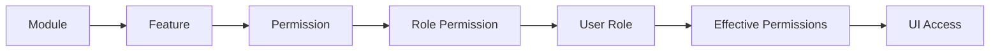

<!-- title: Backend Driven Permission Catalog -->
<!-- status: Active -->
<!-- system: SCS-TIX EPOS Release 1 -->
<!-- last_updated: 2026-06-23 -->

# Backend Driven Permission Catalog

## Purpose

This file is the Release 1 source of truth for the backend-driven permission
catalog: hierarchy, APIs, frontend integration rules, and known gaps.

The backend database and catalog APIs are authoritative. Frontends must load
catalog trees from the backend and must not hardcode module → feature →
permission structures.

## Architecture Flow

| Layer | Meaning |
|---|---|
| Module | Top-level product area (`platform_modules`) |
| Feature | Entitlement-capable feature (`platform_features`) |
| Permission | Action code in `permissions` or `platform_permissions` |
| Role Permission | Assignment in `role_permissions` or `platform_role_permissions` |
| User Role | `tenant_user_roles` / `platform_user_roles` |
| Effective Permissions | Resolved codes for the signed-in user in tenant context |
| UI Access | Menus, routes, buttons gated by effective permissions and entitlements |

## Source Of Truth Rules

| Rule | Detail |
|---|---|
| Backend catalog | Seeded in existing tables; exposed through catalog APIs |
| Canonical codes | Existing backend permission codes remain canonical |
| Aliases | Supported in application layer for plural/newer names; not duplicate DB rows |
| Platform Admin | Sees full catalog (all modules, features, permissions) |
| Tenant Admin | Sees entitlement-filtered catalog only |
| User access | Effective permissions come from role assignments |
| Frontend hiding | UX only; backend authorization is mandatory |
| Tenant assignment | Tenant Admin cannot assign permissions outside tenant entitlements |
| Schema | Do not create duplicate modules/features/permissions tables |

## Database And Migrations

Additive hierarchy columns on existing tables:

- `platform_modules`
- `platform_features`
- `permissions`
- `platform_permissions`

Release 1 migrations:

| Migration | Purpose |
|---|---|
| `20260620120000_AddPermissionCatalogHierarchyColumns` | Hierarchy/display columns |
| `20260620120100_SeedPermissionCatalogRelease1` | Release 1 catalog seed (`PermissionCatalogSeedData`) |
| `20260623103000_LinkTenantAdminSalesPermissions` | Correct existing databases so tenant-admin `sales.*` permissions link to the `sales` catalog feature |

Seed data must stay aligned with [[../05_BACKEND_ARCHITECTURE/Seed_Data_Standards]] and
[[Permission_Code_List]].

### Final Verification Fix 2026-06-23

During final Flutter Tenant Admin verification, the `tenant_admin_dev` role had
`sales.*` permissions assigned, but those permission rows were not linked to the
tenant-admin `sales` feature. Because Tenant Admin role saves validate the full
submitted permission set against tenant entitlements, this caused
`PUT /api/v1/tenant-admin/roles/{roleId}/permissions` to fail with
`ENTITLEMENT_DENIED`.

The fix is migration `20260623103000_LinkTenantAdminSalesPermissions`, backed by
the same mapping in `PermissionCatalogSeedData` for fresh databases.

## Backend APIs

### Platform Admin

| Method | Route | Permission | Purpose |
|---|---|---|---|
| GET | `/api/v1/platform-admin/permission-catalog` | `platform.permissions.view` | Hierarchical module → feature → permission catalog |
| GET | `/api/v1/platform-admin/permission-catalog/flat` | `platform.permissions.view` | Flat permission list |

### Tenant Admin

| Method | Route | Permission | Purpose |
|---|---|---|---|
| GET | `/api/v1/tenant-admin/permission-catalog` | `roles.permissions.view` | Entitlement-filtered hierarchical catalog |
| GET | `/api/v1/tenant-admin/roles/{roleId}/permissions` | `roles.permissions.view` | Permission codes assigned to a role |
| PUT | `/api/v1/tenant-admin/roles/{roleId}/permissions` | `roles.permissions.update` | Replace role permission assignments |
| GET | `/api/v1/tenant-admin/context` | Authenticated tenant admin | Session context; includes `effectivePermissions` and `enabledFeatures` |

### Tenant Context Fields

`GET /api/v1/tenant-admin/context` exposes:

| Field | Meaning |
|---|---|
| `effectivePermissions` | Resolved permission codes for the current user |
| `enabledFeatures` | Feature keys enabled for the tenant |
| `permissions` | Legacy alias; prefer `effectivePermissions` |
| `features` | Legacy alias; prefer `enabledFeatures` |
| `roles[]` | Tenant roles (id, name) for role picker until a dedicated roles list API exists |

Frontends should parse `effectivePermissions` / `enabledFeatures` first and fall
back to `permissions` / `features` for older responses.

## Frontend Routes

### Angular Platform Admin

| Route | Guard permission | API |
|---|---|---|
| `/admin/roles-permissions` | `platform.permissions.view` | `GET /api/v1/platform-admin/permission-catalog` |

Renders modules → features → permissions with search and scope filter
(platform / tenant / pos). No mock or hardcoded catalog arrays.

### Flutter Tenant Admin

| Route | Purpose |
|---|---|
| `/tenant-admin/roles-permissions` | Role list and entry to permission editor |
| `/tenant-admin/roles-permissions/:roleId` | Backend-driven permission tree with save |
| `/tenant-admin/roles` | Redirects to `/tenant-admin/roles-permissions` |
| `/tenant-admin/roles-access` | Redirects to `/tenant-admin/roles-permissions` |

Menu item **Roles & Access** points to `/tenant-admin/roles-permissions`.

Access codes (view/save) live in `tenant_admin_access_codes.dart` as typed
constants only; they are not the catalog source.

Alias normalization may use `tenant_admin_permission_aliases.dart` and backend
`TenantAdminPermissionAliases` for compatibility with canonical codes.

## Frontend Integration Rules

| Platform | Rule |
|---|---|
| Angular | Load catalog from platform-admin API; guard with `platform.permissions.view` |
| Flutter | Load catalog and role assignments from tenant-admin APIs; use repository/datasource pattern |
| Both | No hardcoded permission catalog trees or mock catalog data |
| Both | UI checks improve UX; every protected API must enforce the same permission on the backend |

## Known Gaps (Release 1)

| Gap | Current behavior |
|---|---|
| Tenant roles list API | Not available; Flutter uses `roles[]` from `tenant-admin/context` |
| Role CRUD screens | Placeholders; permission assignment is implemented |
| Root `flutter analyze` | Do not use; repo bundles a local Flutter SDK under `flutter/` |
| Flutter verification | Use `.\flutter\bin\dart.bat analyze lib` and `.\flutter\bin\flutter.bat test --no-pub` |

## Verification Summary

| Layer | Result | Reference |
|---|---|---|
| Backend | Build passed; migration applied; permission catalog APIs passed | Commit `0c7008e8fda4c9eb0892b44cfe2468155f73ebf6` |
| Angular Platform Admin | 95/95 tests passed | Commit `9626a85f28bccf379b3bf48d6f51de9718b2bace` |
| Flutter Tenant Admin | 90/90 tests passed; `dart analyze lib` clean | Commit `18e1b29` on `Nytroz-POS-App` |

Final backend-driven Tenant Admin verification:

- Login used real backend APIs, not mock data.
- `GET /api/v1/tenant-admin/permission-catalog` returned 5 modules and 99 permissions.
- `tenant_admin_dev` returned 84 assigned permissions.
- Search targets existed in the backend catalog: `role.view`, `roles.permissions.view`, and `outlet.view`.
- `activity.view` was toggled off successfully through `PUT /api/v1/tenant-admin/roles/{roleId}/permissions`.
- `activity.view` was toggled back on successfully through the same PUT endpoint.
- Visual browser/remote-debug click-through was not completed; the backend-driven UI flow was verified through real API calls and Flutter tests.

## Last Updated

| Date | Change | Commits |
|---|---|---|
| 2026-06-18 | Backend-driven permission catalog documented across backend, Angular, and Flutter | Backend `34d10999`, Angular `9626a85f`, Flutter `18e1b29` |
| 2026-06-23 | Recorded final tenant-admin sales permission catalog fix and real API save verification | Backend `0c7008e8`, Flutter `18e1b29` |

## Related Files

- [[Access_Control_Overview]]
- [[Permission_Code_List]]
- [[API_Authorization_Rules]]
- [[Feature_Entitlement_Matrix]]
- [[../03_USER_JOURNEYS/Tenant_Admin/06_Role_Permission_Flow]]
- [[../05_BACKEND_ARCHITECTURE/Authorization_And_Permissions]]
- [[../05_BACKEND_ARCHITECTURE/API_ENDPOINTS]]
- [[../05_BACKEND_ARCHITECTURE/Seed_Data_Standards]]
- [[../06_DATABASE_KNOWLEDGE/Migration_Rules]]
- [[../08_FLUTTER_POS_KNOWLEDGE/Flutter/Flutter_Routing_Guards]]
- [[../09_ANGULAR_ADMIN_KNOWLEDGE/Routing_And_Guards]]
