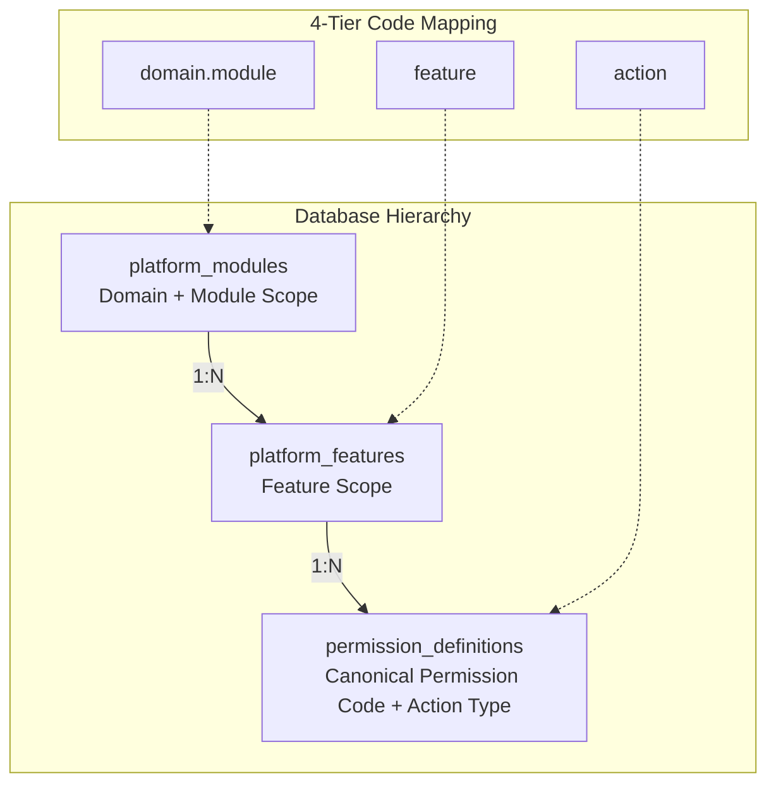

<!-- title: Backend Driven Permission Catalog -->
<!-- status: CANONICAL — LOCKED & MERGED -->
<!-- system: OneVerz POS MVP -->
<!-- last_updated: 2026-09-09 -->

# Backend Driven Permission Catalog

> **Permission & Entitlement Contract Reconciled: 2026-08-28 — CANONICAL / LOCKED FOR RELEASE 1**  
> Full Release-1 catalog: [CANONICAL_MODULE_FEATURE_PERMISSION_CATALOG_R1.md](file:///c:/Users/User/Desktop/Nytroz__POS/Nytroz%20POS%20-%20Second%20Brain/Pos-system-Knowledge/02_ACCESS_CONTROL/CANONICAL_MODULE_FEATURE_PERMISSION_CATALOG_R1.md).

## Purpose

This document defines the backend-driven permission catalog architecture for the OneVerz POS / Unified Commerce system.

The frontend must not own the permission catalog or define standalone permission trees. The backend database seeds and catalog APIs (`/api/v1/permissions/catalog`) are the authoritative source of truth.

```text
NO production frontend-owned permission list as Source of Truth.
```

```text
Canonical Permission Definitions
        ↓
Database / Backend Seed
        ↓
Backend Permission Catalog API
        ↓
Frontend Rendering
```

---

## 4-Tier Taxonomy Database Mapping

The canonical **4-Tier Permission Taxonomy** (`domain.module.feature.action`) aligns directly with the existing relational database catalog hierarchy:


```mermaid
flowchart TD
    subgraph Database Hierarchy
        PM[platform_modules<br/>Domain + Module Scope]
        PF[platform_features<br/>Feature Scope]
        PD[permission_definitions<br/>Canonical Permission Code + Action Type]
    end

    PM -->|1:N| PF
    PF -->|1:N| PD

    subgraph 4-Tier Code Mapping
        T1[domain.module] -.-> PM
        T2[feature] -.-> PF
        T3[action] -.-> PD
    end
```

### Structural Mapping Breakdown

| 4-Tier Segment | Meaning | Database Table / Column | Catalog Hierarchy Role |
|---|---|---|---|
| **`domain.module`** | High-level domain and functional business module | `platform_modules.module_code` (e.g. `pos_sales`, `catalog_products`, `platform_admin`) | **Top-Level Navigation Grouping** |
| **`feature`** | Specific capability or sub-area | `platform_features.feature_code` (e.g. `pos_new_sale`, `pos_discount`, `product_master`) | **Sub-Feature Grouping & Entitlement Gate** |
| **`action`** | Specific allowed operation verb | `permission_definitions.action_type` (e.g. `view`, `create`, `apply`, `manage`) | **Action Capability** |
| **`Full Code`** | Canonical executable permission string | `permission_definitions.permission_code` (e.g. `pos.sales.new_sale.create`) | **Unique Permission Identity & Auth Key** |

### Distinction of Concerns

1. **Grouping / Navigation Hierarchy:** `platform_modules` and `platform_features` provide the structural catalog tree for Angular Platform Admin and Tenant Admin role-permission assignment screens.
2. **Permission Identity:** `permission_definitions.id` (UUID) serves as the foreign key in role-permission join tables (`tenant_role_permissions`, `role_template_version_permissions`, `outlet_user_permissions`).
3. **Executable Authorization Code:** `permission_definitions.permission_code` is the canonical 4-tier string (`domain.module.feature.action`) transmitted in JWT claims (`permissionCodes`) and evaluated by Backend API guards and Frontend route/action checks.

---

## Catalog Principles

1. **Database-Driven Authority:** Permissions are stored as immutable, versioned records in `permission_definitions`.
2. **Role Grouping:** Roles group permission records. Users inherit permissions dynamically through tenant user roles, role templates, or direct assignments.
3. **Tenant & Outlet Context:** Outlet-scoped roles and permissions apply when an action belongs to a physical outlet, till, device, POS flow, stock location, pickup point, or cash session.
4. **Entitlement Precondition:** A permission cannot authorize an action if the parent tenant feature entitlement is disabled (e.g. `commerce.online_order.picking.pick` is invalid if `click_collect` entitlement is disabled).

---

## Catalog Consumers

| Consumer | Usage |
|---|---|
| **Backend APIs** | Final security authorization using `[AuthorizePermission(CanonicalCode)]` |
| **Flutter POS App** | Renders/hides/disables screens, cards, and buttons via `PosPermissionAccess` |
| **Tenant Admin Angular App** | Dynamically builds navigation menus and role-permission matrices |
| **Platform Admin Angular App** | Manages subscription plan entitlements and platform role permissions |
| **QA / Automated Testing** | Automated permission boundary testing and security audit assertions |

---

## Frontend Integration Rules

1. **No Static Trees:** Frontends must fetch the dynamic catalog from backend APIs rather than maintaining duplicate JSON trees.
2. **Compile-Time Safety Constants:** Static constants (such as `PosPermissionCodes` in Flutter) are strictly compile-time references for guarded routes and UI actions.
3. **No Hardcoded Roles:** UI components must never check `role == 'cashier'` or `role == 'admin'`. Visibility and interaction must evaluate canonical 4-tier permission codes.

---

## Related Files

- [[CANONICAL_PERMISSION_AND_FEATURE_ENTITLEMENT_CONTRACT_R1]]
- [[Permission_Code_List]]
- [[../13_DECISIONS_AND_CHANGES/ADR/ADR_007_Permission_Code_Strategy]]
- [[Feature_Entitlement_Matrix]]
- [[API_Authorization_Rules]]

<!-- RBAC_HARDENING_2026_08_15_START -->
## Tenant Admin Permission Catalog Gap - 2026-08-15

Flutter expects `GET /api/v1/tenant-admin/permission-catalog`.

Backend source inspection found Platform Admin permission catalog endpoints, but did not verify a Tenant Admin permission catalog endpoint. Platform Admin endpoints must not be used as a substitute because Tenant Admin catalog responses must be tenant-isolated and entitlement-filtered.

Status: `MISSING BACKEND CONTRACT`.
<!-- RBAC_HARDENING_2026_08_15_END -->

<!-- RBAC_RUNTIME_RECONCILIATION_2026_08_21_START -->
## Tenant Admin Catalog Runtime Reconciliation - 2026-08-21

`GET /api/v1/tenant-admin/permission-catalog` is implemented and is the only
catalog source for Tenant Admin role setup. It must remain tenant-isolated,
entitlement-aware, permission-definition-driven, and constrained by the
authenticated actor's delegation ceiling.

When a role is edited, every active persisted role permission must be returned
as an assignable catalog item or be explicitly locked and preserved. Silent
catalog omission must never permit a replacement save to revoke a permission.

Authenticated runtime validation found a Cashier role with 44 active persisted
permission grants and no matching returned catalog permissions. No mutation was
performed. Status: `BLOCKED — reconcile catalog, seed, entitlement, and
delegation projections before production role editing.`

This section supersedes the 2026-08-15 missing-endpoint conclusion above.
<!-- RBAC_RUNTIME_RECONCILIATION_2026_08_21_END -->

## User Creation Consumption — 2026-08-25

Tenant Admin Add New User uses the backend catalog to group and preview inherited role permissions and optional additive direct user grants. Role choices come from user `create-options`, not a static UI list. The catalog must not present platform, inactive, unentitled, or non-delegable permissions as assignable. A role change requires the client to rebuild its module summary and the backend to revalidate every direct grant on final save.

- [[../06_DATABASE_KNOWLEDGE/Tables/06_Tenant_Users_Roles_Permissions_And_Outlet_Access_UPDATED]]
