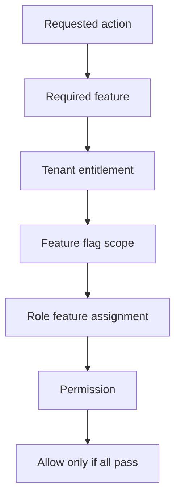

<!-- title: Feature Entitlement Matrix -->
<!-- status: Active -->
<!-- system: SCS-TIX EPOS Release 1 -->
<!-- last_updated: 2026-06-23 -->

# Feature Entitlement Matrix

## Purpose

This file explains how tenant feature entitlements control Release 1 access.

Feature entitlement decides whether a tenant can use a feature.

Permission decides whether a specific user can perform an action.

Both are required.

## Entitlement Tables

| Table | Purpose |
|---|---|
| `platform_modules` | Platform-owned module catalog |
| `platform_features` | Feature catalog |
| `subscription_plan_features` | Features included in a plan |
| `tenant_feature_entitlements` | Features enabled for a tenant |
| `feature_flags` | Runtime enablement by tenant/outlet/user |
| `role_feature_assignments` | Features assigned to roles |

## Entitlement Evaluation

## Feature vs Permission

| Concept | Question |
|---|---|
| Feature entitlement | Is the tenant enabled for this feature? |
| Feature flag | Is the feature enabled for this scope? |
| Role feature assignment | Is the feature assigned to the role? |
| Permission | Can the user perform this action? |

Entitlement without permission must not allow access.

Permission without entitlement must not allow access.

## Release 1 Feature Areas

| Feature Area | Release 1 Position |
|---|---|
| Platform tenant setup | Included |
| Subscription/billing | Included |
| POS and Portable POS | Included |
| Catalog/product | Included |
| Basic inventory and expiry | Included |
| Discount | Included |
| Customer/loyalty | Included |
| Return/refund/exchange | Included |
| Reports and hardware | Included |
| E-commerce/offline/supplier/kiosk | Excluded |

## POS Entitlement Matrix

| Operation | Required Entitlement | Required Context |
|---|---|---|
| Start sale | POS enabled | Outlet, trusted device, till session |
| Portable sale | Portable POS/POS enabled | Outlet, trusted device |
| Apply discount | Discount or POS discount enabled | Sale context and permission |
| Take payment | POS payment enabled | Open till/session where required |
| Print receipt | Receipt/POS enabled | Device and receipt template |
| Return/refund | POS enabled | Original sale validation |
| Exchange | POS enabled | Return/exchange validation |
| Cash in/out | POS cash drawer enabled | Open till session |
| Close till | POS till enabled | Open till session |

## Tenant Admin Matrix

| Operation | Required Entitlement |
|---|---|
| Manage outlets | Outlet/setup enabled |
| Manage tills | Till/setup enabled |
| Manage users | User management enabled |
| Manage roles/permissions | Role/permission enabled |
| Manage products | Catalog/product enabled |
| Import products | Product import enabled |
| Manage inventory | Inventory enabled |
| View expiry | Expiry tracking enabled |
| Configure expiry discount | Discount/expiry discount enabled |
| Manage loyalty | Loyalty enabled |
| View reports | Reports enabled |

## Feature Flag Scope

| Scope | Meaning |
|---|---|
| Tenant | Whole tenant |
| Outlet | One outlet |
| User | One user |

Outlet and user flags must remain inside the same tenant boundary.

## UI Rendering Rule

Menus, buttons, tabs, and routes must render only when tenant feature, feature
flag, role feature assignment where used, and permission all allow access.

Backend checks remain mandatory.

Tenant Admin permission catalog APIs filter modules, features, and permissions by
`tenant_feature_entitlements`. See [[Backend_Driven_Permission_Catalog]].

## Final Catalog Entitlement Fix 2026-06-23

Tenant Admin role-permission saves validate every submitted permission against
the tenant's enabled catalog. Final verification found that `tenant_admin_dev`
already had `sales.summary.view` and `sales.orders.view`, but these `sales.*`
permissions were not linked to the Tenant Admin `sales` feature. This made a
safe save operation fail because the full submitted permission set contained
permissions outside the entitlement-filtered catalog.

Migration `20260623103000_LinkTenantAdminSalesPermissions` links `sales.*`
tenant-admin permissions to the `sales` feature. After the migration:

- Tenant Admin catalog returned 5 modules and 99 permissions.
- `tenant_admin_dev` retained 84 assigned permissions.
- `activity.view` could be toggled off and back on through the real backend PUT endpoint.

## Excluded Entitlements

Do not create active Release 1 entitlement behavior for e-commerce, Click &
Collect, offline sync, supplier management, stock transfer, delivery, kiosk,
coupon engine, AI modules, or full accounting.

These may appear only as future/deferred catalog values if clearly marked.

## Related Files

- [[Backend_Driven_Permission_Catalog]]
- [[Access_Control_Overview]]
- [[Permission_Code_List]]
- [[API_Authorization_Rules]]
- [[../01_RELEASE_SCOPE/Included_Features]]
- [[../01_RELEASE_SCOPE/Excluded_Features]]

## Platform Role Management Feature 2026-06-23

Platform Admin role management is a platform-side feature under `platform_users` / `platform_role_management`. It uses platform permissions, not tenant feature entitlements. Tenant entitlement filtering does not apply to Platform Admin role assignments.

The feature and its five permissions are seeded by `20260623120000_SeedPlatformRoleManagementPermissions` and granted to `super_administrator`.
