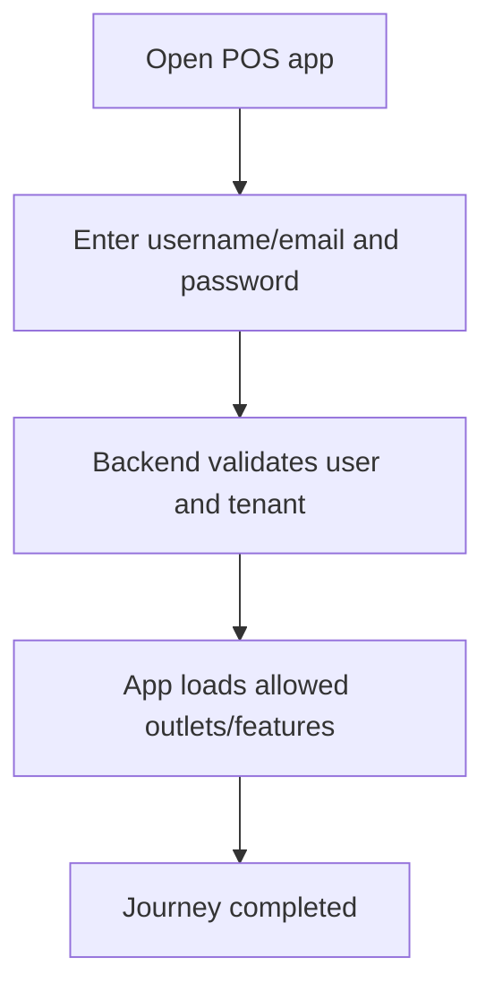

<!-- title: Cashier Login Flow -->
<!-- status: Active -->
<!-- system: SCS-TIX EPOS Release 1 -->
<!-- last_updated: 2026-06-08 -->

# Cashier Login Flow

## Purpose

Defines cashier login to the Flutter POS app before POS operations.

## Source Basis

This journey is based on the uploaded SCS-TIX Release 1 user journey files, UI
screens, backend architecture, database design, and confirmed project decisions.

It must not be expanded into e-commerce, offline sync, supplier, delivery, kiosk,
coupon, AI, or accounting scope.

## Actors

| Actor | Responsibility |
|---|---|
| Cashier | Logs in to POS app |
| Backend | Validates tenant user and session |
| POS App | Stores token securely |

## Preconditions

- Cashier user exists.
- Password is set.
- Tenant is active or allowed for operation.

## Main Flow

| Step | User/System Action | Expected Result |
|---:|---|---|
| 1 | Open POS app | Login screen appears |
| 2 | Enter username/email and password | Credentials are submitted |
| 3 | Backend validates user and tenant | Access and refresh token are issued |
| 4 | App loads allowed outlets/features | Permission-based home appears |

## Journey Diagram



## Business Rules

- Tenant users use `users`, not `platform_users`.
- Login alone does not allow POS checkout.
- Tenant status must be checked.
- Tokens must be stored securely by app.

## Access-Control Rules

| Control | Required Rule |
|---|---|
| Authentication | Required |
| Tenant status | Required |
| Permission | Applied after login |
| Audit | Login/session logged where required |

## Data and API References

| Area | References |
|---|---|
| API endpoint | `POST /api/v1/auth/tenant-login` |
| Request fields | `email`, `password` |
| Tables | `users`, `auth_sessions`, `refresh_tokens`, `tenant_user_roles`, `outlet_user_roles` |

Local development cashier credentials:

```text
Email: cashier001@gmail.com
Password: 123456
```

## Edge Cases

- Invalid credentials show safe error.
- Suspended tenant/user cannot continue.
- No outlet assignment must show no-outlet state.

## Out of Scope

- Platform login is separate.
- Offline login is excluded.
- Tenant Code is no longer entered on the POS login screen. Backend resolves the tenant from the tenant user email and returns a clear tenant-selection error if the email belongs to multiple tenants.

## Completion Criteria

- The user reaches the expected final state without bypassing access control.
- Tenant-owned data remains inside the resolved tenant context.
- Sensitive actions write audit records where required.
- UI state and backend state stay consistent after completion.

## Related Files

- [[../01_RELEASE_SCOPE/Release_1_Scope]]
- [[../02_ACCESS_CONTROL/Access_Control_Overview]]
- [[../05_BACKEND_ARCHITECTURE/API_Standards]]
