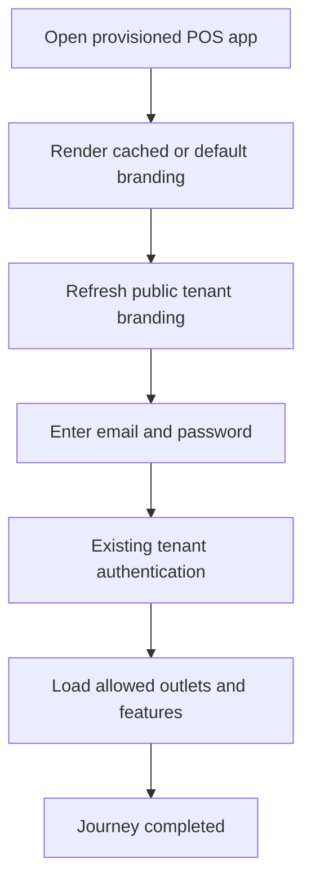

<!-- title: Cashier Login Flow -->
<!-- status: Active -->
<!-- system: OneVerz POS MVP -->
<!-- last_updated: 2026-08-10 -->

# Cashier Login Flow

## Purpose

Defines cashier login to the Flutter POS app before POS operations.

## Source Basis

This journey is based on the uploaded SCS-TIX Release 1 user journey files, UI
screens, backend architecture, database design, and confirmed project decisions.

It must not be expanded into e-commerce, offline sync, supplier, delivery, kiosk,
coupon, AI, or accounting scope.

## Actors

| Actor | Responsibility |
|---|---|
| Cashier | Logs in to POS app |
| Backend | Validates tenant user and session |
| POS App | Stores token securely |

## Preconditions

- Cashier user exists.
- Password is set.
- Tenant is active or allowed for operation.

## Main Flow

| Step | User/System Action | Expected Result |
|---:|---|---|
| 1 | Open provisioned POS app | Resolve the provisioned public `tenantSlug`; show cached branding or platform defaults immediately |
| 2 | App refreshes public branding in background | Branded login updates without hiding or blocking credentials |
| 3 | Enter email and password and press Sign In once | Existing local validation and duplicate-submit guard run |
| 4 | Existing backend validates user and tenant | Access and refresh token are issued |
| 5 | App stores the session securely and resolves device/till context | Cashier is routed to activation, till open, or POS home |

## Journey Diagram

```mermaid
flowchart TD
    S1[Open provisioned POS app]
    S1 --> S2[Render cached or default branding]
    S2 --> S3[Refresh public tenant branding]
    S3 --> S4[Enter email and password]
    S4 --> S5[Existing tenant authentication]
    S5 --> S6[Load allowed outlets and features]
    S6 --> Done[Journey completed]
```

## Business Rules

- Tenant users use `users`, not `platform_users`.
- Login alone does not allow POS checkout.
- Tenant status must be checked.
- Tokens must be stored securely by app.
- Branding lookup uses provisioned `tenantSlug`, never entered email.
- Branding failure does not prevent authentication.
- When post-login routing requires Device Activation, the Activation screen
  reuses the same shared left branding panel and fallback behavior as Login;
  only the right-side form content changes.

## Access-Control Rules

| Control | Required Rule |
|---|---|
| Authentication | Required |
| Tenant status | Required |
| Permission | Applied after login |
| Audit | Login/session logged where required |

## Data and API References

| Area | References |
|---|---|
| API endpoints | `POST /api/v1/tenant-auth/login`, `POST /api/v1/tenant-auth/refresh`, `POST /api/v1/tenant-auth/logout` |
| Request fields | `email`, `password` |
| Session data | Tenant auth session and rotating refresh-token records defined by the current authentication module |

Flutter stores the authenticated session through secure storage. Concurrent 401
responses share one refresh operation; successful refresh retries each request
once. A retried 401 is not refreshed repeatedly.

## Edge Cases

- Invalid credentials show safe error.
- Suspended tenant/user cannot continue.
- No outlet assignment must show no-outlet state.

## Out of Scope

- Platform login is separate.
- Offline login is not implemented. Controlled offline operation remains part of
  the wider MVP scope, but it does not currently make authentication locally
  authoritative.
- Tenant Code is no longer entered on the POS login screen. Backend resolves the tenant from the tenant user email and returns a clear tenant-selection error if the email belongs to multiple tenants.
- Tenant POS staff Forgot Password is hidden and deferred for Release 1; customer e-commerce password reset is a separate flow.

## Completion Criteria

- The user reaches the expected final state without bypassing access control.
- Tenant-owned data remains inside the resolved tenant context.
- Sensitive actions write audit records where required.
- UI state and backend state stay consistent after completion.

## Related Files

- [[../../01_RELEASE_SCOPE/Release_1_Scope]]
- [[../../02_ACCESS_CONTROL/Access_Control_Overview]]
- [[../../05_BACKEND_ARCHITECTURE/API_Standards]]
- [[../../04_MODULE_KNOWLEDGE/02_Tenant_Foundation/04_POS_Login_Branding_Functional_Rules]]
