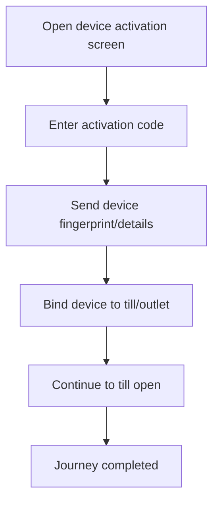

<!-- title: Device Activation Flow -->
<!-- status: Active -->
<!-- system: TM-EPOS MVP -->
<!-- last_updated: 2026-07-23 -->

# Device Activation Flow

## Purpose

Defines POS device activation using till activation code.

## Source Basis

This journey is based on the uploaded SCS-TIX Release 1 user journey files, UI
screens, backend architecture, database design, and confirmed project decisions.

It must not be expanded into e-commerce, offline sync, supplier, delivery, kiosk,
coupon, AI, or accounting scope.

## Actors

| Actor | Responsibility |
|---|---|
| Cashier/User | Enters activation code on POS device |
| Tenant Admin | Provides activation code |
| Backend | Pairs and trusts POS device |

## Preconditions

- Till exists and is active.
- Activation code exists and is active.
- Device is not already blocked.

## Main Flow

| Step | User/System Action | Expected Result |
|---:|---|---|
| 1 | Open device activation screen | Activation input appears |
| 2 | Enter activation code | Backend validates code hash |
| 3 | Send device fingerprint/details | Backend resolves or creates the trusted device context |
| 4 | Bind device to till/outlet | Device becomes trusted if valid |
| 5 | Continue to till open | POS context is available |

## Journey Diagram

## Business Rules

- Activation code is generated after till creation.
- Raw activation code must not be stored.
- Trusted device must match tenant/outlet/till.
- Expired or used code cannot be reused.

## Access-Control Rules

| Control | Required Rule |
|---|---|
| Authentication | May require setup/login context |
| Activation code | Required |
| Trusted device | Established by flow |
| Audit | Required for activation |

## Data and API References

| Area | References |
|---|---|
| API endpoints | `GET /api/v1/devices/current`, `POST /api/v1/devices/activate` |
| Request context | Activation code, device fingerprint and device metadata |
| Tables | `pos_devices`, `till_activation_codes`, `till_device_assignments`, `tills`, `outlets` |

## Edge Cases

- Invalid code returns safe error.
- Expired code requires regeneration.
- Device already trusted should not duplicate device record.

## Out of Scope

- Kiosk activation is excluded.
- Offline device activation is not implemented.

## Completion Criteria

- The user reaches the expected final state without bypassing access control.
- Tenant-owned data remains inside the resolved tenant context.
- Sensitive actions write audit records where required.
- UI state and backend state stay consistent after completion.

## Related Files

- [[../../01_RELEASE_SCOPE/Release_1_Scope]]
- [[../../02_ACCESS_CONTROL/Access_Control_Overview]]
- [[../../05_BACKEND_ARCHITECTURE/API_Standards]]
