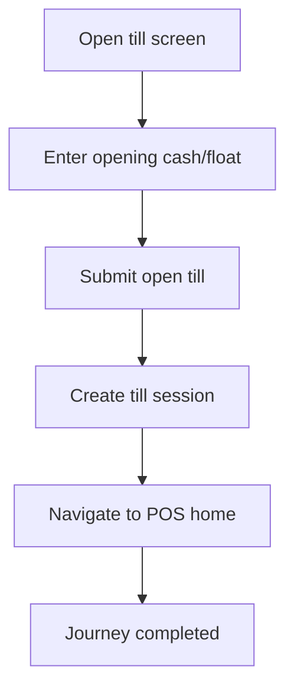

<!-- title: Till Open Flow -->
<!-- status: Active -->
<!-- system: SCS-TIX EPOS Release 1 -->
<!-- last_updated: 2026-06-08 -->

# Till Open Flow

## Purpose

Defines cashier till opening before checkout.

## Source Basis

This journey is based on the uploaded SCS-TIX Release 1 user journey files, UI
screens, backend architecture, database design, and confirmed project decisions.

It must not be expanded into e-commerce, offline sync, supplier, delivery, kiosk,
coupon, AI, or accounting scope.

## Actors

| Actor | Responsibility |
|---|---|
| Cashier | Opens till with opening cash |
| Backend | Creates till session |
| POS Device | Provides trusted device context |

## Preconditions

- Cashier is logged in.
- Device is trusted.
- Till is active and assigned.
- No active open session exists for the till.

## Main Flow

| Step | User/System Action | Expected Result |
|---:|---|---|
| 1 | Open till screen | Assigned till and outlet are shown |
| 2 | Enter opening cash/float | Amount is validated |
| 3 | Submit open till | Backend validates device/till/outlet |
| 4 | Create till session | Open session is stored |
| 5 | Navigate to POS home | Start sale becomes available |

## Journey Diagram

## Business Rules

- Only one open till session per till is allowed.
- Opening cash must be non-negative.
- Till open requires trusted device and outlet access.
- Till session is required for checkout/cash operations.

## Access-Control Rules

| Control | Required Rule |
|---|---|
| Authentication | Required |
| Feature entitlement | POS/till enabled |
| Permission | Till open permission |
| Trusted device | Required |
| Open till session | Created by flow |

## Data and API References

| Area | References |
|---|---|
| API groups | `/api/v1/tills`, `/api/v1/pos/sales` |
| Tables | `till_sessions`, `cash_count_denominations`, `pos_devices`, `tills` |

## Edge Cases

- Already open till returns conflict.
- Wrong outlet/device returns 403.
- Invalid amount returns validation error.

## Out of Scope

- Offline till opening is excluded.
- Customer display is excluded.

## Completion Criteria

- The user reaches the expected final state without bypassing access control.
- Tenant-owned data remains inside the resolved tenant context.
- Sensitive actions write audit records where required.
- UI state and backend state stay consistent after completion.

## Related Files

- [[../01_RELEASE_SCOPE/Release_1_Scope]]
- [[../02_ACCESS_CONTROL/Access_Control_Overview]]
- [[../05_BACKEND_ARCHITECTURE/API_Standards]]
