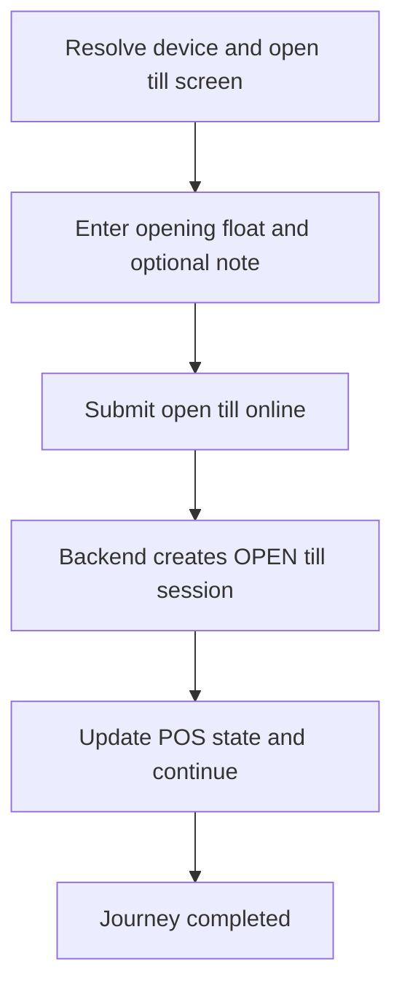

<!-- title: Till Open Flow -->
<!-- status: Active -->
<!-- system: OneVerz POS MVP -->
<!-- last_updated: 2026-08-11 -->

# Till Open Flow

## Purpose

Defines cashier till opening before checkout. Canonical feature contract:
[[../../04_MODULE_KNOWLEDGE/08_Hardware_Till_Cash_Control/04_Open_Till_Feature]].
Flutter UI contract:
[[../../08_FLUTTER_POS_KNOWLEDGE/Flutter_Open_Till_Screen_Implementation_Specification]].

## Actors

| Actor | Responsibility |
|---|---|
| Cashier | Opens till with opening cash / float and optional note |
| Backend | Validates device/till/permission and creates OPEN till session |
| POS Device | Provides trusted device + active till assignment context |

## Preconditions

- Cashier is logged in.
- Device is ACTIVE and trusted.
- Till is ACTIVE and assigned (assignment not released).
- No active OPEN session exists for the till (or current-session restores it).
- Caller has `pos.till.open`.

## Main Flow

| Step | User/System Action | Expected Result |
|---:|---|---|
| 1 | Resolve device + open Open Till screen | Assigned till/outlet/device context shown on white surface under Dashboard Top Bar |
| 2 | Enter opening cash/float (0 allowed); optional note | Amount validated (>= 0); keypad/quick amounts work |
| 3 | Submit Open Till | `POST /api/v1/tills/open`; duplicate submit blocked while in flight |
| 4 | Backend creates till session | OPEN session stored; session number backend-generated |
| 5 | Flutter updates POS state | Navigate into POS home / sale flow |

## Journey Diagram

```mermaid
flowchart TD
    S1[Resolve device and open till screen]
    S1 --> S2[Enter opening float and optional note]
    S2 --> S3[Submit open till online]
    S3 --> S4[Backend creates OPEN till session]
    S4 --> S5[Update POS state and continue]
    S5 --> Done[Journey completed]
```

## Business Rules

- One OPEN till session per till (`till_session.already_open` on conflict).
- Opening float >= 0; zero valid; negative rejected.
- Trusted ACTIVE device, active assignment, ACTIVE till, tenant isolation.
- Backend is final authority; no offline fake OPEN.
- UI never claims OPEN until backend success.
- Opening note optional; trim; blank → null. UI may show 100-char counter; backend has no 100-char rule today.
- Sensitive completion writes audit where implemented — Open Till currently does **not** write `till_session_events.OPENED` (known gap).

## Access-Control Rules

| Control | Required Rule |
|---|---|
| Authentication | Required |
| Permission | `pos.till.open` |
| Trusted ACTIVE device | Required |
| Active till assignment | Required |
| Open till session | Created by successful flow |

## Data and API References

| Area | References |
|---|---|
| Bootstrap | `GET /api/v1/devices/current` |
| Current session | `GET /api/v1/tills/current-session?deviceId=` |
| Open | `POST /api/v1/tills/open` |
| Tables | `till_sessions`, `till_session_events`, `pos_devices`, `till_device_assignments`, `tills`, `outlets`, `currencies` |

New API / table / attribute / permission: **NOT REQUIRED**.

## Edge Cases

- Already open → 409 `till_session.already_open`.
- Untrusted / unassigned / mismatch / inactive till → 403/404 as documented.
- Invalid amount → 400 `till_session.invalid_opening_float`.
- Offline → do not open; show honest blocked/error state.

## Out of Scope

- Offline-authoritative till opening.
- New Open Till APIs, tables, columns or permissions.
- Implementing the missing `OPENED` audit event in documentation-only work.

## Completion Criteria

- Access control not bypassed.
- Tenant isolation preserved.
- UI state matches backend-confirmed session.
- Approved UI contract (Dashboard Top Bar, orange theme, white parent, bold dark text, phone/tablet/desktop) satisfied when Flutter alignment is done.

## Related Files

- [[../../01_RELEASE_SCOPE/Release_1_Scope]]
- [[../../02_ACCESS_CONTROL/Permission_Code_List]]
- [[../../05_BACKEND_ARCHITECTURE/API_ENDPOINTS]]
- [[../../15_IMPLEMENTATION_TRACKING/Backend/OutletTillDevice/Till_Session_Open_Close_Implementation_Status]]
