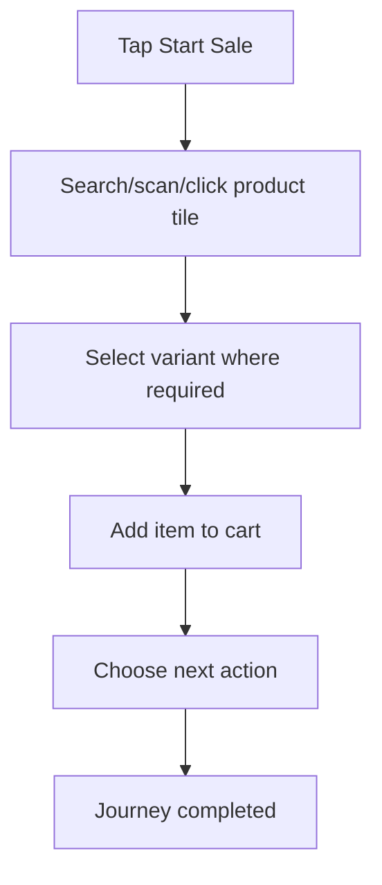

<!-- title: Start Sale Flow -->
<!-- status: Active -->
<!-- system: TM-EPOS MVP -->
<!-- last_updated: 2026-07-23 -->

# Start Sale Flow

## Purpose

Defines cashier start-sale, product search/scan, cart build, and park/recall entry points.

## Source Basis

This journey is based on the uploaded SCS-TIX Release 1 user journey files, UI
screens, backend architecture, database design, and confirmed project decisions.

It must not be expanded into e-commerce, offline sync, supplier, delivery, kiosk,
coupon, AI, or accounting scope.

## Actors

| Actor | Responsibility |
|---|---|
| Cashier | Builds cart and starts sale |
| Backend | Validates product, price, stock, and POS context |
| POS Device | Provides scan/input context |

## Preconditions

- Cashier is authenticated.
- Device is trusted.
- Till session is open.
- Product/catalog feature is available.

## Main Flow

| Step | User/System Action | Expected Result |
|---:|---|---|
| 1 | Tap Start Sale | POS terminal opens |
| 2 | Search/scan/click product tile | Product and variant data is loaded |
| 3 | Select variant where required | Sellable variant is selected |
| 4 | Add item to cart | Cart totals update |
| 5 | Choose next action | Proceed payment, discount, customer, park, or continue sale |

## Journey Diagram

## Business Rules

- Sale must remain tenant/outlet scoped.
- Product price/stock must be validated by backend.
- Cart totals must recalculate after item changes.
- Park/recall is supported for held sales.

## Access-Control Rules

| Control | Required Rule |
|---|---|
| Authentication | Required |
| Feature entitlement | POS/catalog enabled |
| Permission | Sale create permission |
| Trusted device | Required |
| Open till session | Required |

## Data and API References

| Area | References |
|---|---|
| API groups | `/api/v1/pos/sales`, `/api/v1/products` |
| Tables | `sales`, `sale_lines`, `products`, `product_variants`, `inventory_balances`, `price_list_items` |

## Edge Cases

- No stock blocks or warns by business rule.
- Inactive product cannot be sold.
- No open till session returns 403/business error.

## Out of Scope

- Offline sale queue is excluded.
- E-commerce order flow is excluded.

## Completion Criteria

- The user reaches the expected final state without bypassing access control.
- Tenant-owned data remains inside the resolved tenant context.
- Sensitive actions write audit records where required.
- UI state and backend state stay consistent after completion.

## Current Flutter Implementation (2026-06-18)

| Journey step | Implemented? | Notes |
|---|---|---|
| Tap Start Sale | Yes | `/pos/home` → `/pos/new-sale` when permitted |
| Search product | Yes | Manual query uses the existing 350 ms catalog debounce; scanner completion clears/invalidate scanner-generated search without suppressing manual input |
| Scan barcode | Partial | HID framing, exact Flutter API, FIFO direct cart add, one-time visual feedback, and search cleanup are implemented; physical TB-00D validation remains pending |

Chunk 5 feedback and search cleanup are implemented and verified by integrated
New Sale widget tests. Focused scanner text/query clearing, pending debounce
cancellation, general partial-search suppression, failed-lookup cleanup,
feedback replay prevention, next-scan readiness, and manual search all pass.
Overall scanner E2E remains partial pending physical hardware validation.

Chunk 7 camera Scanner button integration is implemented and automated-tested.
A one-shot camera result enters the same exact lookup, resolved-variant cart,
feedback, and search-cleanup pipeline. Cancellation is silent and unsupported
Windows/Linux execution falls back safely to USB HID guidance. Physical Android
camera validation remains pending.
| Select variant | Yes | `PosProductVariantSheet` |
| Add to cart | Yes | Reusable resolved-variant action; variant-key increment, requested quantity and central known-stock limit supported |
| Proceed payment / park / customer | Partial | Cash checkout and customer/discount entry are API-backed; Card/QR/Split are placeholders; park/recall is device-local secure storage |

Exact barcode and exact SKU matches resolve the backend variant and add that
variant directly to cart without reopening the variant picker. Product-only or
ambiguous product search continues to use product detail/variant selection.
Current cart presentation places the newest added line first. Offline catalogue
and offline cash-sale/outbox operation remain MVP scope but are not implemented
end to end.

Full code map: [[../../08_FLUTTER_POS_KNOWLEDGE/Flutter_Cashier_POS_Implementation_Map]].

## Related Files

- [[../../01_RELEASE_SCOPE/Release_1_Scope]]
- [[../../02_ACCESS_CONTROL/Access_Control_Overview]]
- [[../../05_BACKEND_ARCHITECTURE/API_Standards]]
- [[../../08_FLUTTER_POS_KNOWLEDGE/Flutter_Cashier_POS_Implementation_Map]]
