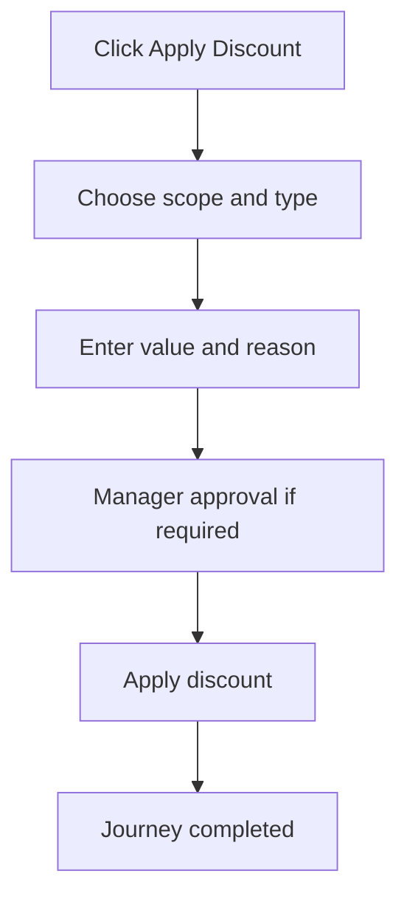

<!-- title: Discount Flow -->
<!-- status: Active -->
<!-- system: SCS-TIX EPOS Release 1 -->
<!-- last_updated: 2026-06-08 -->

# Discount Flow

## Purpose

Defines cashier POS line/bill discount application.

## Source Basis

This journey is based on the uploaded SCS-TIX Release 1 user journey files, UI
screens, backend architecture, database design, and confirmed project decisions.

It must not be expanded into e-commerce, offline sync, supplier, delivery, kiosk,
coupon, AI, or accounting scope.

## Actors

| Actor | Responsibility |
|---|---|
| Cashier | Applies discount if permitted |
| Manager | Approves when policy requires PIN |
| Backend | Validates policy and records discount |

## Preconditions

- Cart/sale exists.
- Discount feature is enabled.
- Cashier has discount permission or approval path exists.

## Main Flow

| Step | User/System Action | Expected Result |
|---:|---|---|
| 1 | Click Apply Discount | Discount modal/screen appears |
| 2 | Choose scope and type | Line or bill, percentage or fixed amount is selected |
| 3 | Enter value and reason | Backend validates policy |
| 4 | Manager approval if required | PIN/approval is validated |
| 5 | Apply discount | Cart totals update and discount is recorded |

## Journey Diagram

## Business Rules

- Discount must follow discount policy limits.
- Manager PIN is required when limit is exceeded.
- Discount application must be tenant/outlet/session scoped.
- Discount totals must be recalculated by backend.

## Access-Control Rules

| Control | Required Rule |
|---|---|
| Authentication | Required |
| Feature entitlement | Discount/POS discount enabled |
| Permission | Discount apply permission |
| Trusted device/open till | Required |

## Data and API References

| Area | References |
|---|---|
| API groups | `/api/v1/discounts`, `/api/v1/pos/sales` |
| Tables | `discount_policies`, `pos_discount_applications`, `discount_types`, `discount_scopes`, `sales`, `sale_lines` |

## Edge Cases

- Invalid discount value returns validation error.
- Approval failure blocks discount.
- Feature disabled returns 403.

## Out of Scope

- Coupons/promotions engine is excluded.
- AI discounting is excluded.

## Completion Criteria

- The user reaches the expected final state without bypassing access control.
- Tenant-owned data remains inside the resolved tenant context.
- Sensitive actions write audit records where required.
- UI state and backend state stay consistent after completion.

## Related Files

- [[../01_RELEASE_SCOPE/Release_1_Scope]]
- [[../02_ACCESS_CONTROL/Access_Control_Overview]]
- [[../05_BACKEND_ARCHITECTURE/API_Standards]]
