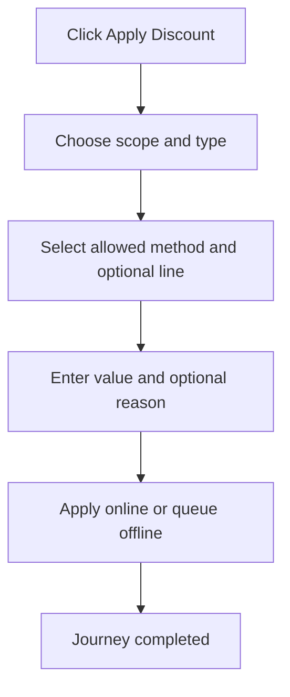

<!-- title: Discount Flow -->
<!-- status: Active -->
<!-- system: OneVerz POS MVP -->
<!-- last_updated: 2026-08-09 -->

# Discount Flow

## Purpose

Defines cashier POS line/bill discount application.

## Source Basis

Authority: [[../../13_DECISIONS_AND_CHANGES/POS_CASHIER_DISCOUNT_CURRENT_RELEASE_DECISION_2026-08-09]].

## Actors

| Actor | Responsibility |
|---|---|
| Cashier | Applies discount if permitted |
| Backend | Validates, persists, synchronizes, and remains final authority |

## Preconditions

- Cart/sale exists.
- Discount feature is enabled.
- Cashier has `sales.discount.apply` and valid tenant/outlet/device/till context.

## Main Flow

| Step | User/System Action | Expected Result |
|---:|---|---|
| 1 | Click Apply Discount | Discount modal/screen appears |
| 2 | Choose scope | Order, or Item with exact cart line/variant |
| 3 | Choose method | Order: Percentage/Fixed; Item: Percentage only |
| 4 | Enter value and optional reason | Preview updates; authority is checked |
| 5 | Apply | Online canonical apply, or offline provisional pending intent |

## Journey Diagram

```mermaid
flowchart TD
    S1[Click Apply Discount]
    S1 --> S2[Choose scope and type]
    S2 --> S3[Select allowed method and optional line]
    S3 --> S4[Enter value and optional reason]
    S4 --> S5[Apply online or queue offline]
    S5 --> Done[Journey completed]
```

## Business Rules

- Cashier UI is MANUAL only; no POLICY/preconfigured selector.
- Exactly one active cashier discount is allowed; replace/remove is not stacking.
- Order supports Percentage and Fixed; Item supports Percentage only.
- Item target must exist in the current cart and be server-revalidated.
- At/below user authority succeeds; above authority is directly rejected and
  never starts `PENDING_APPROVAL`.
- Reason is optional. Promo/VIP/Staff/Other labels, if used, only fill text.
- Discount application must be tenant/outlet/session scoped.
- Online totals are backend-authoritative. Offline preview is provisional.

## Access-Control Rules

| Control | Required Rule |
|---|---|
| Authentication | Required |
| Feature entitlement | Discount/POS discount enabled |
| Permission | `sales.discount.apply` |
| Trusted device/open till | Required |

## Data and API References

| Area | References |
|---|---|
| API endpoints | `GET /api/v1/pos/discounts`, `POST /api/v1/pos/discounts/validate`, `POST /api/v1/pos/discounts/apply` |
| Cancel | `POST /api/v1/pos/discounts/{applicationId}/cancel` |
| Existing deferred approval | `POST /api/v1/pos/discounts/{applicationId}/approve`; not invoked by current cashier flow |
| Tables | `discount_policies`, `pos_discount_applications`, `pos_discount_application_events`, `pos_discount_authority_limits`, `sales_orders`, `sales_order_lines` |

Checkout summary/start-payment accept `discountApplicationId`. Offline intents
use the generic outbox/sync/conflict architecture, not a new Discount table/API.

## Edge Cases

- Invalid discount value returns validation error.
- Above-authority, Item Fixed, second active Discount, invalid/missing line target,
  stale context, and missing permission are blocked/rejected.
- Offline sync rejection/conflict remains visible and never silently overwrites.
- Feature disabled returns 403.

## Out of Scope

- Coupons/promotions engine is excluded.
- AI discounting is excluded.
- Manager PIN/approval, POLICY selection, Item Fixed, and stacking are deferred.

## Completion Criteria

- The user reaches the expected final state without bypassing access control.
- Tenant-owned data remains inside the resolved tenant context.
- Sensitive actions write audit records where required.
- UI state and backend state stay consistent after completion.
- Responsive tablet/narrow/keyboard layouts have no overflow and keep actions reachable.

## Related Files

- [[../../01_RELEASE_SCOPE/Release_1_Scope]]
- [[../../02_ACCESS_CONTROL/Access_Control_Overview]]
- [[../../05_BACKEND_ARCHITECTURE/API_Standards]]
- [[../../10_TESTING_QA/Test_Case/21_POS_Operations/POS_Cashier_Discount_Test_Cases]]
