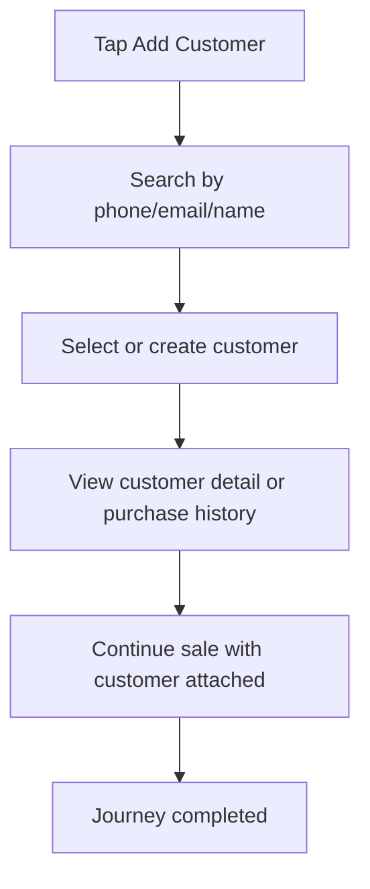

<!-- title: Customer Loyalty Flow -->
<!-- status: Active -->
<!-- system: TM-EPOS MVP -->
<!-- last_updated: 2026-07-23 -->

# Customer Loyalty Flow

## Purpose

Defines adding customer to sale and using basic loyalty earn/redeem.

## Source Basis

This journey is based on the uploaded SCS-TIX Release 1 user journey files, UI
screens, backend architecture, database design, and confirmed project decisions.

It must not be expanded into e-commerce, offline sync, supplier, delivery, kiosk,
coupon, AI, or accounting scope.

## Actors

| Actor | Responsibility |
|---|---|
| Cashier | Searches/selects or creates customer |
| Customer | Receives loyalty benefit if member |
| Backend | Validates membership and loyalty rules |

## Preconditions

- Cart/sale exists.
- Customer/loyalty feature is enabled where used.
- Cashier has customer/loyalty permission.

## Main Flow

| Step | User/System Action | Expected Result |
|---:|---|---|
| 1 | Tap Add Customer | Customer search screen opens |
| 2 | Search by phone/email/name | Matching customer appears |
| 3 | Select or create customer | Customer attaches to cart/sale |
| 4 | View customer detail or purchase history | Backend customer and order data are shown |
| 5 | Continue the sale | Selected customer remains attached to the cart/checkout request |

## Journey Diagram

## Business Rules

- Customer records are tenant-scoped.
- Loyalty is basic earn/redeem in Release 1.
- Redeem requires valid membership and permission.
- Loyalty transactions are ledger records.

## Access-Control Rules

| Control | Required Rule |
|---|---|
| Authentication | Required |
| Feature entitlement | Customer/loyalty enabled |
| Permission | Customer select/create and loyalty redeem where used |
| Open till session | Required for sale use |

## Data and API References

| Area | References |
|---|---|
| Implemented API group | `/api/v1/customers` for list, summary, detail, create and update |
| Implemented sale behavior | Select and attach customer to the current cart/checkout request |
| Tables used by current customer flow | `customers`, `sales_orders` and related customer/order records |

Loyalty earn, redeem, loyalty-ledger and store-credit behavior remain documented
MVP targets, but no complete Cashier Flutter → API → persistence → test chain was
verified. They must not be presented as working cashier actions.

## Edge Cases

- Customer not found allows create if permitted.
- Loyalty actions remain unavailable until their backend-authoritative flow is implemented.

## Out of Scope

- E-commerce customer profile is excluded.
- Advanced loyalty campaigns are excluded.

## Completion Criteria

- The user reaches the expected final state without bypassing access control.
- Tenant-owned data remains inside the resolved tenant context.
- Sensitive actions write audit records where required.
- UI state and backend state stay consistent after completion.

## Related Files

- [[../../01_RELEASE_SCOPE/Release_1_Scope]]
- [[../../02_ACCESS_CONTROL/Access_Control_Overview]]
- [[../../05_BACKEND_ARCHITECTURE/API_Standards]]
