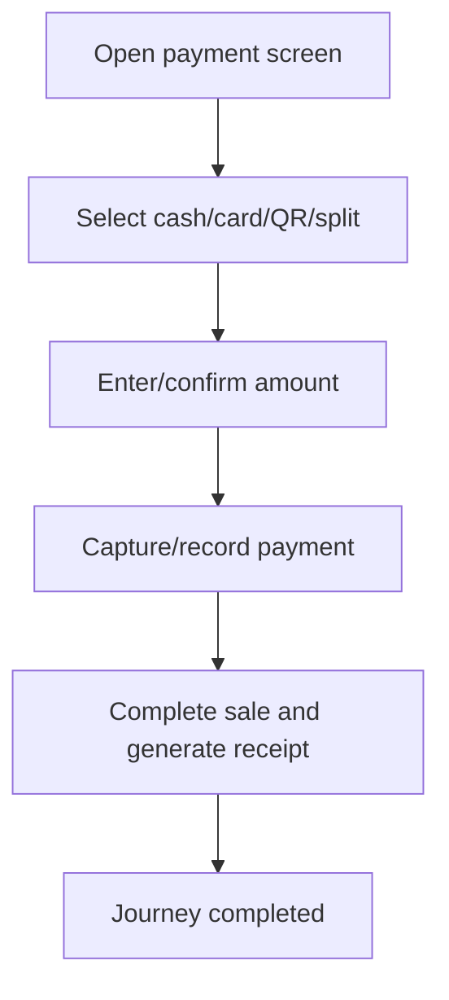

<!-- title: Payment Flow -->
<!-- status: Active -->
<!-- system: SCS-TIX EPOS Release 1 -->
<!-- last_updated: 2026-06-08 -->

# Payment Flow

## Purpose

Defines cashier payment completion with cash, card, QR, or split payment.

## Source Basis

This journey is based on the uploaded SCS-TIX Release 1 user journey files, UI
screens, backend architecture, database design, and confirmed project decisions.

It must not be expanded into e-commerce, offline sync, supplier, delivery, kiosk,
coupon, AI, or accounting scope.

## Actors

| Actor | Responsibility |
|---|---|
| Cashier | Selects payment method and completes sale |
| Backend | Validates payment and completes sale |
| Payment Device/Provider | Processes card/QR where configured |

## Preconditions

- Cart/sale exists with payable total.
- Open till session exists.
- Payment method is enabled for tenant.

## Main Flow

| Step | User/System Action | Expected Result |
|---:|---|---|
| 1 | Open payment screen | Totals and payment methods appear |
| 2 | Select cash/card/QR/split | Payment method is chosen |
| 3 | Enter/confirm amount | Amount is validated |
| 4 | Capture/record payment | Payment record and transaction reference are stored |
| 5 | Complete sale and generate receipt | Sale, stock, payment, receipt, and loyalty records update |

## Journey Diagram

## Business Rules

- Payment total must satisfy sale total.
- Split allocation must be valid.
- Card payment should use real reader/provider integration where configured.
- Sensitive card data must not be stored.

## Access-Control Rules

| Control | Required Rule |
|---|---|
| Authentication | Required |
| Feature entitlement | POS/payment enabled |
| Permission | Payment capture permission |
| Trusted device/open till | Required |

## Data and API References

| Area | References |
|---|---|
| API groups | `/api/v1/pos/payments`, `/api/v1/pos/sales`, `/api/v1/pos/receipts` |
| Tables | `payments`, `payment_transactions`, `sale_payment_allocations`, `sales`, `receipts`, `stock_movements` |

## Edge Cases

- Payment failure keeps sale unpaid/pending.
- Overpayment calculates change for cash.
- Provider duplicate events must be idempotent.

## Out of Scope

- Online e-commerce payment is excluded.
- Full accounting posting is excluded.

## Completion Criteria

- The user reaches the expected final state without bypassing access control.
- Tenant-owned data remains inside the resolved tenant context.
- Sensitive actions write audit records where required.
- UI state and backend state stay consistent after completion.

## Related Files

- [[../01_RELEASE_SCOPE/Release_1_Scope]]
- [[../02_ACCESS_CONTROL/Access_Control_Overview]]
- [[../05_BACKEND_ARCHITECTURE/API_Standards]]
