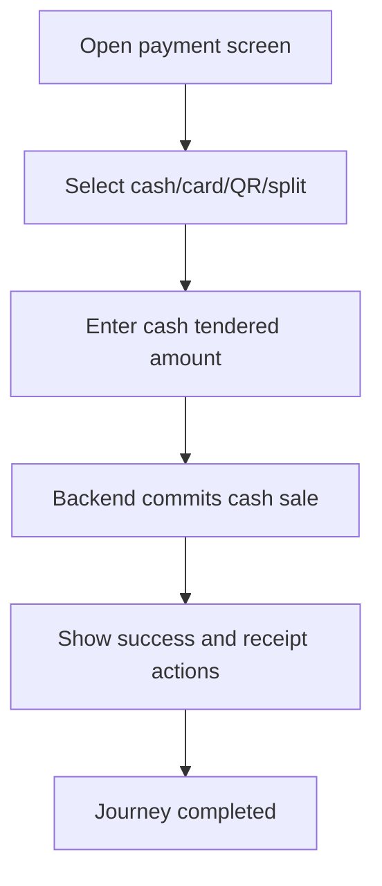

<!-- title: Payment Flow -->
<!-- status: Active -->
<!-- system: TM-EPOS MVP -->
<!-- last_updated: 2026-07-23 -->

# Payment Flow

## Purpose

Defines cashier payment completion with cash, card, QR, or split payment.

## Source Basis

This journey is based on the uploaded SCS-TIX Release 1 user journey files, UI
screens, backend architecture, database design, and confirmed project decisions.

It must not be expanded into e-commerce, offline sync, supplier, delivery, kiosk,
coupon, AI, or accounting scope.

## Actors

| Actor | Responsibility |
|---|---|
| Cashier | Selects payment method and completes sale |
| Backend | Validates payment and completes sale |
| Payment Device/Provider | Processes card/QR where configured |

## Preconditions

- Cart/sale exists with payable total.
- Open till session exists.
- Payment method is enabled for tenant.

## Main Flow

| Step | User/System Action | Expected Result |
|---:|---|---|
| 1 | Open payment screen | Totals and payment methods appear |
| 2 | Select an available method | Cash continues to the implemented tender flow; Card/QR/Split show unavailable placeholders |
| 3 | Enter cash tendered amount | Backend validates payable total and sufficient tender |
| 4 | Confirm cash payment | Order, payment, stock and receipt are committed by backend |
| 5 | Show success and receipt actions | Authoritative sale/payment/receipt values are displayed |

## Journey Diagram

## Business Rules

- Payment total must satisfy sale total.
- Split allocation must be valid.
- Card payment should use real reader/provider integration where configured.
- Sensitive card data must not be stored.

## Access-Control Rules

| Control | Required Rule |
|---|---|
| Authentication | Required |
| Feature entitlement | POS/payment enabled |
| Permission | Payment capture permission |
| Trusted device/open till | Required |

## Data and API References

| Area | References |
|---|---|
| Checkout endpoints | `POST /api/v1/pos/checkout/summary`, `POST /api/v1/pos/checkout/start-payment` |
| Receipt print audit | `POST /api/v1/pos/receipts/{saleId}/print` |
| Tables | `sales_orders`, `sales_order_lines`, `sales_payments`, `sales_payment_transactions`, `receipts`, `receipt_print_logs`, `stock_movements` |

| Method | Current implementation |
|---|---|
| Cash | Transactional Flutter and backend flow implemented; runtime database application still requires environment verification |
| Card | UI placeholder; no verified provider capture flow |
| QR | UI placeholder; no verified provider flow |
| Split | UI placeholder; no verified allocation flow |

Receipt preview exists. Local printing must succeed before the print-audit API is
called. Network printer transport source exists; USB/Bluetooth and the physical
printer matrix remain runtime verification requirements. Email receipt UI exists,
but delivery completion is not verified.

## Edge Cases

- Payment failure keeps sale unpaid/pending.
- Overpayment calculates change for cash.
- Repeated cash submission and backend conflicts must not create duplicate sale,
  payment, stock or receipt records.

## Out of Scope

- Online e-commerce payment is excluded.
- Full accounting posting is excluded.

## Completion Criteria

- The user reaches the expected final state without bypassing access control.
- Tenant-owned data remains inside the resolved tenant context.
- Sensitive actions write audit records where required.
- UI state and backend state stay consistent after completion.

## Related Files

- [[../../01_RELEASE_SCOPE/Release_1_Scope]]
- [[../../02_ACCESS_CONTROL/Access_Control_Overview]]
- [[../../05_BACKEND_ARCHITECTURE/API_Standards]]
