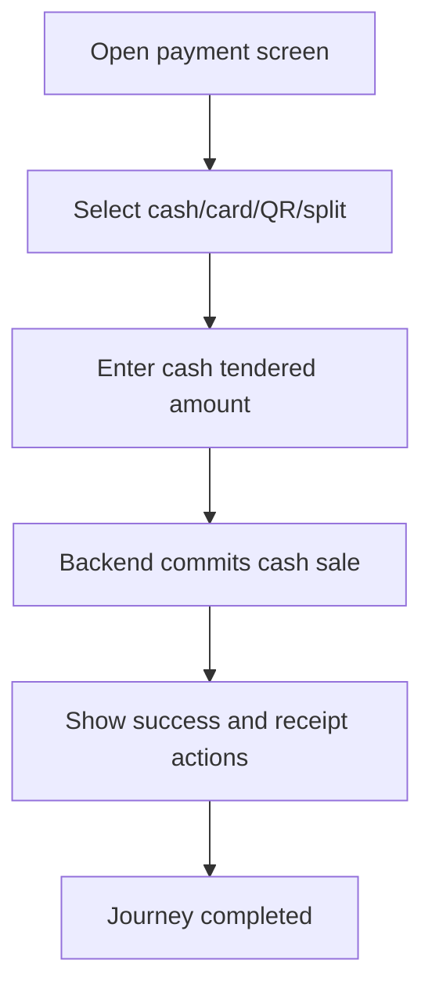

<!-- title: Payment Flow -->
<!-- status: Active -->
<!-- system: OneVerz POS MVP -->
<!-- last_updated: 2026-07-29 -->

# Payment Flow

> Current Payment Method UI decision (2026-08-02): Cash, Card, QR Pay and Split
> Payment only; Pay Later is excluded. Cash is executable. Card, QR Pay and Split
> remain safely unavailable until their real capability is proven and never fall
> back to Cash. The count-derived equal-card rule is recorded in
> `Payment_Method_Screen_Redesign_Implementation_Status.md`.

## Purpose

Defines cashier payment completion with cash, card, QR, or split payment.

## Source Basis

This journey is based on the uploaded SCS-TIX Release 1 user journey files, UI
screens, backend architecture, database design, and confirmed project decisions.

It must not be expanded into e-commerce, offline sync, supplier, delivery, kiosk,
coupon, AI, or accounting scope.

## Actors

| Actor | Responsibility |
|---|---|
| Cashier | Selects payment method and completes sale |
| Backend | Validates payment and completes sale |
| Payment Device/Provider | Processes card/QR where configured |

## Preconditions

- Cart/sale exists with payable total.
- Open till session exists.
- Payment method is enabled for tenant.

## Main Flow

| Step | User/System Action | Expected Result |
|---:|---|---|
| 1 | Open payment screen | Totals and payment methods appear |
| 2 | Select an available method | Cash continues; Card requires a configured provider; QR/Split remain unavailable |
| 3 | Enter cash tendered amount | Backend validates payable total and sufficient tender |
| 4 | Confirm cash payment | Order, payment, stock and receipt are committed by backend |
| 5 | Show success and receipt actions | Authoritative sale/payment/receipt values are displayed |

## Journey Diagram

```mermaid
flowchart TD
    S1[Open payment screen]
    S1 --> S2[Select cash/card/QR/split]
    S2 --> S3[Enter cash tendered amount]
    S3 --> S4[Backend commits cash sale]
    S4 --> S5[Show success and receipt actions]
    S5 --> Done[Journey completed]
```

## Business Rules

- Payment total must satisfy sale total.
- Split allocation must be valid.
- Card payment should use real reader/provider integration where configured.
- Sensitive card data must not be stored.
- A completed backend sale is not rolled back by printer failure.
- Receipt values and copy intent come from the authoritative completion snapshot.
- Cash drawer auto-open, when implemented, occurs only after a successful
  payment containing Cash. Card-only/QR-only, reprint and test receipt never
  pulse the drawer.
- Printer failure is post-payment and never rolls back completed payment.

## Access-Control Rules

| Control | Required Rule |
|---|---|
| Authentication | Required |
| Feature entitlement | POS/payment enabled |
| Permission | Payment capture permission |
| Trusted device/open till | Required |

## Data and API References

| Area | References |
|---|---|
| Checkout endpoints | `POST /api/v1/pos/checkout/summary`, `POST /api/v1/pos/checkout/start-payment` |
| Receipt print audit | `POST /api/v1/pos/receipts/{saleId}/print` |
| Tables | `sales_orders`, `sales_order_lines`, `sales_payments`, `sales_payment_transactions`, `receipts`, `receipt_print_logs`, `stock_movements` |

| Method | Current implementation |
|---|---|
| Cash | Transactional Flutter and backend flow implemented; runtime database application still requires environment verification |
| Card | Provider-neutral backend boundary exists; production provider unavailable |
| QR | UI placeholder; no verified provider flow |
| Split | UI placeholder; no verified allocation flow |

Receipt preview, Local Print Agent completed-sale printing, durable recovery and
print audit orchestration exist. Each intended copy is printed once and audited
once. Unknown timeout outcome is queried/reviewed, not silently retried. Direct
USB/Bluetooth remain unsupported/fail-safe and direct TCP is a separate path.
Email delivery remains unverified.

## Edge Cases

- Payment failure keeps sale unpaid/pending.
- Card timeout/unknown requires provider reconciliation; no fake success, Cash
  fallback, or blind capture retry is permitted.
- Overpayment calculates change for cash.
- Repeated cash submission and backend conflicts must not create duplicate sale,
  payment, stock or receipt records.

## Out of Scope

- Online e-commerce payment is excluded.
- Full accounting posting is excluded.

## Completion Criteria

- The user reaches the expected final state without bypassing access control.
- Tenant-owned data remains inside the resolved tenant context.
- Sensitive actions write audit records where required.
- UI state and backend state stay consistent after completion.

## Related Files

- [[../../01_RELEASE_SCOPE/Release_1_Scope]]
- [[../../02_ACCESS_CONTROL/Access_Control_Overview]]
- [[../../05_BACKEND_ARCHITECTURE/API_Standards]]

## Chunk 1B Payment/Receipt Integrity Update (2026-07-29)

- POS card checkout now crosses a provider-neutral `ICardPaymentGateway` boundary.
- The production default is explicitly unavailable and blocks sale completion with
  `card_provider_not_configured`; it never converts card to cash.
- A completed provider result uses provider-capture persistence and stores only
  safe provider reference, brand and last four digits.
- Declined, cancelled, pending, failed, unknown and unavailable results do not
  create the sale, payment, stock movement or receipt.
- Real terminal/provider integration remains external and unverified.
- Split tender DTO groundwork exists, but multi-tender checkout persistence and
  Flutter split UI remain pending; Split is not production-complete.
- Sale-completion receipt JSON owns historical tax code/name/effective rate,
  taxable amount and tax amount snapshots where tax configuration exists.
- Receipt copy orchestration uses per-copy type/index and stable Local Print
  Agent request identity. Default policy remains one customer copy and no
  merchant copy. Persisted admin-configurable copy policy remains pending.

Status: `PARTIALLY COMPLETE` — card safety and receipt integrity are implemented;
real card provider and real split-payment completion are pending.
