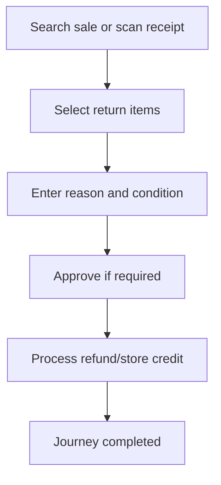

<!-- title: Return Refund Flow -->
<!-- status: Active -->
<!-- system: SCS-TIX EPOS Release 1 -->
<!-- last_updated: 2026-06-08 -->

# Return Refund Flow

## Purpose

Defines cashier return and refund flow linked to original sale.

## Source Basis

This journey is based on the uploaded SCS-TIX Release 1 user journey files, UI
screens, backend architecture, database design, and confirmed project decisions.

It must not be expanded into e-commerce, offline sync, supplier, delivery, kiosk,
coupon, AI, or accounting scope.

## Actors

| Actor | Responsibility |
|---|---|
| Cashier | Searches receipt and processes return/refund |
| Manager | Approves where policy requires |
| Backend | Validates eligibility and refund limits |

## Preconditions

- Original sale exists.
- Return/refund feature is enabled.
- Cashier has required permission.

## Main Flow

| Step | User/System Action | Expected Result |
|---:|---|---|
| 1 | Search sale or scan receipt | Original sale is loaded |
| 2 | Select return items | Eligible items are checked |
| 3 | Enter reason and condition | Return details are captured |
| 4 | Approve if required | Manager approval is validated |
| 5 | Process refund/store credit | Refund or customer credit is recorded |

## Journey Diagram

## Business Rules

- Return must reference original sale.
- Returned quantity must not exceed sold quantity.
- Refund amount must not exceed refundable value.
- Customer credit is separate from refund payment.

## Access-Control Rules

| Control | Required Rule |
|---|---|
| Authentication | Required |
| Feature entitlement | POS return/refund enabled |
| Permission | Return/refund permission |
| Open till session | Required for cash refund where applicable |

## Data and API References

| Area | References |
|---|---|
| API groups | `/api/v1/pos/returns`, `/api/v1/pos/refunds` |
| Tables | `returns`, `return_lines`, `refunds`, `return_refund_allocations`, `customer_credits`, `sales`, `sale_lines` |

## Edge Cases

- Non-returnable item is blocked.
- Receipt not found shows safe not-found state.
- Refund approval denial stops refund.

## Out of Scope

- E-commerce return flow is excluded.
- Supplier return is excluded.

## Completion Criteria

- The user reaches the expected final state without bypassing access control.
- Tenant-owned data remains inside the resolved tenant context.
- Sensitive actions write audit records where required.
- UI state and backend state stay consistent after completion.

## Related Files

- [[../01_RELEASE_SCOPE/Release_1_Scope]]
- [[../02_ACCESS_CONTROL/Access_Control_Overview]]
- [[../05_BACKEND_ARCHITECTURE/API_Standards]]
