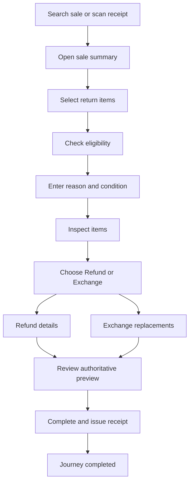

<!-- title: Return Refund Flow -->
<!-- status: Active -->
<!-- system: SCS-TIX EPOS Release 1 -->
<!-- last_updated: 2026-07-23 -->

# Return Refund Flow

## Purpose

Defines cashier return and refund flow linked to original sale.

## Source Basis

This journey is based on the uploaded SCS-TIX Release 1 user journey files, UI
screens, backend architecture, database design, and confirmed project decisions.

It must not be expanded into e-commerce, offline sync, supplier, delivery, kiosk,
coupon, AI, or accounting scope.

## Actors

| Actor | Responsibility |
|---|---|
| Cashier | Searches receipt and processes return/refund |
| Manager | Approves where policy requires |
| Backend | Validates eligibility and refund limits |

## Preconditions

- Original sale exists.
- Return/refund feature is enabled.
- Cashier has required permission.
- Trusted POS device with an open till session is required for search and eligibility.

## Main Flow

| Step | User/System Action | Expected Result |
|---:|---|---|
| 1 | Search sale or scan receipt on `/pos/returns-refunds` | Original sale candidates are loaded from the current outlet |
| 2 | Open Sale Summary | Selected sale eligibility/detail is loaded |
| 3 | Select return items on `/pos/returns-refunds/eligibility` | Eligible lines load; cashier selects qty; Continue is local |
| 4 | Check eligibility on `/pos/returns-refunds/check-eligibility` | Selected-line eligibility is validated |
| 5 | Enter reason and condition | Return details are captured |
| 6 | Inspect items on `/pos/returns-refunds/inspect-items` | Conditions/notes/photos saved to draft; validate marks `VALIDATED` |
| 7 | Choose Refund or Exchange | Persisted, versioned resolution selects the authorised branch |
| 8 | Enter Refund details or Exchange replacements | Branch data is persisted against the validated inspection draft |
| 9 | Review authoritative preview | Continue is blocked when backend `canProceed` is false |
| 10 | Complete and issue receipt | Return/refund or return/exchange records are committed atomically |

## Step 1 — Search Original Sale

### Route

`/pos/returns-refunds`

### Search API

`GET /api/v1/pos/returns/sales/search`

Required permission: exact `returns.view`

Required context:

- authenticated tenant user
- trusted `deviceId`
- assigned till
- open till session
- outlet resolved from till/device context (never from Flutter)

Query parameters:

| Parameter | Notes |
|---|---|
| `deviceId` | Required |
| `searchType` | `invoice`, `receipt` (alias of invoice), `sale`, `mobile`, `customer`, `recent` |
| `search` | Required for non-`recent` types |
| `fromDate` | Optional `YYYY-MM-DD` |
| `toDate` | Optional `YYYY-MM-DD` |
| `paymentMethodCode` | Optional active POS payment method code |
| `minAmount` | Optional non-negative amount |
| `maxAmount` | Optional non-negative amount |
| `page` | Default `1` |
| `pageSize` | Default `20`, clamped by backend |

Response page:

- `items`
- `page`
- `pageSize`
- `totalCount`
- `paymentMethods` (active POS filter options)

Each item includes safe payment display:

- `paymentMethod`
- `maskedCard` (safe masked payment reference; empty for cash/non-card)

`maskedCard` is produced by the backend from persisted safe tips only
(`provider_response_json.cardLast4` / exact four-digit tip). Flutter must not invent
Visa/4242-style masks. Split payments show `Multiple` with empty `maskedCard`.

Outlet isolation:

- sale/receipt tenant == current tenant
- receipt outlet == resolved till outlet
- sale status completed and paid/partially refunded
- receipt type `SALE` and status `ISSUED`

Phone search reuses `Customer.NormalizePhone` and matches normalized customer phone values.

### Continue action

No Step 1 draft API.

Continue remains local navigation and requires:

- `returns.view`
- `returns.create`
- valid selected sale
- search not loading

Without `returns.create`, the cashier may view/search sales but cannot continue to Step 2.

### Recent tab vs local chips

- Recent tab = backend recent eligible sales for the current outlet
- Recent chips = ephemeral in-memory cashier search history only

### Eligibility APIs reused by later steps

`GET /api/v1/pos/returns/sales/{saleId}/eligibility`

- Opens Step 3 Select Items (`/pos/returns-refunds/eligibility`)
- Permission: exact `returns.view`
- Line fields include sold/returned/available qty, `isReturnable`, ineligibility reason, optional `barcode`
- Prior returned qty counts only `COMPLETED` returns
- Continue from Step 3 is local (no draft API); mutation requires `returns.create`

`POST /api/v1/pos/returns/sales/{saleId}/eligibility-check`

- Opens Step 4 Check Eligibility
- Permission: exact `returns.view` (non-mutating validation)
- Rejects duplicate sale lines, non-returnable lines, and quantity above remaining (409 where applicable)
- Backend remaining quantity is authoritative; Flutter quantities are not trusted
- Checklist rows are backend-evaluated:
  - `ORIGINAL_RECEIPT` honors `requires_receipt`
  - `PAYMENT_VERIFICATION` uses persisted successful payments (`PAID` / `PARTIALLY_REFUNDED`)
  - `PRODUCT_RETURN_POLICY` resolves product policy → tenant default (no category policy in schema)
  - `INSPECTION_REQUIRED` is preliminary/`NOT_APPLICABLE` until Step 5 reason selection
  - `MANAGER_APPROVAL_REQUIRED` is `REQUIRES_REVIEW` when policy requires approval (Continue still allowed)
- `policyNote` from policy description or neutral window summary only
- Continue to Step 5 is local and requires `returns.view` + `returns.create` + `canContinue`

### Development return-policy seed (2026-07-18)

| Item | Value |
|---|---|
| Migration | `20260718180000_AssignReturnPolicyToExistingPosProducts` |
| Policy code | `DEV-14DAYS` |
| Policy ID | `dddd0001-0014-4000-8000-000000000001` |
| Window | 14 return / 14 exchange days |
| Default | `is_default_policy = true` (tenant fallback) |
| Assignment | `products.return_policy_id` for ACTIVE sellable `MER-%` products with null policy |
| Resolution | product ACTIVE policy → tenant ACTIVE default (no category policy) |
| Old sales | Eligibility uses **current** product/default policy at return time (no sale-time policy snapshot) |

Root cause of Step 3 “No active return policy…” for `MER-006-SIZE-8`: merchandise seed left `return_policy_id` null and no tenant `return_policies` rows existed.

### Step 5 — Select Reason

- Load reasons: `GET /api/v1/pos/returns/reasons?deviceId=`
- Validate (no persist): `POST /api/v1/pos/returns/sales/{saleId}/reasons/validate?deviceId=`
- Permission: `returns.view` + `returns.create`
- Reason flags (`requires_note`, `requires_inspection`, `requires_manager_approval`, `description`) come from `return_reasons`
- Apply-same-reason checkbox: when unchecked, per-line reason/note inputs are shown
- Notes max length: 1000
- Step 5 state is Flutter-transient; durable reason persistence occurs at final Return completion
- Merged flags for later steps: Step 4 preliminary OR any selected reason flag

Development seed (`20260718190000_EnsureDevelopmentTenantReturnReasons`):

- Tenant: `55555555-0000-4000-8000-000000000001`
- Active ordered reasons: `DAMAGED`, `WRONG_ITEM`, `SIZE_ISSUE`, `CHANGED_MIND`, `DEFECTIVE`, `OTHER`
- `SIZE_ISSUE` and `OTHER` apply to both returns and exchanges
- `DEFECTIVE` requires inspection; `OTHER` requires a note; manager approval is false by default
- Seed conflicts use `(tenant_id, reason_code) DO NOTHING`; existing inactive or tenant-customized rows are never overwritten or reactivated
- Rollback intentionally does not delete seeded rows because they may subsequently become tenant-owned configuration

### Step 6 — Inspect Items

Route: `/pos/returns-refunds/inspect-items`

- Load conditions: `GET /api/v1/pos/returns/inspection/conditions?deviceId=`
- Load/save draft: `GET|PUT .../sales/{saleId}/inspection/draft?deviceId=` (optional `version` on PUT)
- Upload/delete/preview photos: `POST .../inspection/media`, `DELETE|GET .../inspection/media/{mediaId}`
- Validate: `POST .../sales/{saleId}/inspection/validate?deviceId=` — evaluates persisted draft; sets `VALIDATED` when all lines complete
- Permission: `returns.view` + `returns.create`
- Outlet isolation: till session outlet + sale receipt outlet must match
- Draft statuses: `DRAFT` / `VALIDATED` / `CONSUMED` / `CANCELLED`; version conflict → 409 `inspection_draft_conflict`
- Draft and media expire after 24h (default); expired draft requires restart
- Validate merges Step 4 + Step 5 (`reasonRefs`) + Step 6 condition flags (OR, never downgrade)
- No Step 6 Continue/finalize/approval API; Continue is local navigation
- Finalization: `CompleteReturnAsync` atomically consumes `VALIDATED` draft into `return_inspections` / `return_inspection_media`
- Migration: `20260717150000_HardenReturnInspectionDraftMediaLifecycle`

### Step 7 — Choose Option

Route: `/pos/returns-refunds/choose-option`

- Load authoritative state: `GET /api/v1/pos/returns/sales/{saleId}/resolution?deviceId=`
- Save selection: `PUT /api/v1/pos/returns/sales/{saleId}/resolution?deviceId=`
- PUT body: `resolutionType` (`REFUND` or `EXCHANGE`) and `expectedVersion`
- Both routes require authenticated tenant context, `returns.view`, `returns.create`,
  trusted device, assigned till, open session, resolved outlet, matching sale/draft,
  `VALIDATED` status, and a non-expired/non-consumed draft.
- GET returns draft ID/status/version/expiry, selected resolution/actor/time, branch
  availability, unavailable reason codes, inspection/approval flags, and `nextStep`.
- Refund requires `refunds.create`; Exchange requires `exchanges.create`. Backend
  downstream APIs enforce the same branch permission and persisted resolution.
- Version mismatch returns 409 `inspection_draft_conflict`. Repeating the same
  selection at the latest version is idempotent.
- Switching branches transactionally clears incompatible draft state. Re-editing
  Step 6 clears both branch drafts and increments the draft version.
- Flutter uses GET as source of truth, cancels superseded requests, sequence-checks
  responses, blocks duplicate Continue, and reloads after returning from Step 8.

### Steps 8–10 — Branch, Review, Completion

- Refund APIs reject persisted Exchange resolution; Exchange APIs reject persisted
  Refund resolution.
- Direct branch navigation first reloads authoritative resolution and verifies
  status, expiry, branch, and branch availability.
- **Step 9 (Review & Confirm)** is review-only: Back + Complete. There is no Print
  action before completion; receipt printing belongs to Step 10.
- On every Step 9 entry Flutter reloads resolution, then fetches a fresh
  `credit-preview` (Refund) or `exchange-preview` (Exchange). Cached Step 8
  financials are not treated as authoritative. Preview `draftVersion` must match
  the current resolution version before Complete is enabled.
- Exchange financials (return credit, replacement tax/discount/total, difference
  direction/amounts) come only from backend `exchange-preview`. Flutter does not
  invent difference direction or totals when preview is missing.
- Review honours backend `preview.canProceed`; approval-required previews cannot
  complete.
- General completion endpoint:
  `POST /api/v1/pos/returns/sales/{saleId}/complete?deviceId=`.
- Completion body includes `expectedVersion` and `idempotencyKey`; totals, prices,
  stock, tax, discounts, currency, and exchange difference are recalculated by the
  backend.
- **Refund completion idempotency** persists `sales_returns.idempotency_key` with
  unique `(tenant_id, idempotency_key)`. Same-key + same logical sale/outlet replay
  returns the existing completion/receipt without duplicate refund, payment,
  stock, or receipt rows. Same key with a different sale/outlet → 409
  `pos_returns.idempotency_conflict`. Exchange continues to use
  `sales_exchanges.idempotency_key`.
- In-transaction refund completion revalidates draft status, expiry, expected
  version, REFUND resolution, approval-required flags, and idempotent prior
  completion under a Serializable transaction.
- Exchange supports `NO_SETTLEMENT` (even), `CASH_PAYMENT` (customer pays), and
  `CASH_REFUND`/`CARD_REFUND` (customer receives), subject to authoritative direction.
- Final return/receipt numbers are created only after successful completion
  (Step 10). Step 9 does not present preview credit references as final return IDs.
- Known completion conflicts include `inspection_draft_conflict`,
  `inspection_draft_expired`, `inspection_draft_consumed`, `refund_preview_stale`,
  `exchange_preview_stale`, `exchange_price_changed`, `exchange_tax_changed`,
  `exchange_discount_changed`, `insufficient_outlet_stock`, `approval_required`,
  `idempotency_conflict`, and `duplicate_completion`.
- Manager approval grant remains intentionally out of scope. Existing
  `requiresManagerApproval` is durable and completion returns 409
  `pos_returns.approval_required` until a valid approval capability exists.

### Step 10 — Completion Success & Final Receipt

Route: `/pos/returns-refunds/receipt?returnId=`

- **Authority:** `GET /api/v1/pos/returns/completions/{returnId}?deviceId=` is the
  only success authority. Flutter must not display Step 9 memory
  (`flowState.completedReceipt`) as confirmed success when GET fails.
- Success UI appears only after GET returns a completed record. GET failure shows
  error/not-found/retry with no success hero and no cached financial values.
- Load uses Dio `CancelToken`, monotonic request sequence, and route `returnId`
  validation so stale responses cannot overwrite a newer route.
- Completion DTO includes outlet/till/device names (till resolved from
  `receipts.till_id` → `tills.till_name`), immutable customer display preference
  (`sales_orders.customer_name_snapshot`), cashier, settlement, safe masked card
  (last4/brand only from sanitized payment transaction metadata), provider
  transaction reference (never PAN/CVV/token), returned-item reason/condition/
  subtotal/discount/tax/total, replacement-line tax/discount totals, and print count.
- `STORE_CREDIT` is never returned or rendered.
- **Print:** physical print via per-device local printer config, then
  `POST /api/v1/pos/receipts/{saleId}/print` audit. Audit is never recorded before
  local transport success. If physical print succeeds and audit fails, show
  “Receipt printed, but print audit could not be recorded” and allow audit-only
  retry without reprinting.
- Printer facade: `PosReceiptPrinterService` selects exactly one adapter
  (USB / Bluetooth / Network) from the current device’s secure-storage config
  keyed by `deviceId`. ESC/POS generator formats backend values only (58mm/80mm).
  Tamil/non-Latin unsupported glyphs are replaced unless a verified code page or
  raster path is configured.
- **PHYSICAL_PRINTER_VERIFICATION: NOT_VERIFIED** for USB, Bluetooth, and Network
  on real hardware in this hardening pass. Network adapter uses TCP:9100 where
  `dart:io` is available; USB/Bluetooth adapters fail safely until hardware-verified.
- Start New Return / Back Home use `resetReturnExchangeFlow` to clear all
  Return/Exchange providers and idempotency/completion state. System Back from
  Step 10 does not return to Step 9.

Both enforce the same resolved-outlet isolation and return safe masked payment fields.

## Journey Diagram

### Step 8B notes (Exchange replacements)

- Search matches product name, variant name, SKU, and barcode; stock is **current outlet only**.
- Quantity is editable (min 1, max outlet available); persisted on `return_exchange_replacement_draft_lines.quantity`.
- PUT replacement requires `expectedVersion`; draft expiry and optimistic concurrency apply to GET/PUT/preview.
- Preview route is `POST .../exchange-preview`. Replacement tax/discount/total come from shared `IPosSaleLinePricingCalculator` (checkout-equivalent). Flutter only renders backend values.
- Completion recalculates with the same calculator and persists replacement line tax/discount; stale price/tax/discount → conflict.
- Direction change clears stale settlement; Flutter must not invent totals or outlet IDs.
- `STORE_CREDIT` unsupported; manager approval grant workflow out of scope (approval-required remains a hard stop).

## Business Rules

- Return must reference original sale.
- Returned quantity must not exceed sold quantity.
- Refund amount must not exceed refundable value.
- Customer credit is separate from refund payment.
- Split payments display as deterministic `Multiple` without inventing a card mask.

## Access-Control Rules

| Control | Required Rule |
|---|---|
| Authentication | Required |
| Feature entitlement | POS return/refund enabled |
| Step 1 search/nav | exact `returns.view` |
| Step 1 Continue / Step 2 Sale Summary | `returns.view` AND `returns.create` AND selected sale context |
| Open till session | Required for search/eligibility |

## Data and API References

| Area | References |
|---|---|
| API groups | `/api/v1/pos/returns` |
| Primary tables | `sales_orders`, `sales_order_lines`, `receipts`, `customers`, `sales_payments`, `payment_methods`, `sales_returns`, `sales_return_lines`, `return_inspection_drafts`, `return_inspection_draft_lines`, `return_inspection_conditions`, `return_inspection_media_staging`, `return_inspections`, `return_inspection_media` |

## Edge Cases

- Non-returnable item is blocked.
- Same-tenant cross-outlet sale returns not-found without leakage.
- Receipt not found shows safe not-found state.
- Refund approval denial stops refund.

## Out of Scope

- E-commerce return flow is excluded.
- Supplier return is excluded.
- Backend persistence of recent search chips is excluded.

## Completion Criteria

- The user reaches the expected final state without bypassing access control.
- Tenant-owned data remains inside the resolved tenant context.
- Sensitive actions write audit records where required.
- UI state and backend state stay consistent after completion.

## Related Files

- [[../../01_RELEASE_SCOPE/Release_1_Scope]]
- [[../../02_ACCESS_CONTROL/Access_Control_Overview]]
- [[../../05_BACKEND_ARCHITECTURE/API_Standards]]
