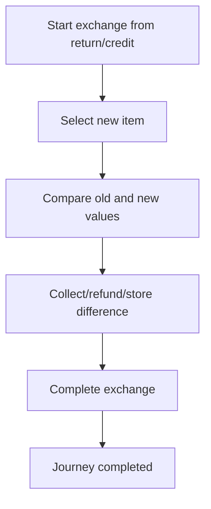

<!-- title: Exchange Flow -->
<!-- status: Active -->
<!-- system: SCS-TIX EPOS Release 1 -->
<!-- last_updated: 2026-06-08 -->

# Exchange Flow

## Purpose

Defines cashier exchange using returned value/customer credit difference handling.

## Source Basis

This journey is based on the uploaded SCS-TIX Release 1 user journey files, UI
screens, backend architecture, database design, and confirmed project decisions.

It must not be expanded into e-commerce, offline sync, supplier, delivery, kiosk,
coupon, AI, or accounting scope.

## Actors

| Actor | Responsibility |
|---|---|
| Cashier | Processes exchange items |
| Customer | Receives new item or pays/receives difference |
| Backend | Records exchange and allocations |

## Preconditions

- Return/customer credit context exists.
- Exchange feature is enabled.
- Cashier has exchange permission.

## Main Flow

| Step | User/System Action | Expected Result |
|---:|---|---|
| 1 | Start exchange from return/credit | Exchange cart opens |
| 2 | Select new item | New item price is calculated |
| 3 | Compare old and new values | Difference direction is shown |
| 4 | Collect/refund/store difference | Payment/refund/credit is allocated |
| 5 | Complete exchange | Exchange and stock/payment records are stored |

## Journey Diagram

## Business Rules

- Exchange records old value, new value, difference total, and direction.
- Higher value collects payment.
- Lower value refunds or stores customer credit as allowed.
- Stock movements must be consistent.

## Access-Control Rules

| Control | Required Rule |
|---|---|
| Authentication | Required |
| Feature entitlement | POS/exchange enabled |
| Permission | Exchange permission |
| Trusted device/open till | Required |

## Data and API References

| Area | References |
|---|---|
| API groups | `/api/v1/pos/exchanges`, `/api/v1/pos/payments`, `/api/v1/pos/refunds` |
| Tables | `exchanges`, `exchange_lines`, `exchange_payment_allocations`, `exchange_refund_allocations`, `customer_credits`, `stock_movements` |

## Edge Cases

- Invalid credit/return context blocks exchange.
- Insufficient stock blocks new item.
- Unbalanced difference blocks completion.

## Out of Scope

- E-commerce exchange is excluded.
- Advanced promotion exchange rules are excluded.

## Completion Criteria

- The user reaches the expected final state without bypassing access control.
- Tenant-owned data remains inside the resolved tenant context.
- Sensitive actions write audit records where required.
- UI state and backend state stay consistent after completion.

## Related Files

- [[../01_RELEASE_SCOPE/Release_1_Scope]]
- [[../02_ACCESS_CONTROL/Access_Control_Overview]]
- [[../05_BACKEND_ARCHITECTURE/API_Standards]]
