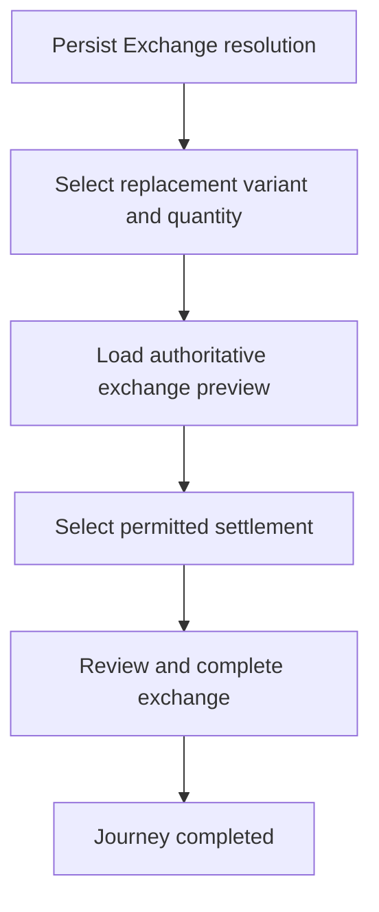

<!-- title: Exchange Flow -->
<!-- status: Active -->
<!-- system: TM-EPOS MVP -->
<!-- last_updated: 2026-07-23 -->

# Exchange Flow

## Purpose

Defines the Exchange branch inside the cashier Return and Refund workflow.

## Source Basis

This journey is based on the uploaded SCS-TIX Release 1 user journey files, UI
screens, backend architecture, database design, and confirmed project decisions.

It must not be expanded into e-commerce, offline sync, supplier, delivery, kiosk,
coupon, AI, or accounting scope.

## Actors

| Actor | Responsibility |
|---|---|
| Cashier | Processes exchange items |
| Customer | Receives new item or pays/receives difference |
| Backend | Records exchange and allocations |

## Preconditions

- Original sale, selected return lines and a validated inspection draft exist.
- Exchange feature is enabled.
- Cashier has exchange permission.

## Main Flow

| Step | User/System Action | Expected Result |
|---:|---|---|
| 1 | Select Exchange as the persisted Return resolution | Backend validates branch access and draft version |
| 2 | Search and select replacement product/variant | Current-outlet stock and replacement details are loaded |
| 3 | Save replacement quantity and load preview | Backend calculates return credit, replacement totals and difference |
| 4 | Select the permitted settlement | Cash payment, cash/card refund, or no settlement follows the authoritative direction |
| 5 | Review and complete exchange | Exchange, stock, payment/refund and receipt records are committed |

## Journey Diagram

## Business Rules

- Exchange requires a non-expired `VALIDATED` inspection draft and persisted
  `EXCHANGE` resolution.
- Preview and completion recalculate price, tax, discount, stock and difference
  on the backend.
- Higher replacement value requires customer payment; lower value permits the
  backend-approved refund method; equal value uses no settlement.
- Store credit is not supported by the current completion flow.
- Completion uses expected draft version and idempotency key.

## Access-Control Rules

| Control | Required Rule |
|---|---|
| Authentication | Required |
| Feature entitlement | POS/exchange enabled |
| Permission | Exchange permission |
| Trusted device/open till | Required |

## Data and API References

| Area | References |
|---|---|
| Resolution | `GET|PUT /api/v1/pos/returns/sales/{saleId}/resolution` |
| Replacement | `GET /api/v1/pos/returns/sales/{saleId}/exchange/products`, `GET|PUT .../exchange/replacement` |
| Preview/completion | `POST .../exchange-preview`, `POST .../complete` |
| Tables | `sales_exchanges`, `sales_exchange_lines`, `sales_exchange_events`, `return_exchange_replacement_draft_lines`, `return_inspection_drafts`, `stock_movements`, payment/refund and receipt tables |

## Edge Cases

- Missing, expired, consumed or stale inspection draft blocks exchange.
- Insufficient stock blocks new item.
- Stale price/tax/discount preview or unbalanced settlement blocks completion.

## Out of Scope

- E-commerce exchange is excluded.
- Advanced promotion exchange rules are excluded.
- Store-credit settlement is not implemented.

## Completion Criteria

- The user reaches the expected final state without bypassing access control.
- Tenant-owned data remains inside the resolved tenant context.
- Sensitive actions write audit records where required.
- UI state and backend state stay consistent after completion.

## Related Files

- [[../../01_RELEASE_SCOPE/Release_1_Scope]]
- [[../../02_ACCESS_CONTROL/Access_Control_Overview]]
- [[../../05_BACKEND_ARCHITECTURE/API_Standards]]
