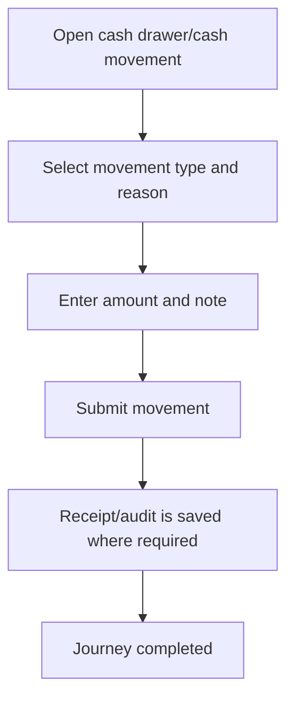

<!-- title: Cash In Out Flow -->
<!-- status: Active -->
<!-- system: SCS-TIX EPOS Release 1 -->
<!-- last_updated: 2026-06-08 -->

# Cash In Out Flow

## Purpose

Defines cashier cash drawer movement flow.

## Source Basis

This journey is based on the uploaded SCS-TIX Release 1 user journey files, UI
screens, backend architecture, database design, and confirmed project decisions.

It must not be expanded into e-commerce, offline sync, supplier, delivery, kiosk,
coupon, AI, or accounting scope.

## Actors

| Actor | Responsibility |
|---|---|
| Cashier | Records cash in/out |
| Manager | Approves where business policy requires |
| Backend | Stores cash movement under till session |

## Preconditions

- Cashier is logged in.
- Till session is open.
- Cash drawer/cash movement permission exists.

## Main Flow

| Step | User/System Action | Expected Result |
|---:|---|---|
| 1 | Open cash drawer/cash movement | Cash movement form appears |
| 2 | Select movement type and reason | Cash in/out category is chosen |
| 3 | Enter amount and note | Amount is validated |
| 4 | Submit movement | Cash movement is stored |
| 5 | Receipt/audit is saved where required | Till expected cash updates |

## Journey Diagram

## Business Rules

- Cash movement must attach to open till session.
- Amount must be positive.
- Reason is required.
- Cash movement must be auditable.

## Access-Control Rules

| Control | Required Rule |
|---|---|
| Authentication | Required |
| Feature entitlement | POS cash drawer enabled |
| Permission | Cash movement permission |
| Open till session | Required |

## Data and API References

| Area | References |
|---|---|
| API groups | `/api/v1/pos/payments` or cash movement group |
| Tables | `cash_movement_types`, `cash_movements`, `till_sessions`, `audit_logs` |

## Edge Cases

- No open till blocks action.
- Invalid amount returns validation error.
- No permission returns 403.

## Out of Scope

- Accounting ledger is excluded.
- Bank deposit workflow is excluded.

## Completion Criteria

- The user reaches the expected final state without bypassing access control.
- Tenant-owned data remains inside the resolved tenant context.
- Sensitive actions write audit records where required.
- UI state and backend state stay consistent after completion.

## Related Files

- [[../01_RELEASE_SCOPE/Release_1_Scope]]
- [[../02_ACCESS_CONTROL/Access_Control_Overview]]
- [[../05_BACKEND_ARCHITECTURE/API_Standards]]
