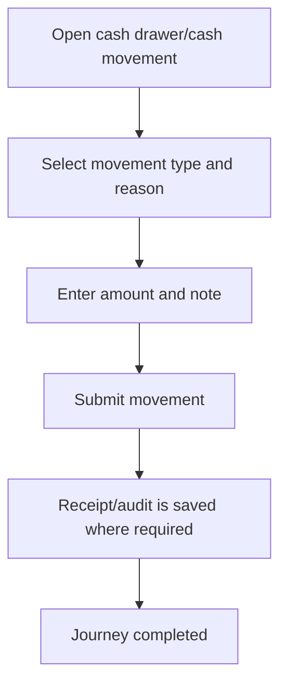

<!-- title: Cash In Out Flow -->
<!-- status: Active -->
<!-- system: TM-EPOS MVP -->
<!-- last_updated: 2026-07-23 -->

# Cash In Out Flow

## Purpose

Defines cashier cash drawer movement flow.

## Source Basis

This journey is based on the uploaded SCS-TIX Release 1 user journey files, UI
screens, backend architecture, database design, and confirmed project decisions.

It must not be expanded into e-commerce, offline sync, supplier, delivery, kiosk,
coupon, AI, or accounting scope.

## Actors

| Actor | Responsibility |
|---|---|
| Cashier | Records cash in/out |
| Manager | Approves where business policy requires |
| Backend | Stores cash movement under till session |

## Preconditions

- Cashier is logged in.
- Till session is open.
- Cash drawer/cash movement permission exists.

## Main Flow

| Step | User/System Action | Expected Result |
|---:|---|---|
| 1 | Open cash drawer/cash movement | Cash movement form appears |
| 2 | Select movement type and reason | Cash in/out category is chosen |
| 3 | Enter amount and note | Amount is validated |
| 4 | Submit movement | Target behavior is backend validation and persistence |
| 5 | Refresh drawer summary | Target behavior is authoritative expected-cash update |

## Journey Diagram

## Business Rules

- Cash movement must attach to open till session.
- Amount must be positive.
- Reason is required.
- Cash movement must be auditable.

## Access-Control Rules

| Control | Required Rule |
|---|---|
| Authentication | Required |
| Feature entitlement | POS cash drawer enabled |
| Permission | Cash movement permission |
| Open till session | Required |

## Data and API References

| Area | References |
|---|---|
| Current Flutter | Cash Drawer, Cash In and Cash Drop screens/forms/providers exist |
| Current API | No cashier cash-movement mutation endpoint was verified |
| Schema | `till_cash_movements` and related till-session schema are defined in source |

Current classification is `FRONTEND_ONLY`. Form state is not proof of a stored
movement, audit record or expected-cash update. The schema is approved data
foundation, but operational controller/service/repository wiring remains absent.
Defined in migration source; live applied state not verified.

## Edge Cases

- No open till blocks action.
- Invalid amount is blocked by current Flutter form validation.
- No permission returns 403.

## Out of Scope

- Accounting ledger is excluded.
- Bank deposit workflow is excluded.
- Cash movement must not be treated as completed until backend mutation and
  persistence are wired and tested.

## Completion Criteria

- The user reaches the expected final state without bypassing access control.
- Tenant-owned data remains inside the resolved tenant context.
- Sensitive actions write audit records where required.
- UI state and backend state stay consistent after completion.

## Related Files

- [[../../01_RELEASE_SCOPE/Release_1_Scope]]
- [[../../02_ACCESS_CONTROL/Access_Control_Overview]]
- [[../../05_BACKEND_ARCHITECTURE/API_Standards]]
