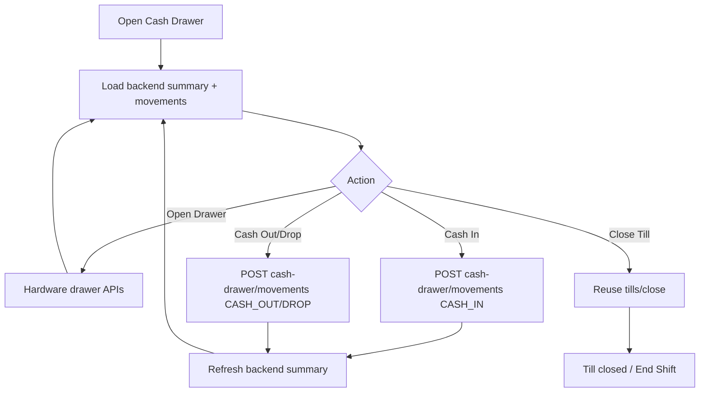

<!-- title: Cash In Out Flow -->
<!-- status: Active -->
<!-- system: OneVerz POS MVP -->
<!-- last_updated: 2026-08-13 -->

# Cash In Out Flow

## Purpose

Defines cashier Cash Drawer monitoring and Cash In / Cash Out·Drop movement
flow for OneVerz POS MVP.

## Source Basis

Canonical product contracts:

- [[../../04_MODULE_KNOWLEDGE/08_Hardware_Till_Cash_Control/06_Cash_Drawer_Feature]]
- [[../../08_FLUTTER_POS_KNOWLEDGE/Flutter_Cash_Drawer_Management_Implementation_Specification]]
- [[../../12_INTEGRATIONS/Cash_Drawer_Integration]] (physical pulse only)

This journey must not expand into e-commerce, offline financial completion,
supplier, delivery, kiosk, coupon, AI, or accounting scope.

## Actors

| Actor | Responsibility |
|---|---|
| Cashier | Views Cash Drawer; records Cash In / Out·Drop; may Open Drawer / Close Till when permitted |
| Manager | Approves where business policy requires |
| Backend | Authoritative expected cash, movement persistence, audit |

## Preconditions

- Cashier is logged in.
- Tenant active; POS device trusted and ACTIVE.
- Device resolves to outlet/till context.
- Till session is open for financial movements.
- Permissions: `cash_drawer.view` (screen); `cash_drawer.movement.create` (In/Out/Drop); `cash_drawer.manage` (physical Open Drawer); `pos.till.close` (Close Till).

## Main Flow — Cash Drawer

| Step | User/System Action | Expected Result |
|---:|---|---|
| 1 | Open `/pos/cash-drawer` | White content card shows title **Cash Drawer** and subtitle; standard top bar; bottom nav available |
| 2 | Backend loads summary | Till, Status, Opening Cash, Cash Sales, Current Expected Cash (backend-authoritative) |
| 3 | View recent movements | Newest first; typed direction semantics |
| 4a | Open Drawer | Hardware pulse path only; **no** cash movement |
| 4b | Cash In | Navigate to Cash In; amount (+ reason per policy); backend persist |
| 4c | Cash Out / Drop | Navigate to Cash Out/Drop; reason required; backend persist |
| 4d | Close Till | Reuse canonical Close Till flow |
| 5 | Refresh summary | Expected cash and movements update from backend |

## Journey Diagram

```mermaid
flowchart TD
    S1[Open Cash Drawer]
    S1 --> S2[Load backend summary + movements]
    S2 --> A{Action}
    A -->|Open Drawer| H[Hardware drawer APIs]
    A -->|Cash In| CI[POST cash-drawer/movements CASH_IN]
    A -->|Cash Out/Drop| CO[POST cash-drawer/movements CASH_OUT/DROP]
    A -->|Close Till| CT[Reuse tills/close]
    CI --> R[Refresh backend summary]
    CO --> R
    H --> S2
    CT --> Done[Till closed / End Shift]
    R --> S2
```

## Business Rules

- Cash movement must attach to open till session.
- Amount must be positive; currency from till session.
- Cash Out / Drop reason required; Cash In reason per type policy.
- Movement auditable; persist only after backend success.
- Local Flutter objects are not final truth.
- Duplicate submit must not create duplicates.
- Open Drawer does not alter expected cash.
- Offline Cash In/Out/Drop completion is **not** approved (ONLINE / BACKEND AUTHORITATIVE).

## Access-Control Rules

| Control | Required Rule |
|---|---|
| Authentication | Required |
| Feature entitlement | POS cash drawer enabled when plan-controlled |
| Permission | See Permissions above — no role-name bypass |
| Open till session | Required for financial movements |
| Trusted device | Required |

## Data and API References

| Area | References |
|---|---|
| Flutter screens | `/pos/cash-drawer`, `/pos/cash-drawer/cash-in`, `/pos/cash-drawer/cash-drop`, `/pos/cash-drawer/close-till` |
| Target financial APIs | `GET/POST /api/v1/pos/cash-drawer/summary|movements` — **APPROVED_TARGET_NOT_IMPLEMENTED** |
| Reused till APIs | `GET /api/v1/tills/current-session`, `POST /api/v1/tills/open`, `POST /api/v1/tills/close` |
| Reused hardware | `/api/v1/pos/hardware/drawer/*` |
| Runtime ledger | `till_cash_movements` (+ cash sales via `sales_payments`) |
| ERD target ledger | `cash_movements` + `cash_movement_types` |

Current classification: Cash In/Out Flutter = **FRONTEND_ONLY**. Form success
is not proof of stored movement or expected-cash update.

## Edge Cases

- No open till blocks financial actions.
- Invalid amount blocked by validation + backend.
- Missing permission → Forbidden / hidden-disabled actions.
- Backend unavailable → error state; no fake local success.

## Out of Scope

- Accounting ledger / bank deposit workflow.
- Inventing a second physical drawer subsystem.
- Dual-writing `cash_movements` and `till_cash_movements`.

## Completion Criteria

- Backend financial APIs persist movements and return authoritative summary.
- Flutter uses repository/datasource stack (no local-only success).
- Permissions aligned including `cash_drawer.movement.create`.
- Phone + Tablet + Desktop acceptance passes.
- Access control and audit satisfied.

## Related Files

- [[../../04_MODULE_KNOWLEDGE/08_Hardware_Till_Cash_Control/06_Cash_Drawer_Feature]]
- [[../../08_FLUTTER_POS_KNOWLEDGE/Flutter_Cash_Drawer_Management_Implementation_Specification]]
- [[11_Till_Close_Flow]]
- [[13_Hardware_Testing_Flow]]
