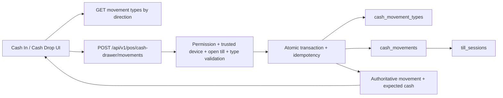

<!-- title: Cash In Out Flow -->
<!-- status: Active -->
<!-- system: OneVerz POS MVP -->
<!-- last_updated: 2026-08-16 -->

# Cash In Out Flow

## Purpose

Defines the canonical online Cash In and Cash Out/Drop journey.

## Preconditions

- Authenticated user with `cash_drawer.view` and, for mutation,
  `cash_drawer.movement.create`.
- Active tenant and trusted ACTIVE device with resolved outlet/till.
- OPEN till session.
- Backend and database reachable; offline financial completion is forbidden.

## Domain separation

| Domain | Meaning | Persistence |
|---|---|---|
| Financial Cash In | Movement `Direction = IN` | `cash_movements` |
| Financial Cash Drop / Out | Movement `Direction = OUT` | `cash_movements` |
| Physical drawer open | Hardware pulse / manual open | `cash_drawer_operations` |

Physical drawer open is **not** a Cash Drop.

## Status matrix (verified 2026-08-16)

| Capability | Status |
|---|---|
| Cash In UI | **IMPLEMENTED** |
| Cash In backend mutation (`POST .../movements` + `movementTypeId`) | **VERIFIED** |
| Cash In persistence (`cash_movements`) | **VERIFIED** |
| Cash In permission (`pos.cash_drawer.movements.create`) enforcement | **VERIFIED** |
| Cash In idempotency (`request_id`) | **VERIFIED** |
| Cash In expected-cash effect | **VERIFIED** |
| Cash In E2E / production acceptance | **VERIFIED** — [[../../15_IMPLEMENTATION_TRACKING/Flutter/Hardware/Cash_In_Chunk_3_Final_Production_Acceptance]] |
| Cash Drop UI | **IMPLEMENTED** |
| Cash Drop OUT backend support | **VERIFIED** (automated + PG concurrency) |
| Cash Drop persistence | **VERIFIED** (`cash_movements`) |
| Cash Drop available-cash server validation | **VERIFIED** |
| Cash Drop expected-cash subtraction | **VERIFIED** |
| Cash Drop concurrent over-drop | **VERIFIED** |
| Cash Drop UI / tablet layout (widget) | **VERIFIED** (automated layout tests) |
| Cash Drop printing | **NOT IMPLEMENTED** (optional) |
| Cash Drop live authenticated E2E / production acceptance | **VERIFIED** — [[../../15_IMPLEMENTATION_TRACKING/Flutter/Hardware/POS_Cash_Drop_Chunk_2_Production_Acceptance_2026-08-16]] |

## Cash In flow

1. Open Cash Drawer and choose **Cash In**.
2. Load current till session/summary from the backend.
3. Load active visible movement types for direction `IN`: global system types
   plus current-tenant custom types only.
4. Enter a positive decimal amount, select **Reason \*** (the movement type),
   and optionally enter a note.
5. Confirm once with a stable idempotency request identifier.
6. Backend validates permission, device, till, session, type eligibility,
   amount, and server-owned currency.
7. Backend atomically inserts one `cash_movements` row linked to
   `cash_movement_types` and `till_sessions`.
8. Backend returns authoritative movement and refreshed expected-cash values.
9. Flutter shows success only after that response, then refreshes summary and
   recent movements.

## Cash Drop flow (Chunk 1 closed; live E2E pending)

1. Open Cash Drop.
2. Permission + trusted device + OPEN till + summary load.
3. Load valid **OUT** movement types.
4. Enter amount + reason + optional note; live remaining-cash preview.
5. Confirm with stable `requestId`; prevent double submit.
6. Backend revalidates including amount ≤ available cash.
7. Atomic OUT `cash_movements` insert; expected cash decreases.
8. Refresh summary; success UI only after confirmation.
9. Physical slip print is optional/separate and must not reverse finance.

## Canonical data flow


```mermaid
flowchart LR
  UI[Cash In / Cash Drop UI] --> TYPES[GET movement types by direction]
  UI --> POST[POST /api/v1/pos/cash-drawer/movements]
  POST --> VALIDATE[Permission + trusted device + open till + type validation]
  VALIDATE --> TX[Atomic transaction + idempotency]
  TX --> CMT[cash_movement_types]
  TX --> CM[cash_movements]
  CM --> TS[till_sessions]
  TX --> RESULT[Authoritative movement + expected cash]
  RESULT --> UI
```

## Reason semantics

| UI/data | Meaning |
|---|---|
| Reason selector | `movement_type_id` from `cash_movement_types` |
| Note | Optional `cash_movements.reason` explanation |
| Currency | `till_sessions.currency_code`, never caller authority |
| Manager PIN | UI-only future placeholder; not authorization/persistence/logging |

### Verified system IN defaults

`FLOAT_ADDED`, `PETTY_CASH_ADDED`, `CASH_CORRECTION`, `OTHER`.

### OUT / Cash Drop types

Seeded system OUT types (Chunk 1): `CASH_DROP` (Safe Drop), `BANK_DEPOSIT`,
`CASH_PICKUP`, `SECURITY_TRANSFER`, `OUT_CASH_CORRECTION`, `OUT_OTHER`.
A "Bank Deposit" label does not authorize a banking module.

## Failure and duplicate handling

- Missing/closed till, invalid type, invalid amount, forbidden permission, or
  stale context returns a typed error and creates no movement.
- Timeout/unknown outcome must be resolved by the same request identifier; do
  not create a fresh automatic retry.
- No optimistic balance or local-only success.
- No dual write to `till_cash_movements` for POS Cash In/Drop.

## Legacy rule

```text
cash_movements = canonical financial ledger for POS Cash In (verified)
till_cash_movements = legacy/compatibility (e.g. some return paths); not POS Cash In writer
No dual-write for one Cash In or Cash Drop.
```

## Related files

- [[../../04_MODULE_KNOWLEDGE/08_Hardware_Till_Cash_Control/06_Cash_Drawer_Feature]]
- [[../../04_MODULE_KNOWLEDGE/08_Hardware_Till_Cash_Control/07_Cash_Drop_Feature]]
- [[../../08_FLUTTER_POS_KNOWLEDGE/Flutter_Cash_In_Screen_Implementation_Specification]]
- [[11_Till_Close_Flow]]
