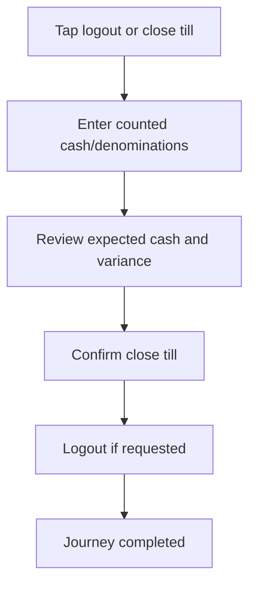

<!-- title: Till Close Flow -->
<!-- status: Active -->
<!-- system: TM-EPOS MVP -->
<!-- last_updated: 2026-07-23 -->

# Till Close Flow

## Purpose

Defines cashier till close and logout completion flow.

## Source Basis

This journey is based on the uploaded SCS-TIX Release 1 user journey files, UI
screens, backend architecture, database design, and confirmed project decisions.

It must not be expanded into e-commerce, offline sync, supplier, delivery, kiosk,
coupon, AI, or accounting scope.

## Actors

| Actor | Responsibility |
|---|---|
| Cashier | Counts cash and closes till |
| Backend | Calculates expected cash and variance |
| Manager | Reviews variance where policy requires |

## Preconditions

- Till session is open.
- Cashier/device belong to same till/outlet.
- Cashier has close till permission.

## Main Flow

| Step | User/System Action | Expected Result |
|---:|---|---|
| 1 | Tap logout or close till | Close till screen appears |
| 2 | Enter counted cash | Difference from backend expected cash is calculated |
| 3 | Review expected cash and variance | Variance is shown |
| 4 | Confirm close till | Session is closed |
| 5 | Logout if requested | Auth session ends after close flow |

## Journey Diagram

## Business Rules

- Only open session can be closed.
- Counted cash must be non-negative.
- Variance must be stored.
- Close till is tied to user and device.

## Access-Control Rules

| Control | Required Rule |
|---|---|
| Authentication | Required |
| Feature entitlement | POS/till enabled |
| Permission | Till close permission |
| Trusted device/open till | Required |

## Data and API References

| Area | References |
|---|---|
| API endpoints | `POST /api/v1/tills/close`, followed by tenant logout when End Shift requests logout |
| Close request | Trusted device context, counted cash and mismatch reason when variance exists |
| Tables | `till_sessions`, `till_session_summaries`, `till_session_payment_summaries`, `till_session_events`, `till_cash_movements` |

The current screen supports total counted cash and requires a mismatch reason
when variance exists. A complete denomination-entry workflow was not verified.
Close API/form/repository tests exist, but one full device-to-close-to-logout E2E
test and logout-failure recovery evidence remain gaps.

## Edge Cases

- Variance requires a mismatch reason in the current Flutter flow.
- Already closed session returns conflict.
- Logout with open till should route to close till.

## Out of Scope

- Offline final till close is not implemented and remains backend-authoritative.
- Accounting close day is excluded.

## Completion Criteria

- The user reaches the expected final state without bypassing access control.
- Tenant-owned data remains inside the resolved tenant context.
- Sensitive actions write audit records where required.
- UI state and backend state stay consistent after completion.

## Related Files

- [[../../01_RELEASE_SCOPE/Release_1_Scope]]
- [[../../02_ACCESS_CONTROL/Access_Control_Overview]]
- [[../../05_BACKEND_ARCHITECTURE/API_Standards]]
