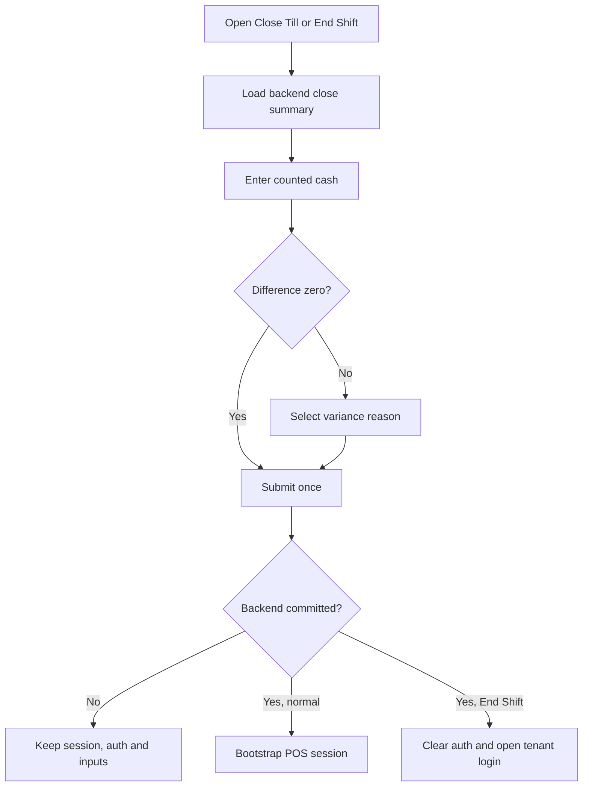

<!-- title: Till Close Flow -->
<!-- status: Active -->
<!-- system: OneVerz POS MVP -->
<!-- last_updated: 2026-08-12 -->

# Till Close Flow

## Purpose

Defines the cashier's backend-authoritative till reconciliation, close and
optional End Shift journey.

## Actors

| Actor | Responsibility |
|---|---|
| Cashier | Counts cash, supplies variance reason and confirms close |
| Backend | Resolves trusted context, calculates expected cash and commits reconciliation |

Manager approval and denomination entry are not part of the current approved UI.

## Preconditions

- Cashier is authenticated and has `pos.till.close`.
- Device is trusted, ACTIVE and assigned to an ACTIVE till.
- The assigned till has one open tenant-scoped session.
- Backend and database are reachable; offline final close is prohibited.

## Main Flow

| Step | User/System Action | Expected Result |
|---:|---|---|
| 1 | Open Close Till or End Shift | Existing Close Till route loads |
| 2 | Backend resolves session summary | Till context and authoritative expected cash appear |
| 3 | Cashier enters counted cash | Preview difference is shown |
| 4 | If non-zero, cashier selects approved reason | Short/Over status is valid for submission |
| 5 | Cashier optionally enters closing note | Note is trimmed and limited to 500 characters |
| 6 | Cashier taps Close Till once | One backend close request is in flight |
| 7 | Backend commits close | Session, reconciliation and CLOSED event commit atomically |
| 8a | Normal close | POS session is re-bootstrapped and routed appropriately |
| 8b | End Shift | Auth is cleared and tenant login opens only after close success |

## Journey Diagram

```mermaid
flowchart TD
    A[Open Close Till or End Shift] --> B[Load backend close summary]
    B --> C[Enter counted cash]
    C --> D{Difference zero?}
    D -- No --> E[Select variance reason]
    D -- Yes --> F[Submit once]
    E --> F
    F --> G{Backend committed?}
    G -- No --> H[Keep session, auth and inputs]
    G -- Yes, normal --> I[Bootstrap POS session]
    G -- Yes, End Shift --> J[Clear auth and open tenant login]
```

## Business Rules

- Expected Cash is calculated by the backend, never accepted from Flutter as
  authoritative input.
- Counted Cash must be non-negative and currency-precision valid.
- Difference is counted minus expected: zero = Balanced, negative = Short,
  positive = Over.
- Every non-zero difference requires one backend-approved reason.
- Final close writes one reconciliation and one CLOSED audit event.
- A failed/unknown response must not cause an automatic second close.
- Logout failure after confirmed close must not resubmit the transaction.
- Save Draft is current in-memory convenience only and is not durable.

## API And Data

| Area | Contract |
|---|---|
| Read | Extend/reuse `GET /api/v1/tills/current-session?deviceId=` for authoritative close summary |
| Write | Modify/reuse `POST /api/v1/tills/close` |
| Core tables | `till_sessions`, `cash_reconciliations`, `till_session_events` |
| Expected-cash input | Cash activity plus canonical `till_cash_movements`; `cash_movement_types` controls effect |

Current code trusts optional request `ExpectedCash` (or falls back to opening
float) and does not persist `cash_reconciliations`. Those are release blockers,
not accepted journey behavior.

## Alternate And Error Flows

- No open session: show no-open-session state; do not submit.
- Permission/device/assignment/till failure: block close with safe message.
- Missing variance reason: inline validation; no API success state.
- Network/server failure: preserve counted cash, reason, note, auth and open till.
- Concurrent/already closed: refresh authoritative session; never create a second
  reconciliation/event.
- Close succeeds but navigation fails: reconcile local session without another
  close request.

## Completion Criteria

- Exactly one session becomes CLOSED.
- Exactly one matching `cash_reconciliations` row exists.
- Exactly one CLOSED `till_session_events` row exists.
- Expected, counted and difference agree across response and database.
- Normal-close and End Shift navigation behave as defined.
- Authenticated runtime evidence confirms no duplicate submission.

## Out Of Scope

- Offline close, denominations, manager approval, report printing, accounting
  day close and durable draft storage.

## Visual Direction

Approved orange Close Till presentation (including Save Draft outline + solid Close Till CTA):
[[../../08_FLUTTER_POS_KNOWLEDGE/Flutter_Open_Close_Till_Orange_Visual_Direction]]

## Related Files

- [[../../04_MODULE_KNOWLEDGE/08_Hardware_Till_Cash_Control/05_Close_Till_Feature]]
- [[../../08_FLUTTER_POS_KNOWLEDGE/Flutter_Close_Till_Screen_Implementation_Specification]]
- [[../../15_IMPLEMENTATION_TRACKING/Flutter/Sales/End_Shift_And_Close_Till_Implementation_Status]]
- [[../../15_IMPLEMENTATION_TRACKING/Backend/OutletTillDevice/Till_Session_Open_Close_Implementation_Status]]
