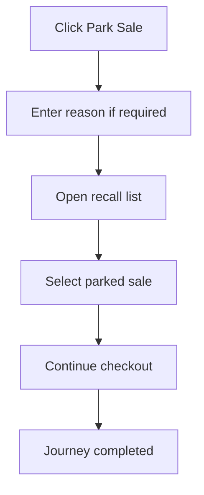

<!-- title: Park Recall Sale Flow -->
<!-- status: Active -->
<!-- system: TM-EPOS MVP -->
<!-- last_updated: 2026-07-23 -->

# Park Recall Sale Flow

## Purpose

Captures the uploaded parked-sale journey as a distinct cashier flow.

## Source Basis

This journey is based on the uploaded SCS-TIX Release 1 user journey files, UI
screens, backend architecture, database design, and confirmed project decisions.

It must not be expanded into e-commerce, offline sync, supplier, delivery, kiosk,
coupon, AI, or accounting scope.

## Actors

| Actor | Responsibility |
|---|---|
| Cashier | Parks and recalls a sale |
| Backend | Exposes a held-sale API that is not currently called by Flutter |
| POS App | Shows recall list |

## Preconditions

- Cart has items for park.
- Till session is open.
- Cashier has sale permission.

## Main Flow

| Step | User/System Action | Expected Result |
|---:|---|---|
| 1 | Click Park Sale | Current Flutter cart is serialized to device secure storage |
| 2 | Enter reference details | Device-local park details are saved |
| 3 | Open recall dialog | Device-local parked sales are shown |
| 4 | Select parked sale | Cart is restored and local parked record is removed |
| 5 | Continue checkout | Cart returns to active sale flow |

## Journey Diagram

## Business Rules

- Current Flutter parked records are device-local and are not cross-device
  backend records.
- Backend Holds provides tenant/outlet/till-scoped create/list/recall/cancel
  operations, but Flutter does not currently call it.
- Current local recall is not proof of backend release/expiry/cancel handling.
- Cart totals must be recalculated after recall.

## Access-Control Rules

| Control | Required Rule |
|---|---|
| Authentication | Required |
| Feature entitlement | POS enabled |
| Permission | Sale park/recall permission |
| Open till session | Required |

## Data and API References

| Area | References |
|---|---|
| Current Flutter authority | Secure-storage key `pos.parked_sales`; local save/list/recall/delete |
| Existing backend API | `POST|GET /api/v1/pos/holds`, `POST .../{holdId}/recall`, `DELETE .../{holdId}` |
| Backend table | `pos_order_holds` |

Current classification is `PARTIALLY_IMPLEMENTED` and disconnected. Backend
Holds controller/service/repository and tests exist, but the Flutter provider
uses only local secure storage.

## Edge Cases

- Empty cart cannot be parked.
- Sale already completed cannot be recalled.
- Different outlet/till access must be blocked.

## Out of Scope

- Offline parked-sale operation is MVP scope, but backend sync and cross-device
  recall are not implemented in the current Flutter flow.

## Completion Criteria

- The user reaches the expected final state without bypassing access control.
- Tenant-owned data remains inside the resolved tenant context.
- Sensitive actions write audit records where required.
- UI state and backend state stay consistent after completion.

## Related Files

- [[../../01_RELEASE_SCOPE/Release_1_Scope]]
- [[../../02_ACCESS_CONTROL/Access_Control_Overview]]
- [[../../05_BACKEND_ARCHITECTURE/API_Standards]]
