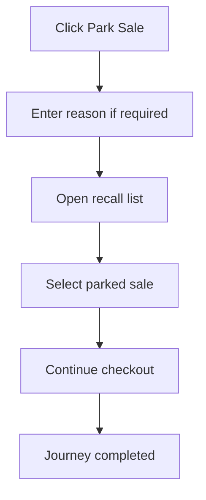

<!-- title: Park Recall Sale Flow -->
<!-- status: Active -->
<!-- system: SCS-TIX EPOS Release 1 -->
<!-- last_updated: 2026-06-08 -->

# Park Recall Sale Flow

## Purpose

Captures the uploaded parked-sale journey as a distinct cashier flow.

## Source Basis

This journey is based on the uploaded SCS-TIX Release 1 user journey files, UI
screens, backend architecture, database design, and confirmed project decisions.

It must not be expanded into e-commerce, offline sync, supplier, delivery, kiosk,
coupon, AI, or accounting scope.

## Actors

| Actor | Responsibility |
|---|---|
| Cashier | Parks and recalls a sale |
| Backend | Stores held sale state |
| POS App | Shows recall list |

## Preconditions

- Cart has items for park.
- Till session is open.
- Cashier has sale permission.

## Main Flow

| Step | User/System Action | Expected Result |
|---:|---|---|
| 1 | Click Park Sale | Current cart is marked held/parked |
| 2 | Enter reason if required | Park details are saved |
| 3 | Open recall list | Parked sales for outlet/till are shown |
| 4 | Select parked sale | Sale/cart is recalled |
| 5 | Continue checkout | Cart returns to active sale flow |

## Journey Diagram

## Business Rules

- Parked sale must stay tenant/outlet scoped.
- Recall must track user/time where supported.
- Only eligible parked sales can be recalled.
- Cart totals must be recalculated after recall.

## Access-Control Rules

| Control | Required Rule |
|---|---|
| Authentication | Required |
| Feature entitlement | POS enabled |
| Permission | Sale park/recall permission |
| Open till session | Required |

## Data and API References

| Area | References |
|---|---|
| API groups | `/api/v1/pos/sales` |
| Tables | `sales`, `sale_lines`, `till_sessions` |

## Edge Cases

- Empty cart cannot be parked.
- Sale already completed cannot be recalled.
- Different outlet/till access must be blocked.

## Out of Scope

- Offline parked-sale sync is excluded.

## Completion Criteria

- The user reaches the expected final state without bypassing access control.
- Tenant-owned data remains inside the resolved tenant context.
- Sensitive actions write audit records where required.
- UI state and backend state stay consistent after completion.

## Related Files

- [[../01_RELEASE_SCOPE/Release_1_Scope]]
- [[../02_ACCESS_CONTROL/Access_Control_Overview]]
- [[../05_BACKEND_ARCHITECTURE/API_Standards]]
