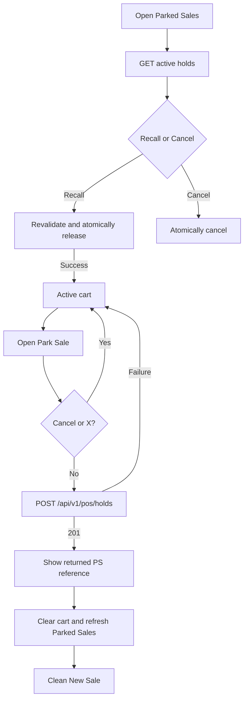

<!-- title: Park Recall Sale Flow -->
<!-- status: Active -->
<!-- system: OneVerz POS MVP -->
<!-- last_updated: 2026-08-06 -->

# Park Recall Sale Flow

## Purpose

Defines the approved backend-authoritative cashier flow for **Park Sale**, **Parked Sales**, and **Recall Sale**. Backend internal names and `/pos/holds` routes may remain unchanged.

## Preconditions

- Authenticated cashier, valid POS entitlement, trusted active device, eligible till assignment, and open till session.
- Park requires `sales.park.create` and at least one valid cart line.
- List requires `sales.park.view`; recall requires `sales.park.recall`.
- Customer and discount context, when present, come from the active cart.

## Park Sale

| Step | Action | Result |
|---:|---|---|
| 1 | Cashier selects Park Sale | Modal opens immediately; cart is unchanged |
| 2 | Modal loads | Reference reads `Generated automatically after parking`; 24-hour message is shown |
| 3 | Cashier optionally enters a short note | Trimmed note accepts at most 250 characters |
| 4 | Cashier confirms | Button is disabled/loading; one stable idempotency key is dispatched |
| 5 | Backend validates context and recalculates | Client prices, totals, expiry, tenant, user and till are not authoritative |
| 6 | API returns `201 Created` | Returned Park Reference is displayed and list/count refreshes |
| 7 | Success is accepted | Cart/customer/discount clear and clean New Sale opens |

Cancel or X closes the modal without changing the cart. Any timeout or `4xx/5xx` result preserves the cart.

## Parked Sales, Recall and Cancel

- The active list contains only accessible `HELD`, non-expired records for the current tenant, till and holding user.
- Recall revalidates device, till session, stock, price, tax, discount and totals, then atomically changes `HELD` to `RELEASED` once.
- Successful recall restores the backend response into the active cart. Failed recall leaves both cart and hold recoverable.
- Cancel uses the current DELETE contract and atomically changes an eligible hold to `CANCELLED`.
- Expired, released or cancelled records cannot be recalled and do not appear in the active list.

```mermaid
flowchart TD
  A[Active cart] --> B[Open Park Sale]
  B --> C{Cancel or X?}
  C -->|Yes| A
  C -->|No| D[POST /api/v1/pos/holds]
  D -->|Failure| A
  D -->|201| E[Show returned PS reference]
  E --> F[Clear cart and refresh Parked Sales]
  F --> G[Clean New Sale]
  H[Open Parked Sales] --> I[GET active holds]
  I --> J{Recall or Cancel}
  J -->|Recall| K[Revalidate and atomically release]
  K -->|Success| A
  J -->|Cancel| L[Atomically cancel]
```

## Approved Rules

- Target reference: `PS-{YYYY}-{NNNNN}`, generated only by the backend after success.
- Standard expiry: `expires_at = held_at + 24 hours`, using backend server time.
- Park creates/uses a draft unpaid POS order; it creates no completed sale, payment or receipt and triggers no printer or drawer.
- Current scope is tenant + till + holding user. No manager or cross-cashier override is implied.
- Same idempotency key plus same payload replays safely; a changed payload conflicts.
- Backend online persistence is authoritative. Offline outbox/sync is a separate pending contract.

## Failure States

| State | Expected behaviour |
|---|---|
| Empty cart or invalid line | Modal/action blocked with validation guidance |
| Permission denied | Action hidden for UX; backend returns final denial |
| Invalid device/session/till | Request fails; cart remains intact |
| Expired/not recallable/wrong till | Conflict state; active cart remains unchanged |
| Network/timeout/unknown result | Preserve key and cart; reconcile before retry |
| Empty list | Explain that no active parked sales are available |

## Current Implementation Gap

Flutter currently saves independent device-local records under secure-storage key `pos.parked_sales`, creates labels such as `Parked Sale #1`, accepts reference name/phone/note, removes the local record during recall, and does not call the backend Holds API. The UI still contains `Hold Sale`. Backend currently generates `HOLD-000001` style references and accepts optional client `ExpiresAt`. These are verified current behaviours, not the approved target.

## Completion Criteria

- Backend contract produces PS reference and server-controlled 24-hour expiry.
- Canonical permissions are seeded, assigned and enforced.
- Flutter uses typed backend create/list/recall/cancel flows and has no competing authority.
- Cart clears only after confirmed create success; recall/cancel are atomic and retry-safe.
- Automated tenant, permission, lifecycle, idempotency and failure tests pass.
- Authenticated runtime proves list/count, park, recall, cancel and expiry without duplicates or cart loss.

## Related Files

- [[../../04_MODULE_KNOWLEDGE/21_POS_Operations/08_Park_Recall_Sale_Feature]]
- [[../../08_FLUTTER_POS_KNOWLEDGE/Flutter_Park_Recall_Sale_Implementation_Specification]]
- [[../../10_TESTING_QA/Test_Case/21_POS_Operations/POS_Park_Recall_Sale_Test_Cases]]
- [[../../13_DECISIONS_AND_CHANGES/ADR/ADR_008_Park_Recall_Sale_Authority_And_Expiry]]
