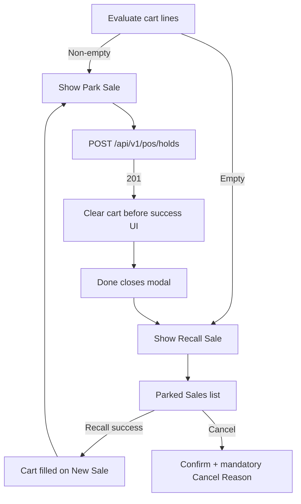

<!-- title: Park Recall Sale Flow -->
<!-- status: Active -->
<!-- system: OneVerz POS MVP -->
<!-- last_updated: 2026-08-07 -->

# Park Recall Sale Flow

## Purpose

Defines the approved backend-authoritative cashier flow for **Park Sale**,
**Parked Sales**, and **Recall Sale**. Backend `/pos/holds` names may remain.
Controller: `PosHoldsController`.

## Verification posture

| Evidence | Status |
|---|---|
| Code + automated Flutter/backend suites | Implemented / verified |
| Authenticated full cashier runtime E2E | Runtime Verification Pending |

## Preconditions

- Authenticated cashier, POS entitlement, trusted device, till assignment, open session.
- Park requires `sales.park.create` and at least one **valid cart line**.
- List requires `sales.park.view`; recall requires `sales.park.recall`.
- Empty cart = no valid cart lines. Customer-only or discount-only is still empty.
- Customer/discount context, when present, comes from the active cart.
- Source sale must not be partially paid (optional `SourceSaleId` check).

## Park Sale / Recall Sale visibility

| Active cart | Park Sale | Recall Sale |
|---|---|---|
| One or more valid lines | Show | Hide |
| No valid lines | Hide | Show |

- Only this action pair is toggled; other New Sale actions stay unchanged.
- Cashier cannot recall while the cart has lines; Park Sale or clear cart first.
- Recall Sale opens the current-till **Parked Sales** list (New Sale dialog or
  home route `/pos/parked-sales` → `PosParkedSalesScreen`, same provider).
- Successful recall fills the cart, navigates to New Sale, and switches action
  to Park Sale (subject to permission).
- Recall must never silently overwrite a non-empty cart.

## Park Sale

| Step | Action | Result |
|---:|---|---|
| 1 | Cart non-empty; cashier selects Park Sale | Modal opens; cart unchanged |
| 2 | Modal loads | Reference: `Generated automatically after parking`; 24-hour message |
| 3 | Optional short note | Trimmed; max 250 characters |
| 4 | Confirm | Loading; one stable idempotency key; double-tap guarded |
| 5 | Backend validates | Soft stock check; no reserve/deduct; client clocks not authoritative |
| 6 | `201 Created` | Cart clears **before** success dialog; list/count refresh |
| 7 | Done | Closes success modal only; no second API; clean New Sale (Recall Sale visible) |

Cancel/X preserves cart. Timeout/`4xx`/`5xx` preserves cart and key.

## Parked Sales, Recall and Cancel

- **List scope:** current tenant + current till (trusted device / open session) +
  holding cashier + `HELD` + non-expired. Home count uses the same predicate.
- List/count/recall/cancel call `ExpireDueHolds`, which persists `EXPIRED`.
- Cards show product-name summary (first two names, then `+N more`) plus separate
  `itemCount`. Use backend line order; no display-only API.
- Recall revalidates device, session, price, tax, discount and totals; soft stock
  warnings may return; then `HELD → RELEASED` once. SalesOrder stays `DRAFT`.
- Success restores the cart on New Sale and switches action to Park Sale.
- **Cancel:** confirmation with Park Reference, warning, required **Cancel Reason**,
  Back/Close, Confirm Cancel. Reason mandatory at service (trim; not blank; max 250).
- Expired/released/cancelled records stay off the active list and cannot be recalled.

## Dashboard Parked Sales Screen Journey (Approved Target)

1. Cashier selects Dashboard **Recall Sale**; `sales.park.view` guards
   `/pos/parked-sales` before data is shown.
2. The existing POS shell remains visible. **Today** is selected by default;
   **This Shift** and **All Parked Sales** retain the same active current-till,
   holding-user scope.
3. Rows show Park Reference, Customer (`Walk-in Customer` fallback), quantity-sum
   Items, outlet-timezone Parked Time, backend currency/amount and actions.
4. View opens typed read-only details. Recall protects a non-empty cart; success
   refreshes the list and navigates to `/pos/new-sale`.
5. Cancel Parked Sale confirms a required trimmed reason (max 250), performs no
   hard delete and refreshes only after success.
6. Start New Sale uses `pos.sales.new_sale.create` (legacy alias: `sales.create`) and `/pos/new-sale`; it must not silently
   discard an active cart.

Current cards/refresh/recall/cancel exist. Filters, table, View, summary totals,
pagination and Start New Sale panel are pending. Exact target:
[[../../08_FLUTTER_POS_KNOWLEDGE/Flutter_Parked_Sales_Recall_Screen_Implementation_Specification]].

```mermaid
flowchart TD
  A[Evaluate cart lines] -->|Non-empty| B[Show Park Sale]
  A -->|Empty| C[Show Recall Sale]
  B --> D[POST /api/v1/pos/holds]
  D -->|201| E[Clear cart before success UI]
  E --> F[Done closes modal]
  F --> C
  C --> G[Parked Sales list]
  G -->|Recall success| H[Cart filled on New Sale]
  H --> B
  G -->|Cancel| I[Confirm + mandatory Cancel Reason]
```

## Approved Rules

- Backend-generated `PS-{UTC_YEAR}-{5 digit}` after success; Flutter display-only.
- Expiry = server UTC + 24 hours; lazy `EXPIRED` persistence via `ExpireDueHolds`.
- Park is draft unpaid; no payment, receipt, printer or drawer.
- Park does not reserve/deduct stock; checkout remains hard stock authority.
- Partially paid cannot park (`pos_holds.sale_partially_paid_cannot_be_parked`).
- No cross-cashier or manager override.
- Same idempotency key + fingerprint replays; changed fingerprint conflicts.
  DB: `UNIQUE (tenant_id, idempotency_key) WHERE idempotency_key IS NOT NULL`.
- Backend online persistence is authoritative; offline outbox is separate.
- Audit: `pos_order_hold_events` (`PARK_CREATED`, `PARK_IDEMPOTENT_REPLAY`,
  `PARK_RECALLED`, `PARK_CANCELLED`, `PARK_EXPIRED`).

## Failure States

| State | Expected behaviour |
|---|---|
| Empty cart on Park | Park Sale hidden; do not open Park modal |
| Non-empty cart on Recall | Recall Sale hidden; block overwrite |
| Invalid Cancel Reason | Inline + service rejection; no cancel |
| Partially paid source | Reject with `pos_holds.sale_partially_paid_cannot_be_parked` |
| Permission denied | Action hidden; backend final denial |
| Wrong/expired till context | Fail or empty list; cart unchanged |
| Idempotency fingerprint mismatch | Conflict; cart unchanged |
| Network/timeout | Preserve cart/key/reason; reconcile before retry |

## Current vs Target

| Area | Status |
|---|---|
| Park/Recall mutual visibility | Implemented (code + automated tests) |
| Product-name card summary | Target; confirm in authenticated UI E2E |
| Cancel Reason mandatory | Implemented at service |
| List/home count till filter | Implemented (aligned active-hold predicate) |
| Authenticated full E2E | Runtime Verification Pending — not Completed |

## Related Files

- [[../../04_MODULE_KNOWLEDGE/21_POS_Operations/08_Park_Recall_Sale_Feature]]
- [[../../08_FLUTTER_POS_KNOWLEDGE/Flutter_Park_Recall_Sale_Implementation_Specification]]
- [[../../08_FLUTTER_POS_KNOWLEDGE/Flutter_Parked_Sales_Recall_Screen_Implementation_Specification]]
- [[../../10_TESTING_QA/Test_Case/21_POS_Operations/POS_Park_Recall_Sale_Test_Cases]]
- [[../../13_DECISIONS_AND_CHANGES/ADR/ADR_008_Park_Recall_Sale_Authority_And_Expiry]]
