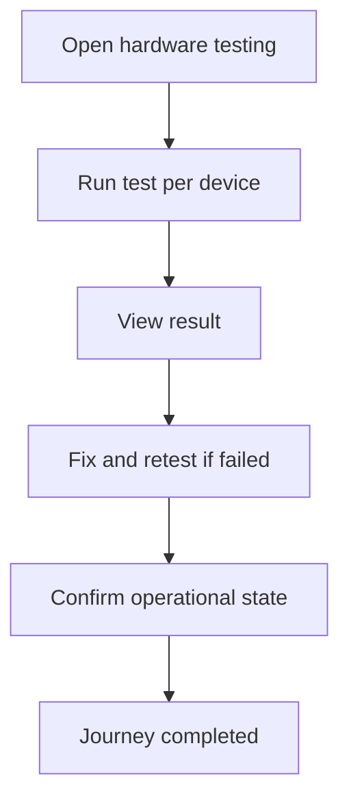

<!-- title: Hardware Testing Flow -->
<!-- status: Active -->
<!-- system: TM-EPOS MVP -->
<!-- last_updated: 2026-07-23 -->

# Hardware Testing Flow

## Purpose

Captures the uploaded cashier hardware testing journey.

## Source Basis

This journey is based on the uploaded SCS-TIX Release 1 user journey files, UI
screens, backend architecture, database design, and confirmed project decisions.

It must not be expanded into e-commerce, offline sync, supplier, delivery, kiosk,
coupon, AI, or accounting scope.

## Actors

| Actor | Responsibility |
|---|---|
| Cashier/Manager | Runs hardware tests |
| Backend | Records hardware test results |
| POS Device | Performs local device test |

## Preconditions

- Device is trusted.
- Hardware devices are configured.
- User has hardware test permission.

## Main Flow

| Step | User/System Action | Expected Result |
|---:|---|---|
| 1 | Open hardware testing | Configured devices are listed |
| 2 | Run test per device | Printer/scanner/cash drawer/card reader test starts |
| 3 | View result | Success/failure result appears |
| 4 | Fix and retest if failed | New test log is recorded |
| 5 | Confirm operational state | POS can continue with working devices |

## Journey Diagram

## Business Rules

- Direct hardware communication is handled by POS/local device service.
- Backend stores device configuration and test logs.
- Failures must not be hidden.
- Hardware tests are tenant/outlet/device scoped.

## Access-Control Rules

| Control | Required Rule |
|---|---|
| Authentication | Required |
| Feature entitlement | Hardware/POS enabled |
| Permission | Hardware test permission |
| Trusted device | Required |

## Data and API References

| Area | References |
|---|---|
| API groups | `/api/v1/devices`, hardware API group where implemented |
| Tables | `hardware_profiles`, `hardware_devices`, `hardware_test_logs`, `pos_devices` |

## Edge Cases

- Missing device config shows empty/error state.
- Failed test records diagnostic message.
- Blocked device cannot run operational tests.

## Out of Scope

- Kiosk hardware testing is excluded.
- Unsupported peripherals are future scope.

## Completion Criteria

- The user reaches the expected final state without bypassing access control.
- Tenant-owned data remains inside the resolved tenant context.
- Sensitive actions write audit records where required.
- UI state and backend state stay consistent after completion.

## Scanner implementation note (2026-07-22)

Flutter USB HID keyboard framing is implemented for Enter/numpad Enter
terminated input, with configurable minimum length, 120 ms inactivity reset,
enabled-state reset, and handler disposal. Physical TURBOGEAR TB-00D validation
has not yet been completed. Exact API processing, FIFO queue/lock, direct cart
add, modal lifecycle controls, typed one-time visual feedback, focused-search
clearing, pending debounce cancellation, and scanner partial-search suppression
are implemented. Manual product search remains available. Camera scanning
remains pending, and full scanner E2E is partial until physical validation.

Chunk 5 scanner feedback and search cleanup are implemented and verified in the
Flutter widget/provider test environment. Physical TURBOGEAR TB-00D testing is
still pending Chunk 6; at that point camera scanning was not implemented.

Camera scanning is now implemented for Android/iOS with automated coverage and
a successful Android debug APK build. Real camera permission, preview, printed
barcode recognition, background/resume, and device-specific performance remain
pending physical Android validation. This does not complete physical TB-00D
Chunk 6 acceptance.

Current hardware capability must be read per device type:

| Device area | Source-code status | Runtime/physical status |
|---|---|---|
| USB HID scanner | Keyboard framing and shared exact barcode-to-cart pipeline implemented | TURBOGEAR TB-00D physical and repeated-scan acceptance not verified |
| Camera scanner | Android/iOS camera source and automated coverage implemented | Physical Android/iOS camera permission, lifecycle and barcode recognition not verified |
| Receipt printer | Device-configured facade, ESC/POS generator and network socket transport exist; USB/Bluetooth adapters fail safely where unsupported | USB/Bluetooth/network physical printer matrix not verified |
| Cash drawer | UI entry exists | No verified drawer-kick/printer-pulse command or physical result |
| Card reader | Payment route exists as placeholder | No provider terminal capture or physical terminal evidence |
| Hardware test log | Hardware schema includes test-log foundation | No complete cashier screen → API → service → repository logging chain was verified |

Therefore this journey is `RUNTIME_VERIFICATION_REQUIRED`, not end-to-end
complete. Package/plugin registration and adapter classes are not physical-test
evidence.

## Related Files

- [[../../01_RELEASE_SCOPE/Release_1_Scope]]
- [[../../02_ACCESS_CONTROL/Access_Control_Overview]]
- [[../../05_BACKEND_ARCHITECTURE/API_Standards]]
