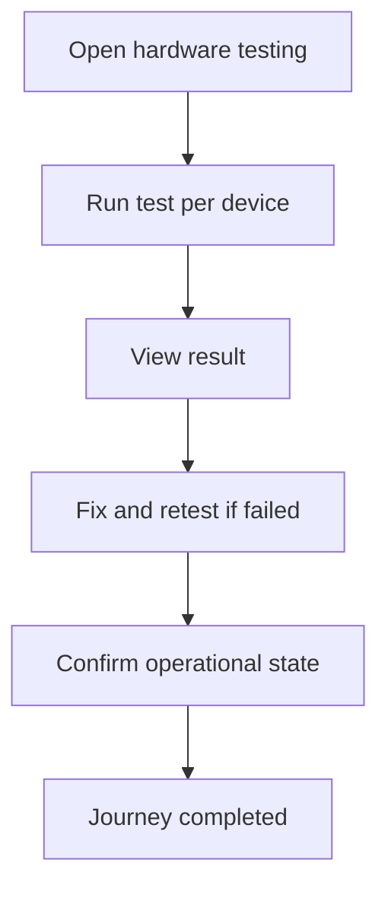

<!-- title: Hardware Testing Flow -->
<!-- status: Active -->
<!-- system: SCS-TIX EPOS Release 1 -->
<!-- last_updated: 2026-06-08 -->

# Hardware Testing Flow

## Purpose

Captures the uploaded cashier hardware testing journey.

## Source Basis

This journey is based on the uploaded SCS-TIX Release 1 user journey files, UI
screens, backend architecture, database design, and confirmed project decisions.

It must not be expanded into e-commerce, offline sync, supplier, delivery, kiosk,
coupon, AI, or accounting scope.

## Actors

| Actor | Responsibility |
|---|---|
| Cashier/Manager | Runs hardware tests |
| Backend | Records hardware test results |
| POS Device | Performs local device test |

## Preconditions

- Device is trusted.
- Hardware devices are configured.
- User has hardware test permission.

## Main Flow

| Step | User/System Action | Expected Result |
|---:|---|---|
| 1 | Open hardware testing | Configured devices are listed |
| 2 | Run test per device | Printer/scanner/cash drawer/card reader test starts |
| 3 | View result | Success/failure result appears |
| 4 | Fix and retest if failed | New test log is recorded |
| 5 | Confirm operational state | POS can continue with working devices |

## Journey Diagram

## Business Rules

- Direct hardware communication is handled by POS/local device service.
- Backend stores device configuration and test logs.
- Failures must not be hidden.
- Hardware tests are tenant/outlet/device scoped.

## Access-Control Rules

| Control | Required Rule |
|---|---|
| Authentication | Required |
| Feature entitlement | Hardware/POS enabled |
| Permission | Hardware test permission |
| Trusted device | Required |

## Data and API References

| Area | References |
|---|---|
| API groups | `/api/v1/devices`, hardware API group where implemented |
| Tables | `hardware_profiles`, `hardware_devices`, `hardware_test_logs`, `pos_devices` |

## Edge Cases

- Missing device config shows empty/error state.
- Failed test records diagnostic message.
- Blocked device cannot run operational tests.

## Out of Scope

- Kiosk hardware testing is excluded.
- Unsupported peripherals are future scope.

## Completion Criteria

- The user reaches the expected final state without bypassing access control.
- Tenant-owned data remains inside the resolved tenant context.
- Sensitive actions write audit records where required.
- UI state and backend state stay consistent after completion.

## Related Files

- [[../01_RELEASE_SCOPE/Release_1_Scope]]
- [[../02_ACCESS_CONTROL/Access_Control_Overview]]
- [[../05_BACKEND_ARCHITECTURE/API_Standards]]
