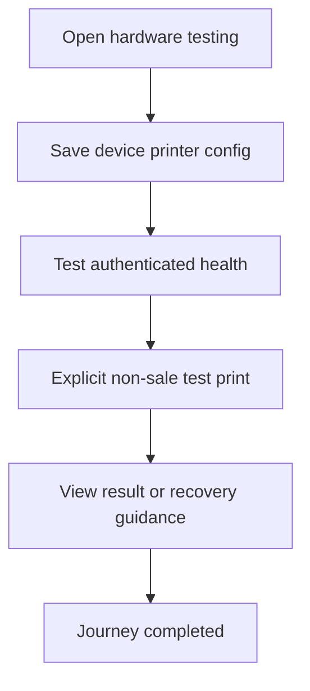

<!-- title: Hardware Testing Flow -->
<!-- status: Active -->
<!-- system: OneVerz POS MVP -->
<!-- last_updated: 2026-07-29 -->
# Hardware Testing Flow
## Purpose

Captures the uploaded cashier hardware testing journey.

## Source Basis

This journey is based on the uploaded SCS-TIX Release 1 user journey files, UI
screens, backend architecture, database design, and confirmed project decisions.

It must not be expanded into e-commerce, offline sync, supplier, delivery, kiosk,
coupon, AI, or accounting scope.

## Actors
| Actor | Responsibility |
|---|---|
| Cashier/Manager | Runs hardware tests |
| Backend | Records hardware test results |
| POS Device | Performs local device test |

## Preconditions
- Device is trusted.
- Hardware devices are configured.
- User has hardware test permission.

## Main Flow
| Step | User/System Action | Expected Result |
|---:|---|---|
| 1 | Open hardware testing | Device-specific Local Print Agent configuration appears |
| 2 | Save printer configuration | URL/timeout/printer name persist; API key remains secure |
| 3 | Test connection | Authenticated health response maps agent/printer readiness |
| 4 | Print labelled test receipt | One non-sale request is sent after explicit action |
| 5 | View result and recover | Failure, unauthorized, incompatible, unavailable, or ready state appears |

## Journey Diagram


```mermaid
flowchart TD
    S1[Open hardware testing]
    S1 --> S2[Save device printer config]
    S2 --> S3[Test authenticated health]
    S3 --> S4[Explicit non-sale test print]
    S4 --> S5[View result or recovery guidance]
    S5 --> Done[Journey completed]
```

## Business Rules
- Direct hardware communication is handled by POS/local device service.
- Backend stores device configuration and test logs.
- Failures must not be hidden.
- Hardware tests are tenant/outlet/device scoped.
- Manual print tests do not create sale/payment/receipt/audit records.
- Local Agent URL must target the laptop LAN address from a physical phone;
  emulator-only `10.0.2.2` is not a physical-phone address.

## Access-Control Rules
| Control | Required Rule |
|---|---|
| Authentication | Required |
| Feature entitlement | Hardware/POS enabled |
| Permission | Hardware test permission |
| Trusted device | Required |

## Data and API References
| Area | References |
|---|---|
| Local Agent APIs | `GET /api/print/health`, `POST /api/print/receipt` |
| Recovery API | `GET /api/print/operations/{requestId}` |
| Tables | `hardware_profiles`, `hardware_devices`, `hardware_test_logs`, `pos_devices` |

## Edge Cases
- Missing device config shows empty/error state.
- Failed test records diagnostic message.
- Blocked device cannot run operational tests.

## Out of Scope

- Kiosk hardware testing is excluded.
- Unsupported peripherals are future scope.

## Completion Criteria
- The user reaches the expected final state without bypassing access control.
- Tenant-owned data remains inside the resolved tenant context.
- Sensitive actions write audit records where required.
- UI state and backend state stay consistent after completion.
- Operator selects hardware, loads activated-device configuration, tests health,
  explicitly triggers a physical action, confirms the observed result, and may
  retry only after the prior outcome is known.
- Production hardware-test audit records test/request identity, hardware,
  operator, tenant/outlet/till/session/device, safe result/error, time, payload
  type and captured physical evidence reference.
- Configuration changes are separate audited commands. Tests create no business
  sale, payment, receipt, refund, exchange or completed-sale print audit.
- Current Local Agent screen covers configuration, health and test receipt;
  backend `hardware_test_logs` API/persistence is now wired for the current
  printer health/test-print flow.

## Hardware Chunk 1 implementation update (2026-07-29)

The activated-device hardware foundation now reuses `hardware_devices`,
`hardware_device_assignments` and `hardware_test_logs`. Device configuration is
tenant/outlet/device/till validated, versioned, and protected by
`pos.hardware.settings`. Safe before/after configuration changes are stored in
`hardware_configuration_change_audits`; Local Print Agent API keys remain only
in Flutter secure storage and are represented to the backend by key-presence
metadata.

The existing Flutter Hardware Testing screen loads and saves the authoritative
receipt-printer configuration, preserves the secure key when a blank key is
submitted, displays the configuration version and active-session state, and
uses the two-stage test lifecycle:

```text
create backend operation
→ execute Local Agent health or non-sale test receipt locally
→ collect typed/physical result
→ finalize backend audit without repeating the physical action
```

Create/result submission is idempotent. A request ID cannot be reused with a
different payload. Spooler acceptance waits for explicit operator confirmation
and is not treated as paper proof. Cash drawer and card terminal cannot report
success: backend results are respectively `Blocked /
drawer_not_implemented` and `Blocked / card_terminal_not_configured`.

Automated validation passed for backend build and all backend suites (627 unit,
375 integration, 339 API, 30 Local Agent), Flutter analysis, 20 targeted
hardware tests and Android debug build. The full Flutter suite recorded
653 passes and 7 unrelated New Sale/widget failures; these are not hidden or
reclassified as Hardware Chunk 1 failures.

Physical printer, scanner and active-shift acceptance remain pending. Scanner
configuration and physical confirmation are not yet fully exposed through this
screen, so the overall hardware journey remains
`RUNTIME_VERIFICATION_REQUIRED`.

## Scanner implementation note (2026-07-22)

Flutter USB HID keyboard framing is implemented for Enter/numpad Enter
terminated input, with configurable minimum length, 120 ms inactivity reset,
enabled-state reset, and handler disposal. Physical TURBOGEAR TB-00D validation
has not yet been completed. Exact API processing, FIFO queue/lock, direct cart
add, modal lifecycle controls, typed one-time visual feedback, focused-search
clearing, pending debounce cancellation, and scanner partial-search suppression
are implemented. Manual product search remains available. Camera scanning
remains pending, and full scanner E2E is partial until physical validation.

Chunk 5 scanner feedback and search cleanup are implemented and verified in the
Flutter widget/provider test environment. Physical TURBOGEAR TB-00D testing is
still pending Chunk 6; at that point camera scanning was not implemented.

Camera scanning is now implemented for Android/iOS with automated coverage and
a successful Android debug APK build. Real camera permission, preview, printed
barcode recognition, background/resume, and device-specific performance remain
pending physical Android validation. This does not complete physical TB-00D
Chunk 6 acceptance.

Current hardware capability must be read per device type:

| Device area | Source-code status | Runtime/physical status |
|---|---|---|
| USB HID scanner | Keyboard framing and shared exact barcode-to-cart pipeline implemented | TURBOGEAR TB-00D physical and repeated-scan acceptance not verified |
| Camera scanner | Android/iOS camera source and automated coverage implemented | Physical Android/iOS camera permission, lifecycle and barcode recognition not verified |
| Receipt printer | Local Agent UI/client/adapter, health, test print and RAW spooler path implemented | POS80 printed in observed development use; current release acceptance, failure matrix and final cutter/barcode fixes remain unverified |
| Cash drawer | UI entry exists | No verified drawer-kick/printer-pulse command or physical result |
| Card reader | Payment route exists as placeholder | No provider terminal capture or physical terminal evidence |
| Hardware test log | Backend operation create/result APIs and `hardware_test_logs` persistence are wired for current printer health/test-print flow | Physical evidence capture and full peripheral matrix remain pending |

Therefore this journey is `RUNTIME_VERIFICATION_REQUIRED`, not end-to-end
complete. Package/plugin registration and adapter classes are not physical-test
evidence.

## Hardware Chunk 2C evidence (2026-07-29)

Non-sale original/reprint receipt contracts and customer/merchant copy
orchestration are automated and regression-tested. The development migration
for independent reprint copy audits was applied successfully. Backend Release
build passed with 627 unit, 379 integration, 339 API and 41 Agent tests.
Flutter targeted receipt tests and analysis passed; debug APK built. Full
Flutter recorded 660 passes and the same seven unrelated New Sale failures.

No POS80 paper test was performed for this update. Original/reprint,
multi-copy, barcode/cut and fault-injection rows remain `Not Run`; the journey
therefore remains `RUNTIME_VERIFICATION_REQUIRED`.

## Related Files
- [[../../01_RELEASE_SCOPE/Release_1_Scope]]
- [[../../02_ACCESS_CONTROL/Access_Control_Overview]]
- [[../../05_BACKEND_ARCHITECTURE/API_Standards]]

## Hardware Chunk 3 scanner lifecycle (2026-07-29)

```text
load device configuration
-> register hardware test
-> listen through HID or camera
-> detect and validate physical input
-> operator confirms physical result
-> finalize result
-> display scanner history
```

Scanner evidence stores mode, barcode length, SHA-256 hash, event counts,
drop/duplicate counts and local latency. Raw barcode values, camera frames and
key streams are not persisted. Product lookup is separate: unknown product
input can pass the hardware test without mutating cart, sale, payment or
inventory data. Physical acceptance remains pending.

## Tenant Admin Monitoring Link (2026-08-01)

Cashier hardware testing remains the physical execution path. Results must eventually land in `hardware_test_logs` for Tenant Admin Till monitoring. End-to-end logging chain remains incomplete; physical verification pending. See [[../../12_INTEGRATIONS/POS_Hardware_Integration]].
