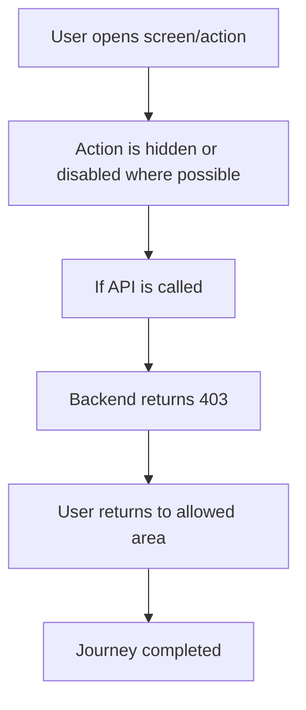

<!-- title: Permission Denied Flow -->
<!-- status: Active -->
<!-- system: SCS-TIX EPOS Release 1 -->
<!-- last_updated: 2026-06-08 -->

# Permission Denied Flow

## Purpose

Defines the common user experience when an authenticated user lacks required permission.

## Source Basis

This journey is based on the uploaded SCS-TIX Release 1 user journey files, UI
screens, backend architecture, database design, and confirmed project decisions.

It must not be expanded into e-commerce, offline sync, supplier, delivery, kiosk,
coupon, AI, or accounting scope.

## Actors

| Actor | Responsibility |
|---|---|
| Any Tenant User | Attempts action without permission |
| Backend | Rejects protected operation |
| UI | Hides or blocks action |

## Preconditions

- User is authenticated.
- Feature may be enabled.
- Required permission is missing.

## Main Flow

| Step | User/System Action | Expected Result |
|---:|---|---|
| 1 | User opens screen/action | UI checks permissions |
| 2 | Action is hidden or disabled where possible | User cannot start blocked flow |
| 3 | If API is called | Backend checks permission |
| 4 | Backend returns 403 | UI shows access denied message |
| 5 | User returns to allowed area | No data mutation occurs |

## Journey Diagram

## Business Rules

- Backend enforcement is mandatory even if UI hides action.
- 403 is correct for authenticated-but-blocked user.
- Permission denial must not expose other tenant data.
- No business record should be mutated.

## Access-Control Rules

| Control | Required Rule |
|---|---|
| Authentication | Required |
| Permission | Missing/denied |
| Feature entitlement | May be enabled |
| Audit | Only if policy requires denied-attempt audit |

## Data and API References

| Area | References |
|---|---|
| API groups | All protected API groups |
| Tables | `permissions`, `role_permissions`, `tenant_user_roles`, `outlet_user_roles`, `audit_logs` where required |

## Edge Cases

- Permission changed during session requires refresh/reload.
- Deep link to blocked route must fail.
- API call from modified client must fail.

## Out of Scope

- Do not use UI hiding as the only protection.
- Do not return 401 for valid authenticated user lacking permission.

## Completion Criteria

- The user reaches the expected final state without bypassing access control.
- Tenant-owned data remains inside the resolved tenant context.
- Sensitive actions write audit records where required.
- UI state and backend state stay consistent after completion.

## Related Files

- [[../01_RELEASE_SCOPE/Release_1_Scope]]
- [[../02_ACCESS_CONTROL/Access_Control_Overview]]
- [[../05_BACKEND_ARCHITECTURE/API_Standards]]
