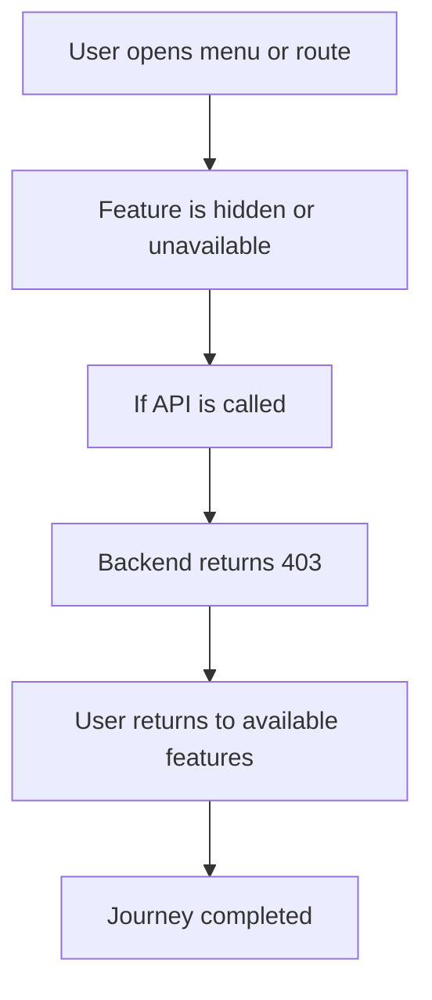

<!-- title: Feature Not Enabled Flow -->
<!-- status: Active -->
<!-- system: SCS-TIX EPOS Release 1 -->
<!-- last_updated: 2026-06-08 -->

# Feature Not Enabled Flow

## Purpose

Defines common behavior when tenant tries to use a feature not enabled by entitlement.

## Source Basis

This journey is based on the uploaded SCS-TIX Release 1 user journey files, UI
screens, backend architecture, database design, and confirmed project decisions.

It must not be expanded into e-commerce, offline sync, supplier, delivery, kiosk,
coupon, AI, or accounting scope.

## Actors

| Actor | Responsibility |
|---|---|
| Tenant User | Attempts feature not enabled for tenant |
| Backend | Rejects by entitlement |
| UI | Hides feature or shows not-enabled state |

## Preconditions

- User is authenticated.
- Tenant is active.
- Feature entitlement is disabled or absent.

## Main Flow

| Step | User/System Action | Expected Result |
|---:|---|---|
| 1 | User opens menu or route | UI checks entitlement |
| 2 | Feature is hidden or unavailable | User cannot proceed |
| 3 | If API is called | Backend checks tenant entitlement |
| 4 | Backend returns 403 | UI shows feature not enabled message |
| 5 | User returns to available features | No data mutation occurs |

## Journey Diagram

## Business Rules

- Permission cannot override missing entitlement.
- Entitlement must be checked before business execution.
- Disabled feature must not appear as active Release 1 behavior.
- Future features must be marked deferred.

## Access-Control Rules

| Control | Required Rule |
|---|---|
| Authentication | Required |
| Feature entitlement | Missing/disabled |
| Permission | Not sufficient alone |
| Tenant context | Required |

## Data and API References

| Area | References |
|---|---|
| API groups | `/api/v1/features` and all protected feature APIs |
| Tables | `tenant_feature_entitlements`, `feature_flags`, `platform_features`, `role_feature_assignments` |

## Edge Cases

- Role has permission but feature disabled must still fail.
- Tenant plan change may enable feature after reload.
- Feature flag can disable feature at outlet/user scope.

## Out of Scope

- E-commerce/offline/supplier/kiosk features must not be activated as Release 1.

## Completion Criteria

- The user reaches the expected final state without bypassing access control.
- Tenant-owned data remains inside the resolved tenant context.
- Sensitive actions write audit records where required.
- UI state and backend state stay consistent after completion.

## Related Files

- [[../01_RELEASE_SCOPE/Release_1_Scope]]
- [[../02_ACCESS_CONTROL/Access_Control_Overview]]
- [[../05_BACKEND_ARCHITECTURE/API_Standards]]
