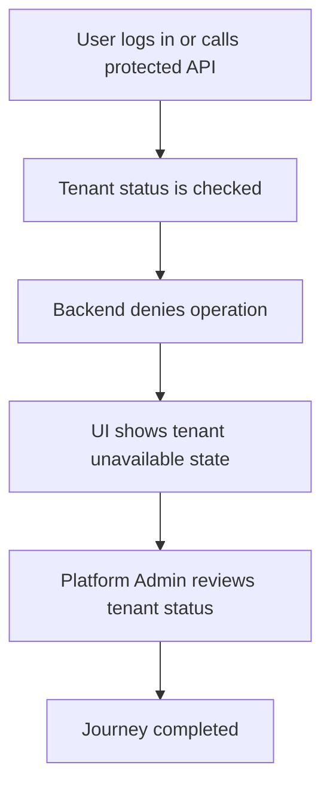

<!-- title: Tenant Suspended Flow -->
<!-- status: Active -->
<!-- system: SCS-TIX EPOS Release 1 -->
<!-- last_updated: 2026-06-08 -->

# Tenant Suspended Flow

## Purpose

Defines common behavior when tenant status blocks operation.

## Source Basis

This journey is based on the uploaded SCS-TIX Release 1 user journey files, UI
screens, backend architecture, database design, and confirmed project decisions.

It must not be expanded into e-commerce, offline sync, supplier, delivery, kiosk,
coupon, AI, or accounting scope.

## Actors

| Actor | Responsibility |
|---|---|
| Tenant User | Attempts login or operation |
| Backend | Rejects tenant operation |
| Platform Admin | May review or reactivate if permitted |

## Preconditions

- Tenant exists.
- Tenant status is suspended, inactive, expired, or otherwise blocked.
- User attempts login or protected operation.

## Main Flow

| Step | User/System Action | Expected Result |
|---:|---|---|
| 1 | User logs in or calls protected API | Backend resolves tenant |
| 2 | Tenant status is checked | Blocked status is detected |
| 3 | Backend denies operation | Safe message is returned |
| 4 | UI shows tenant unavailable state | User cannot continue POS operations |
| 5 | Platform Admin reviews tenant status | Activation/reactivation follows permitted platform flow |

## Journey Diagram

## Business Rules

- Tenant status is checked before protected tenant operations.
- Suspended tenant cannot sell, refund, exchange, or manage setup.
- Platform Admin action is required to change tenant status where allowed.
- Denied tenant operations must not mutate data.

## Access-Control Rules

| Control | Required Rule |
|---|---|
| Authentication | May pass |
| Tenant status | Blocks operation |
| Feature/permission | Not enough if tenant blocked |
| Audit | Required for status change |

## Data and API References

| Area | References |
|---|---|
| API groups | `/api/v1/auth`, `/api/v1/tenants`, all tenant-owned protected APIs |
| Tables | `tenants`, `tenant_subscriptions`, `tenant_subscription_history`, `audit_logs` |

## Edge Cases

- Expired subscription can block tenant according to status rules.
- Already logged-in user must be blocked on next protected call.
- Platform user must use platform permission to reactivate.

## Out of Scope

- Do not allow offline bypass.
- Do not allow POS sale during suspension.

## Completion Criteria

- The user reaches the expected final state without bypassing access control.
- Tenant-owned data remains inside the resolved tenant context.
- Sensitive actions write audit records where required.
- UI state and backend state stay consistent after completion.

## Related Files

- [[../01_RELEASE_SCOPE/Release_1_Scope]]
- [[../02_ACCESS_CONTROL/Access_Control_Overview]]
- [[../05_BACKEND_ARCHITECTURE/API_Standards]]
