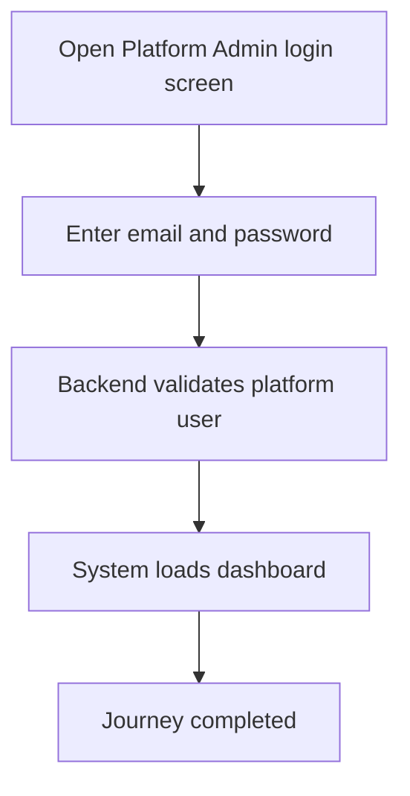

<!-- title: Platform Admin Login Flow -->
<!-- status: Active -->
<!-- system: SCS-TIX EPOS Release 1 -->
<!-- last_updated: 2026-06-08 -->

# Platform Admin Login Flow

## Purpose

Defines how a Platform Admin signs in before tenant, subscription, entitlement, and activation work.

## Source Basis

This journey is based on the uploaded SCS-TIX Release 1 user journey files, UI
screens, backend architecture, database design, and confirmed project decisions.

It must not be expanded into e-commerce, offline sync, supplier, delivery, kiosk,
coupon, AI, or accounting scope.

## Actors

| Actor | Responsibility |
|---|---|
| Platform Admin | Signs in to the Platform Admin Web application |
| Backend | Validates credentials and creates authenticated session |

## Preconditions

- Platform user account exists.
- Platform user status allows login.
- Platform Admin Web is available.

## Main Flow

| Step | User/System Action | Expected Result |
|---:|---|---|
| 1 | Open Platform Admin login screen | Login form is displayed |
| 2 | Enter email and password | Credentials are submitted securely |
| 3 | Backend validates platform user | Valid session is created if valid |
| 4 | System loads dashboard | Platform dashboard appears with permitted menus |

## Journey Diagram

## Business Rules

- Platform identity uses `platform_users`, not tenant `users`.
- Platform login does not create tenant-user access.
- Invalid credentials must not reveal account existence.
- Sensitive login failures should be logged safely.

## Access-Control Rules

| Control | Required Rule |
|---|---|
| Authentication | Required |
| Platform permission | Required after login for protected actions |
| Tenant context | Not required for platform dashboard |
| Audit | Required for sensitive platform actions |

## Data and API References

| Area | References |
|---|---|
| API groups | `/api/v1/auth`, `/api/v1/platform` |
| Tables | `platform_users`, `platform_roles`, `platform_user_roles`, `auth_sessions` |

## Edge Cases

- Invalid password returns safe login error.
- Inactive or suspended platform user cannot continue.
- Expired session requires re-login.

## Out of Scope

- Tenant user login is separate.
- POS cashier login is separate.
- E-commerce admin login is not Release 1.

## Completion Criteria

- The user reaches the expected final state without bypassing access control.
- Tenant-owned data remains inside the resolved tenant context.
- Sensitive actions write audit records where required.
- UI state and backend state stay consistent after completion.

## Related Files

- [[../01_RELEASE_SCOPE/Release_1_Scope]]
- [[../02_ACCESS_CONTROL/Access_Control_Overview]]
- [[../05_BACKEND_ARCHITECTURE/API_Standards]]
