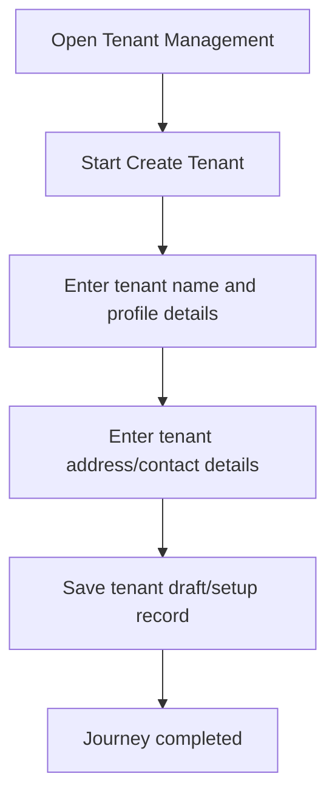

<!-- title: Create Tenant Flow -->
<!-- status: Active -->
<!-- system: SCS-TIX EPOS Release 1 -->
<!-- last_updated: 2026-06-08 -->

# Create Tenant Flow

## Purpose

Defines how a Platform Admin creates the tenant business record and starts tenant onboarding.

## Source Basis

This journey is based on the uploaded SCS-TIX Release 1 user journey files, UI
screens, backend architecture, database design, and confirmed project decisions.

It must not be expanded into e-commerce, offline sync, supplier, delivery, kiosk,
coupon, AI, or accounting scope.

## Actors

| Actor | Responsibility |
|---|---|
| Platform Admin | Creates tenant and captures business details |
| Backend | Stores tenant, profile, address, and setup state |
| Tenant Admin | Receives later setup/payment flow |

## Preconditions

- Platform Admin is authenticated.
- Platform user has tenant creation permission.
- Required business details are available.

## Main Flow

| Step | User/System Action | Expected Result |
|---:|---|---|
| 1 | Open Tenant Management | Tenant list and create action are visible |
| 2 | Start Create Tenant | Business details step opens |
| 3 | Enter tenant name and profile details | Data is validated |
| 4 | Enter tenant address/contact details | Tenant profile is completed |
| 5 | Save tenant draft/setup record | Tenant is created in setup state |

## Journey Diagram

## Business Rules

- Tenant code must be unique.
- Tenant-owned records must include tenant context.
- Tenant status must reflect setup/payment state.
- Tenant creation must be audited.

## Access-Control Rules

| Control | Required Rule |
|---|---|
| Authentication | Required |
| Platform permission | `platform.tenant.create` or equivalent |
| Tenant context | Created by backend, not trusted from frontend |
| Audit | Required |

## Data and API References

| Area | References |
|---|---|
| API groups | `/api/v1/tenants`, `/api/v1/platform` |
| Tables | `tenants`, `tenant_profiles`, `tenant_addresses`, `audit_logs` |

## Edge Cases

- Duplicate tenant code must return conflict.
- Missing required business data must return validation error.
- Tenant must not be activated before required setup/payment decision.

## Out of Scope

- E-commerce storefront creation is excluded.
- Delivery setup is excluded.
- Supplier setup is excluded.

## Completion Criteria

- The user reaches the expected final state without bypassing access control.
- Tenant-owned data remains inside the resolved tenant context.
- Sensitive actions write audit records where required.
- UI state and backend state stay consistent after completion.

## Related Files

- [[../01_RELEASE_SCOPE/Release_1_Scope]]
- [[../02_ACCESS_CONTROL/Access_Control_Overview]]
- [[../05_BACKEND_ARCHITECTURE/API_Standards]]
