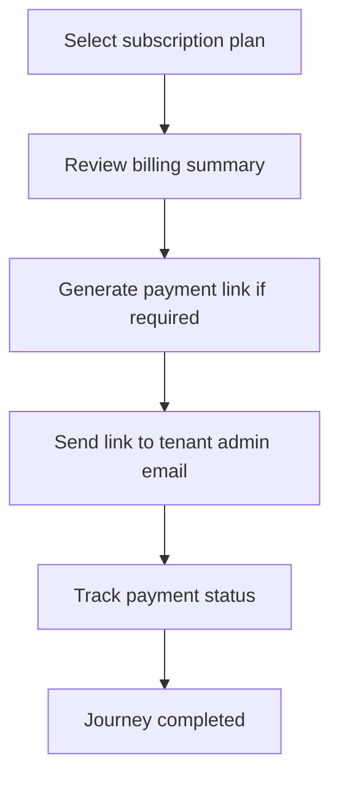

<!-- title: Subscription Payment Link Flow -->
<!-- status: Active -->
<!-- system: SCS-TIX EPOS Release 1 -->
<!-- last_updated: 2026-06-08 -->

# Subscription Payment Link Flow

## Purpose

Defines how Platform Admin assigns subscription billing and sends a payment link when payment is required.

## Source Basis

This journey is based on the uploaded SCS-TIX Release 1 user journey files, UI
screens, backend architecture, database design, and confirmed project decisions.

It must not be expanded into e-commerce, offline sync, supplier, delivery, kiosk,
coupon, AI, or accounting scope.

## Actors

| Actor | Responsibility |
|---|---|
| Platform Admin | Assigns plan and issues payment link |
| Tenant Admin | Receives payment link where applicable |
| Backend | Creates invoice, payment link, and transaction records |

## Preconditions

- Tenant exists.
- Subscription plan exists.
- Billing decision is known as trial, demo, waived, or payment required.

## Main Flow

| Step | User/System Action | Expected Result |
|---:|---|---|
| 1 | Select subscription plan | Plan and limits are shown |
| 2 | Review billing summary | Invoice lines and total are calculated |
| 3 | Generate payment link if required | Secure payment link is created |
| 4 | Send link to tenant admin email | Tenant admin can open billing summary |
| 5 | Track payment status | Tenant billing status updates after payment result |

## Journey Diagram

## Business Rules

- Payment link token must be stored as hash.
- Trial/demo flows must not force payment.
- Provider code is configurable/TBD.
- Payment status change must be audited.

## Access-Control Rules

| Control | Required Rule |
|---|---|
| Authentication | Platform admin required |
| Permission | Subscription/billing permission required |
| Tenant context | Explicit tenant being configured |
| Audit | Required |

## Data and API References

| Area | References |
|---|---|
| API groups | `/api/v1/subscriptions` |
| Tables | `tenant_subscriptions`, `subscription_invoices`, `subscription_invoice_lines`, `subscription_payment_links`, `subscription_payment_transactions` |

## Edge Cases

- Expired payment link cannot activate payment.
- Failed payment keeps tenant pending/payment state.
- Duplicate provider transaction must be handled safely.

## Out of Scope

- Full accounting is excluded.
- E-commerce checkout payment is excluded.
- SMS/WhatsApp payment notifications are excluded.

## Completion Criteria

- The user reaches the expected final state without bypassing access control.
- Tenant-owned data remains inside the resolved tenant context.
- Sensitive actions write audit records where required.
- UI state and backend state stay consistent after completion.

## Related Files

- [[../01_RELEASE_SCOPE/Release_1_Scope]]
- [[../02_ACCESS_CONTROL/Access_Control_Overview]]
- [[../05_BACKEND_ARCHITECTURE/API_Standards]]
