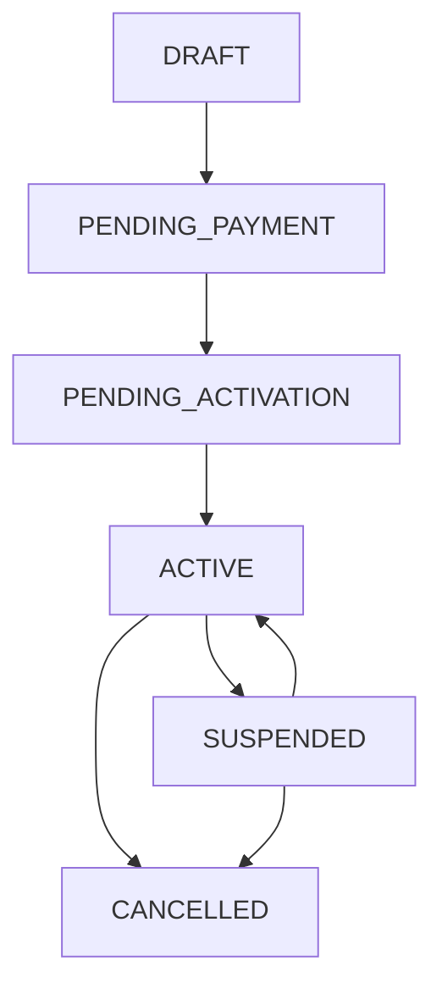

<!-- title: Tenant Management Flow -->
<!-- status: Active -->
<!-- system: TM-EPOS MVP / OneVerz -->
<!-- last_updated: 2026-07-31 -->
<!-- decision_closure_date: 2026-07-31 -->

# Tenant Management Flow

## Purpose

Defines how Platform Admin searches, reviews, manages tenant accounts, executes lifecycle transitions, and edits tenant feature entitlements from Tenant Detail.

## Actor

Platform Admin (or Platform User with approved platform permissions).

## Source

Derived from `Slide 3 - Tenant Management Flow` in `SYSTEM_USER_JOURNEY.pptx` and aligned to TM-EPOS MVP Second Brain scope.

## Trigger

Platform Admin opens Tenant Management (`/admin/tenants`) from dashboard or platform menu.

## Preconditions

- Platform User is authenticated with an active platform session.
- Access to Tenant List and Tenant Detail requires `platform.tenants.view`.
- Entitlement editing requires `platform.tenants.entitlements.update` and an existing tenant subscription.
- Tenant lifecycle mutations require explicit permissions (`platform.tenants.activate`, `platform.tenants.suspend`, `platform.tenants.update`).
- Viewing tenant subscription data requires `platform.tenant_subscriptions.view`.
- Viewing commercial billing data requires `platform.billing.view`.
- Viewing tenant audit history requires `platform.audit.view`.

## Main Flow

| Step | Action | System Behavior |
|---:|---|---|
| 1 | Open tenant management | System opens tenant management module (`/admin/tenants`). |
| 2 | Load tenant list | System loads tenants with summary information via `GET /api/v1/platform-admin/tenants`. |
| 3 | Search or filter tenants | Platform Admin narrows tenants by `search`, `status` (lifecycle), `statusGroup` (`setup_pending`), `billingStatus` (subscription status filter), or `planId`. |
| 4 | Review tenant row summary | System shows tenant name, code, lifecycle status badge (`LifecycleStatus`), subscription summary (if permitted by `platform.tenant_subscriptions.view`), footprint counts (outlets, tills, users), setup progress %, and row action menu. |
| 5 | Open tenant detail | System loads `GET /api/v1/platform-admin/tenants/{tenantId}` including profile, address, subscription (gated), `enabledFeatureIds`, `enabledFeatureCodes`, setup progress (`SetupCompletedSteps`, `SetupMissingSteps`, `SetupProgressPercent`), `concurrencyVersion`, and action flags (`canUpdate`, `canActivate`, `canSuspend`, `canManageEntitlements`). |
| 6 | Continue Setup (if applicable) | When tenant is in Setup Pending (`statusGroup=setup_pending`), UI highlights progress checklist and deep-links or opens relevant detail section (`ContinueSetupPath = /admin/tenants/{tenantId}`). |
| 7 | Activate, suspend, or reactivate | When permitted (`canActivate` / `canSuspend`), lifecycle actions execute `POST /api/v1/platform-admin/tenants/{tenantId}/activate` (for initial activation), `POST .../suspend` (for suspension), or `POST .../reactivate` (for reactivation from `SUSPENDED`) with confirmation. |
| 8 | View Audit History | On Tenant Detail, user opens Audit History tab which calls `GET /api/v1/platform-admin/tenants/{tenantId}/audit-logs` (requires `platform.audit.view`). |
| 9 | Edit entitlements | When `canManageEntitlements` is true, editor loads `GET /api/v1/platform-admin/tenants/{tenantId}/entitlement-options` (requires `platform.tenants.entitlements.update`). |
| 10 | Select plan and features | UI displays active plans and catalog modules. Checkboxes are restricted to features included in the selected plan. |
| 11 | Save entitlements | UI calls `PUT /api/v1/platform-admin/tenants/{tenantId}/entitlements` with `subscriptionPlanId` (optional plan change), selected `enabledFeatureIds` / `enabledFeatureCodes`, and `concurrencyVersion`. |
| 12 | Refresh detail | System reloads tenant detail so feature entitlement arrays, subscription summary, and action flags reflect saved state. |

## Tenant List Contract

### Release 1 Approved Fields

| Field | Source | Required Permission | Notes |
|---|---|---|---|
| Tenant Name | `display_name` / `Name` | `platform.tenants.view` | Core display name |
| Tenant Code | `tenant_code` / `Code` | `platform.tenants.view` | Unique tenant code |
| Lifecycle Status | `status` / `LifecycleStatus` | `platform.tenants.view` | Authoritative lifecycle status badge (`DRAFT`, `PENDING_PAYMENT`, `PENDING_ACTIVATION`, `ACTIVE`, `SUSPENDED`, `CANCELLED`) |
| Subscription Plan | `Subscription.PlanName` | `platform.tenant_subscriptions.view` | Hidden/omitted if permission lacking |
| Billing / Sub Status | `Subscription.Status` / `BillingStatus` | `platform.tenant_subscriptions.view` | Filter compatibility field |
| Primary Contact | `Profile.PrimaryContactName` / `PrimaryEmail` | `platform.tenants.view` | Contact name & email |
| Base Currency | `base_currency_code` / `BaseCurrency` | `platform.tenants.view` | ISO currency code (e.g. LKR) |
| Default Timezone | `default_timezone` / `DefaultTimezone` | `platform.tenants.view` | e.g. `Asia/Colombo` |
| Outlet Count | `OutletCount` | `platform.tenants.view` | Active outlet footprint count |
| Till Count | `TillCount` | `platform.tenants.view` | Active till footprint count |
| Tenant User Count | `UserCount` | `platform.tenants.view` | Tenant user footprint count |
| Created Date | `createdAt` / `CreatedAt` | `platform.tenants.view` | ISO timestamp |
| Setup Progress | `SetupProgressPercent` | `platform.tenants.view` | Nullable integer (0–100%) |

### Approved Release 1 Filter Scope (`SA-TENANT-DECISION-PENDING-03` — Closed)

- `search`: Case-insensitive partial search (`display_name`, `tenant_code`, `tenant_slug`, contact name/email)
- `status`: Single-select lifecycle status filter (`DRAFT`, `PENDING_PAYMENT`, `PENDING_ACTIVATION`, `ACTIVE`, `SUSPENDED`, `CANCELLED`)
- `statusGroup`: Lifecycle group filter (`setup_pending` matches `DRAFT`, `PENDING_PAYMENT`, `PENDING_ACTIVATION`, or legacy `setup_pending`)
- `billingStatus`: Subscription status filter (`ACTIVE`, `TRIALING`, `PAST_DUE`, `EXPIRED`, `CANCELLED`)
- `planId`: GUID filter for active subscription plan

*Post-R1 Backlog (Deferred):* Country filter, created-date range, and feature-entitlement filter are deferred to post-R1 backlog.

### Filter & Sorting Rules

- Applying or clearing filters resets pagination to page 1.
- URL query parameters persist filter state for deep-linking.
- Sorting supports `name`, `code`, `createdAt`, `status` (`asc` / `desc`, default `desc` on `createdAt`).
- Pagination default: `pageNumber = 1`, `pageSize = 10` (max 100).

## Lifecycle Status and Transitions

### Persisted Lifecycle Values (`tenants.status`) & UI Display Mapping

| Persisted Status (`tenants.status`) | Tenant Management UI Display | Presentation Group | Allowed R1 Actions |
|---|---|---|---|
| `DRAFT` | Draft | Setup Pending | Edit Profile, Continue Setup |
| `PENDING_PAYMENT` | Pending Payment | Setup Pending | View Details, Continue Setup, Mark Paid (Billing) |
| `PENDING_ACTIVATION` | Pending Activation | Setup Pending | View Details, Edit Profile, Activate Tenant |
| `ACTIVE` | Active | Active | View Details, Edit Profile, Edit Entitlements, Suspend Tenant |
| `SUSPENDED` | Suspended | Suspended | View Details, Reactivate Tenant |
| `CANCELLED` | Cancelled | Inactive (Read-only) | View Details (Read-only terminal archive) |

*Contract Corrections:*
1. `CANCELLED` renders as **Cancelled** (or Terminated) read-only terminal state in Tenant Management UI.
2. `CANCELLED` records are excluded from self-service cancellation actions in Release 1 (`SA-TENANT-DECISION-PENDING-01`). No Cancel button or endpoint exists in R1.
3. Dashboard Inactive KPI counts explicitly approved inactive records; `CANCELLED` is excluded unless approved in future dashboard specs.

### Allowed Lifecycle State Transitions

| Current Status | Target Status | Endpoint / Mechanism | Required Permission | Preconditions & Audit Event |
|---|---|---|---|---|
| `DRAFT` | `PENDING_PAYMENT` | Wizard `POST /tenants` | `platform.tenants.create` | Paid creation path; emits `tenant.created` |
| `DRAFT` / `PENDING_PAYMENT` | `ACTIVE` | Wizard `POST /tenants` | `platform.tenants.create` | Trial / Demo auto-activation; emits `tenant.created` + `tenant.activated` |
| `PENDING_PAYMENT` | `PENDING_ACTIVATION` | Billing Mark Paid API | `platform.billing.manage` | Payment verification recorded; emits `tenant.billing_state_changed` |
| `PENDING_ACTIVATION` | `ACTIVE` | `POST .../activate` | `platform.tenants.activate` | Initial manual activation; emits `tenant.activated` |
| `SUSPENDED` | `ACTIVE` | `POST .../reactivate` | `platform.tenants.activate` | Reactivation from `SUSPENDED`; emits `tenant.reactivated` |
| `ACTIVE` | `SUSPENDED` | `POST .../suspend` | `platform.tenants.suspend` | Temporary suspension; emits `tenant.suspended` |
| Any active state | `CANCELLED` | Manual Operations / Support | N/A (Out of R1 UI) | Operational support process only; terminal read-only state in R1 |

## Reactivation Contract (`SA-TENANT-GAP-04` — Resolved)

- Target endpoint: `POST /api/v1/platform-admin/tenants/{tenantId}/reactivate`
- Required permission: `platform.tenants.activate` (Canonical permission; do **not** invent `platform.tenants.reactivate`).
- Precondition: Permitted strictly when `tenants.status == SUSPENDED`.
- Result: Sets `tenants.status = ACTIVE`, clears suspension flags, and writes structured audit event `tenant.reactivated`.
- Rejection: Requests from `ACTIVE`, `DRAFT`, `PENDING_PAYMENT`, `PENDING_ACTIVATION`, or `CANCELLED` return HTTP 409 `platform_tenants.invalid_transition`.

## Tenant Audit History Tab (`SA-TENANT-DECISION-PENDING-02` — Closed)

- Target endpoint: `GET /api/v1/platform-admin/tenants/{tenantId}/audit-logs`
- Required permission: `platform.audit.view` (Canonical audit log permission).
- Access control: Enforces tenant isolation; returns events where `tenant_id` matches `{tenantId}`.
- Response payload fields: `id`, `eventCode`, `timestamp` (UTC), `actorId`, `actorName`, `summary`, `details` (safe non-sensitive key-value changes).
- Excluded data: Passwords, tokens, payment credentials, secrets, raw stack traces, or sensitive payloads are strictly scrubbed.
- Pagination & Sorting: Default sorted newest-first (`timestamp desc`), paginated (`pageNumber`, `pageSize`).

## Optimistic Concurrency Control (`SA-TENANT-DECISION-PENDING-04` — Closed)

- `GET /api/v1/platform-admin/tenants/{tenantId}` returns an opaque `concurrencyVersion` (or `ETag`).
- `PUT /api/v1/platform-admin/tenants/{tenantId}` and `PUT .../entitlements` accept `concurrencyVersion` in the request payload or `If-Match` header.
- Backend performs atomic version check during update execution.
- Stale update race condition returns HTTP 409 `platform_tenants.conflict` with safe message `"The tenant record was updated by another user. Please reload and try again."`
- Frontend UI renders safe conflict banner and provides a **Reload & Retry** CTA without clearing valid local user inputs.

## Access Control and Security Rules

- **Permission Gating:**
  - `platform.tenants.view`: View tenant list, summary, profile, address, footprint counts, and entitlement flags.
  - `platform.tenant_subscriptions.view`: View tenant subscription summary (plan, price, dates, subscription status). Without it, subscription section is omitted/hidden and backend redacts subscription DTO (`SA-TENANT-GAP-01`).
  - `platform.billing.view`: View tenant billing history/invoices. Without it, billing section is omitted/hidden.
  - `platform.audit.view`: View tenant audit history tab (`GET .../tenants/{id}/audit-logs`).
  - `platform.tenants.create`: Access Create Tenant Wizard (`/admin/tenants/create`) and POST create endpoint.
  - `platform.tenants.update`: Update tenant profile/address (`PUT /admin/tenants/{tenantId}`).
  - `platform.tenants.activate`: Activate (`POST .../activate`) or reactivate (`POST .../reactivate`) tenant.
  - `platform.tenants.suspend`: Suspend tenant (`POST /admin/tenants/{tenantId}/suspend`).
  - `platform.tenants.entitlements.update`: Access entitlement options and save entitlements (`PUT /admin/tenants/{tenantId}/entitlements`).
- Backend MUST enforce permissions on every API request. Frontend guards provide UX enforcement only.
- Platform-level actions must never accept frontend-provided tenant context as trusted authority.

## Validation and Error Handling

- Tenant not found → HTTP 404 `platform_tenants.not_found`
- Permission denied → HTTP 403 `platform_tenants.access_denied`
- Invalid lifecycle transition → HTTP 409 `platform_tenants.invalid_transition`
- Concurrent update conflict → HTTP 409 `platform_tenants.conflict`
- Missing subscription on entitlement edit → HTTP 400 `platform_tenants.validation_failed`
- Error response payload strictly follows standard legacy envelope (`success: false`, `message`, `errorCode`, `errors[]`, `traceId`). Stack traces and internal database details are scrubbed.

## Implementation Gap & Decision Status Summary

All 4 product decisions are **Closed — Approved**:
- `SA-TENANT-DECISION-PENDING-01`: Closed — No R1 self-service cancellation action.
- `SA-TENANT-DECISION-PENDING-02`: Closed — Embedded Tenant Audit History tab (`GET .../audit-logs`, `platform.audit.view`).
- `SA-TENANT-DECISION-PENDING-03`: Closed — Release 1 approved 5 filters (`search`, `status`, `statusGroup`, `billingStatus`, `planId`).
- `SA-TENANT-DECISION-PENDING-04`: Closed — Opaque `concurrencyVersion` and HTTP 409 conflict handling.

Gaps `SA-TENANT-GAP-01` through `07` contracts are fully specified and ready for implementation.

## Related Documents

- [[17_Platform_Tenant_Detail_Entitlements_Alignment]]
- [[16_Platform_Tenant_Create_Wizard_Alignment]]
- [[04_Create_Tenant_Wizard_Flow]]
- [[11_Tenant_Activation_Flow]]
- [[02_Platform_Dashboard_Flow]]
- [[02_ACCESS_CONTROL/Permission_Code_List]]
- [[02_ACCESS_CONTROL/API_Authorization_Rules]]
- [[05_BACKEND_ARCHITECTURE/API_ENDPOINTS]]
- [[06_DATABASE_KNOWLEDGE/Tables/02_Tenant_Foundation_UPDATED]]
- [[06_DATABASE_KNOWLEDGE/Tables/05_Subscription_Billing_Payments_And_Usage_UPDATED]]
- [[../../15_IMPLEMENTATION_TRACKING/99_AUDITS/2026-07-31-tenant-management/Platform_Tenant_Management_Second_Brain_Readiness_Audit]]

