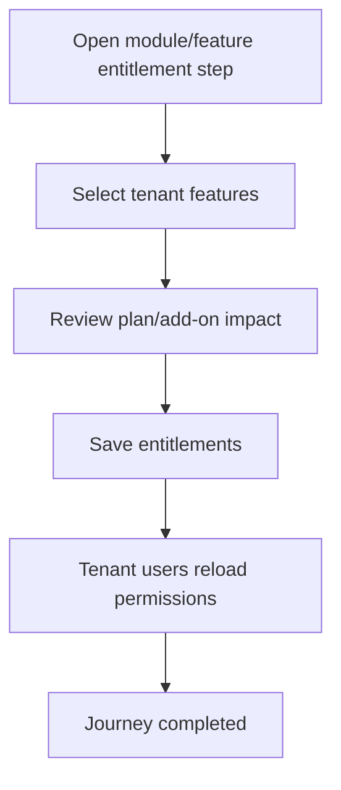

<!-- title: Module Feature Entitlement Flow -->
<!-- status: Active -->
<!-- system: SCS-TIX EPOS Release 1 -->
<!-- last_updated: 2026-06-08 -->

# Module Feature Entitlement Flow

## Purpose

Defines how Platform Admin enables Release 1 features for a tenant.

## Source Basis

This journey is based on the uploaded SCS-TIX Release 1 user journey files, UI
screens, backend architecture, database design, and confirmed project decisions.

It must not be expanded into e-commerce, offline sync, supplier, delivery, kiosk,
coupon, AI, or accounting scope.

## Actors

| Actor | Responsibility |
|---|---|
| Platform Admin | Assigns enabled modules/features |
| Backend | Stores tenant entitlements and feature flags |
| Tenant Users | See only enabled features after login |

## Preconditions

- Tenant exists.
- Platform features are seeded.
- Platform Admin has entitlement permission.

## Main Flow

| Step | User/System Action | Expected Result |
|---:|---|---|
| 1 | Open module/feature entitlement step | Release 1 features are listed |
| 2 | Select tenant features | Enabled features are selected |
| 3 | Review plan/add-on impact | Billing or limits are shown where applicable |
| 4 | Save entitlements | Tenant feature entitlement records are stored |
| 5 | Tenant users reload permissions | Menus/actions align to entitlement |

## Journey Diagram

## Business Rules

- Feature entitlement does not replace permission.
- Disabled features must hide UI and block APIs.
- Excluded Release 2 features must not be enabled as active R1 scope.
- Entitlement changes must be audited.

## Access-Control Rules

| Control | Required Rule |
|---|---|
| Authentication | Platform admin required |
| Permission | Feature entitlement permission required |
| Tenant context | Explicit tenant |
| Audit | Required |

## Data and API References

| Area | References |
|---|---|
| API groups | `/api/v1/features` |
| Tables | `platform_modules`, `platform_features`, `tenant_feature_entitlements`, `feature_flags`, `role_feature_assignments` |

## Edge Cases

- Feature disabled for tenant returns 403 on protected API.
- Role permission without entitlement must still fail.
- Future features must be marked deferred if shown.

## Out of Scope

- E-commerce, offline sync, supplier, transfer, kiosk, coupon, and AI entitlements are not active Release 1.

## Completion Criteria

- The user reaches the expected final state without bypassing access control.
- Tenant-owned data remains inside the resolved tenant context.
- Sensitive actions write audit records where required.
- UI state and backend state stay consistent after completion.

## Related Files

- [[../01_RELEASE_SCOPE/Release_1_Scope]]
- [[../02_ACCESS_CONTROL/Access_Control_Overview]]
- [[../05_BACKEND_ARCHITECTURE/API_Standards]]
