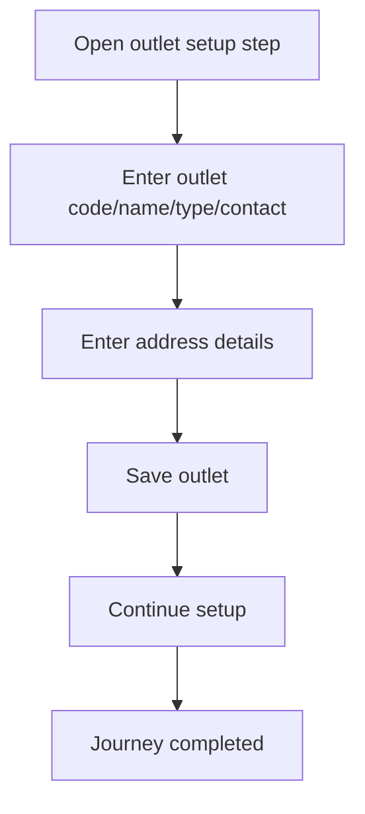

<!-- title: Outlet Setup Flow -->
<!-- status: Active -->
<!-- system: SCS-TIX EPOS Release 1 -->
<!-- last_updated: 2026-06-08 -->

# Outlet Setup Flow

## Purpose

Defines the Platform Admin supported outlet setup step used during tenant onboarding.

## Source Basis

This journey is based on the uploaded SCS-TIX Release 1 user journey files, UI
screens, backend architecture, database design, and confirmed project decisions.

It must not be expanded into e-commerce, offline sync, supplier, delivery, kiosk,
coupon, AI, or accounting scope.

## Actors

| Actor | Responsibility |
|---|---|
| Platform Admin | Optionally creates tenant outlet |
| Backend | Stores outlet and outlet address |
| Tenant Admin | Can manage outlets later if permitted |

## Preconditions

- Tenant exists.
- Outlet feature/setup is included for tenant.
- Platform Admin is in tenant setup context.

## Main Flow

| Step | User/System Action | Expected Result |
|---:|---|---|
| 1 | Open outlet setup step | Outlet form is displayed |
| 2 | Enter outlet code/name/type/contact | Outlet details are validated |
| 3 | Enter address details | Outlet address is validated |
| 4 | Save outlet | Outlet is stored under tenant |
| 5 | Continue setup | Next setup step becomes available |

## Journey Diagram

## Business Rules

- Outlet code must be unique inside tenant.
- Outlet records must include tenant ID.
- Outlet address belongs to outlet and tenant.
- Skipped setup must not block tenant creation unless required by business decision.

## Access-Control Rules

| Control | Required Rule |
|---|---|
| Authentication | Platform admin required |
| Permission | Tenant setup/outlet permission required |
| Tenant context | Explicit tenant |
| Audit | Recommended |

## Data and API References

| Area | References |
|---|---|
| API groups | `/api/v1/outlets` |
| Tables | `outlets`, `outlet_addresses`, `audit_logs` |

## Edge Cases

- Duplicate outlet code returns conflict.
- Missing address fields return validation error.
- Inactive outlet must not be used for POS checkout.

## Out of Scope

- Stock transfer setup is excluded.
- Supplier/warehouse purchasing flow is excluded.
- Delivery outlet flow is excluded.

## Completion Criteria

- The user reaches the expected final state without bypassing access control.
- Tenant-owned data remains inside the resolved tenant context.
- Sensitive actions write audit records where required.
- UI state and backend state stay consistent after completion.

## Related Files

- [[../01_RELEASE_SCOPE/Release_1_Scope]]
- [[../02_ACCESS_CONTROL/Access_Control_Overview]]
- [[../05_BACKEND_ARCHITECTURE/API_Standards]]
