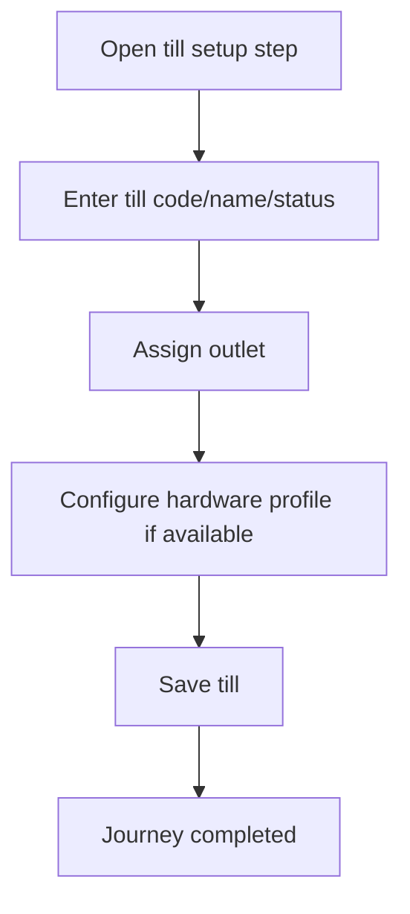

<!-- title: Till Setup Flow -->
<!-- status: Active -->
<!-- system: SCS-TIX EPOS Release 1 -->
<!-- last_updated: 2026-06-08 -->

# Till Setup Flow

## Purpose

Defines the Platform Admin supported till setup flow for a tenant outlet.

## Source Basis

This journey is based on the uploaded SCS-TIX Release 1 user journey files, UI
screens, backend architecture, database design, and confirmed project decisions.

It must not be expanded into e-commerce, offline sync, supplier, delivery, kiosk,
coupon, AI, or accounting scope.

## Actors

| Actor | Responsibility |
|---|---|
| Platform Admin | Optionally creates till |
| Backend | Stores till and activation code support |
| Cashier/POS Device | Uses activation later |

## Preconditions

- Tenant and outlet exist.
- Till setup is enabled.
- Platform Admin has setup permission.

## Main Flow

| Step | User/System Action | Expected Result |
|---:|---|---|
| 1 | Open till setup step | Till form is displayed |
| 2 | Enter till code/name/status | Till details are validated |
| 3 | Assign outlet | Till is linked to outlet |
| 4 | Configure hardware profile if available | Hardware profile can be linked |
| 5 | Save till | Till is stored and activation code can be generated |

## Journey Diagram

## Business Rules

- Till code must be unique per tenant/outlet.
- Activation code is generated after till creation where required.
- Activation code must be hashed.
- Till must be active before POS use.

## Access-Control Rules

| Control | Required Rule |
|---|---|
| Authentication | Platform admin required |
| Permission | Till setup permission required |
| Tenant/outlet context | Required |
| Audit | Recommended |

## Data and API References

| Area | References |
|---|---|
| API groups | `/api/v1/tills`, `/api/v1/devices` |
| Tables | `tills`, `till_activation_codes`, `hardware_profiles`, `hardware_devices` |

## Edge Cases

- Duplicate till code returns conflict.
- Inactive till cannot open till session.
- Expired activation code cannot pair a device.

## Out of Scope

- Customer display screens are excluded.
- Kiosk device setup is excluded.
- Offline till sync is excluded.

## Completion Criteria

- The user reaches the expected final state without bypassing access control.
- Tenant-owned data remains inside the resolved tenant context.
- Sensitive actions write audit records where required.
- UI state and backend state stay consistent after completion.

## Related Files

- [[../01_RELEASE_SCOPE/Release_1_Scope]]
- [[../02_ACCESS_CONTROL/Access_Control_Overview]]
- [[../05_BACKEND_ARCHITECTURE/API_Standards]]
